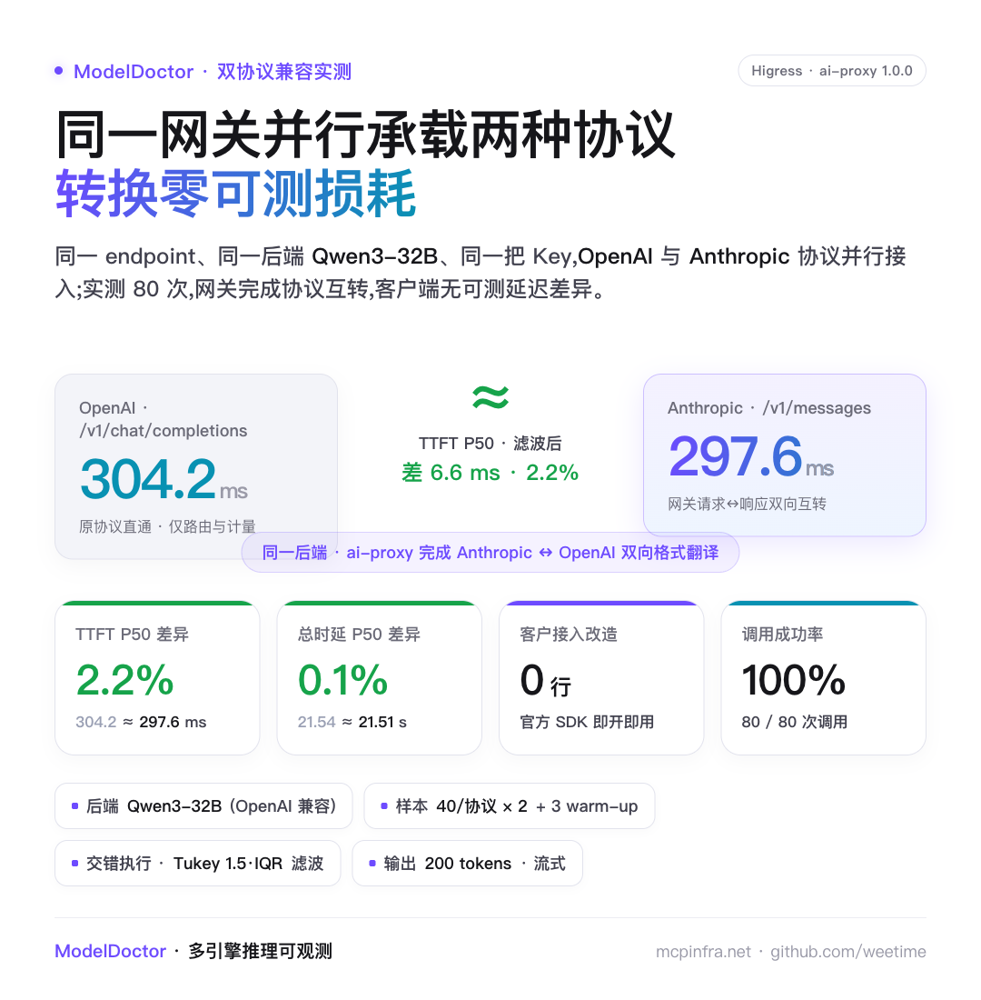
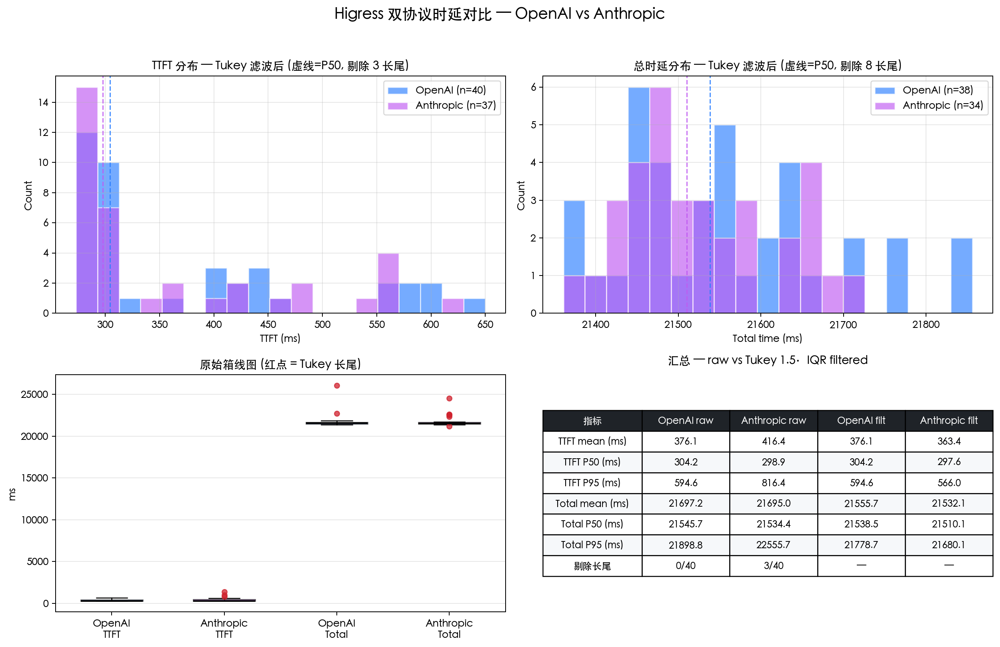
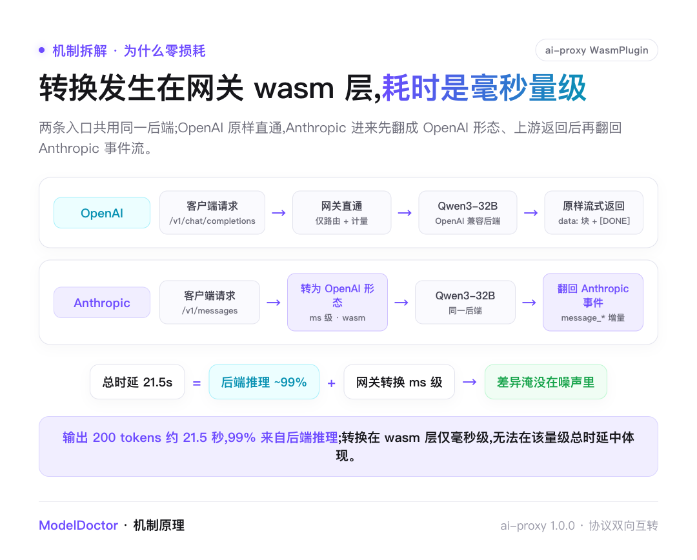
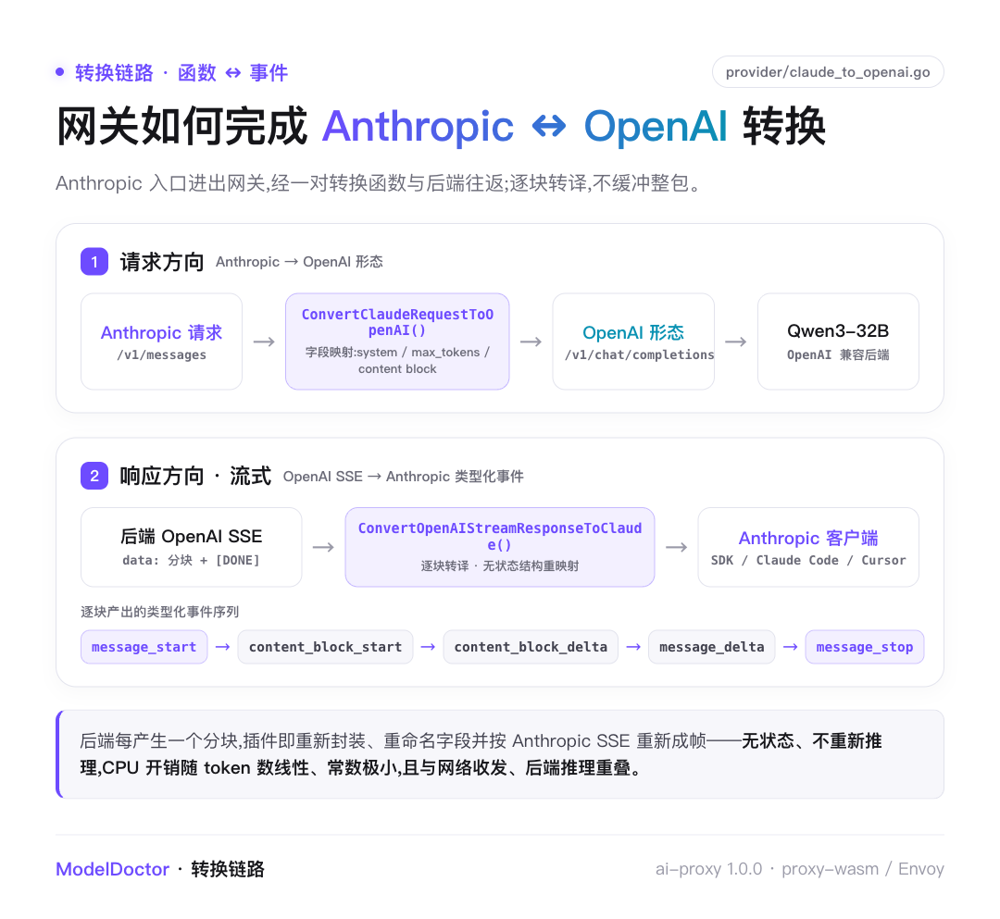
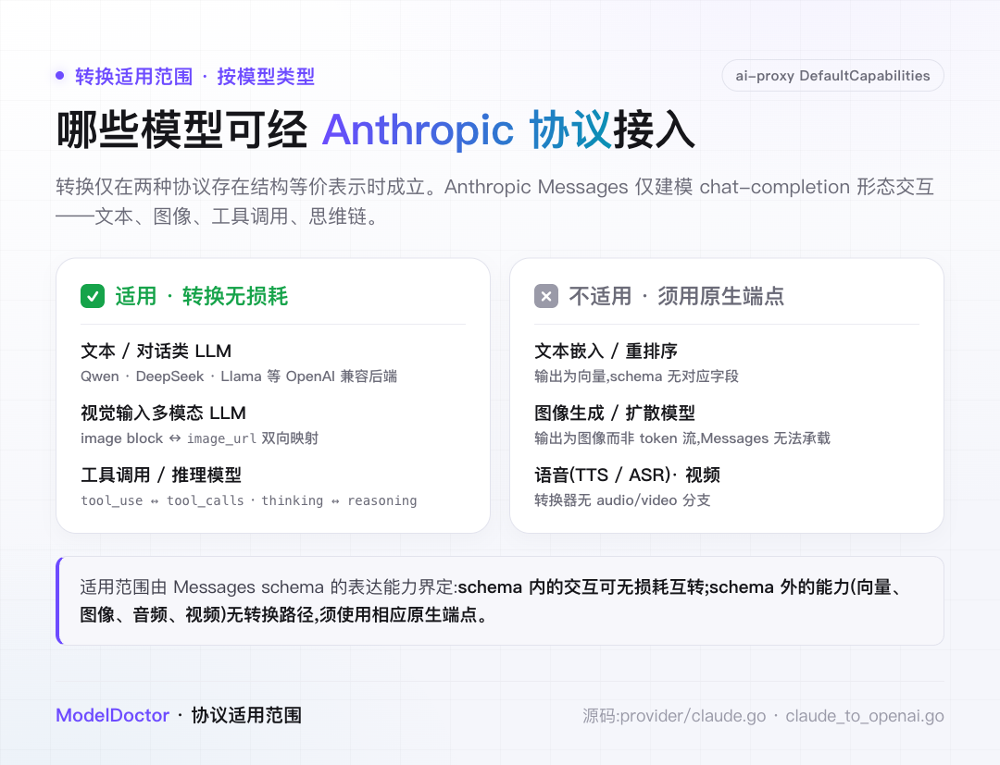
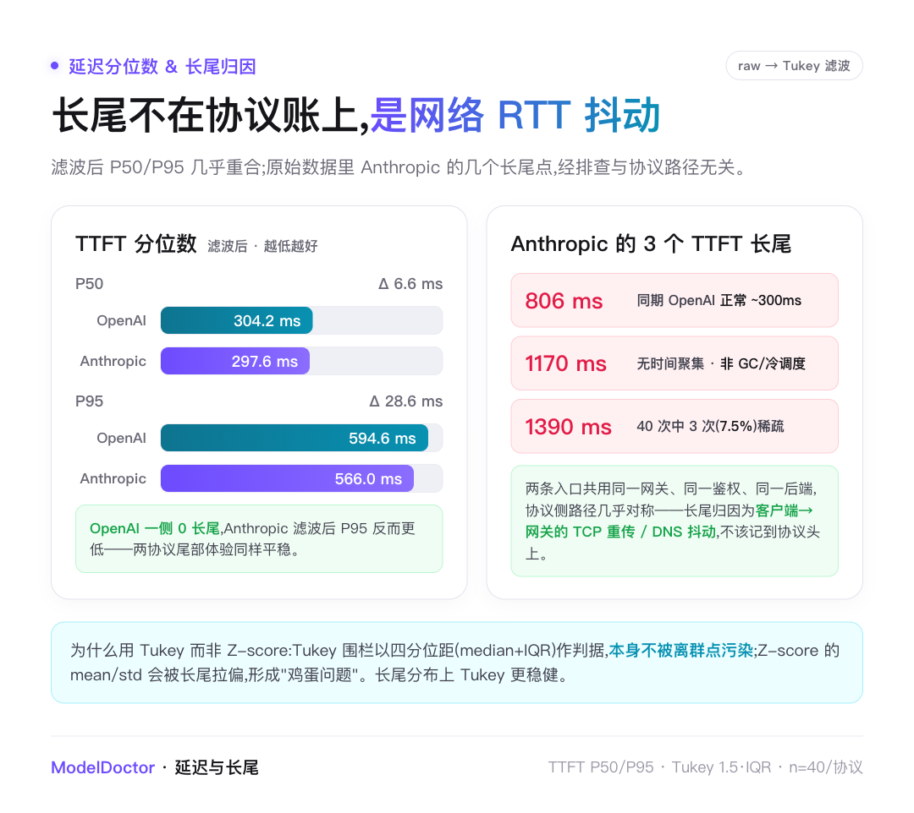
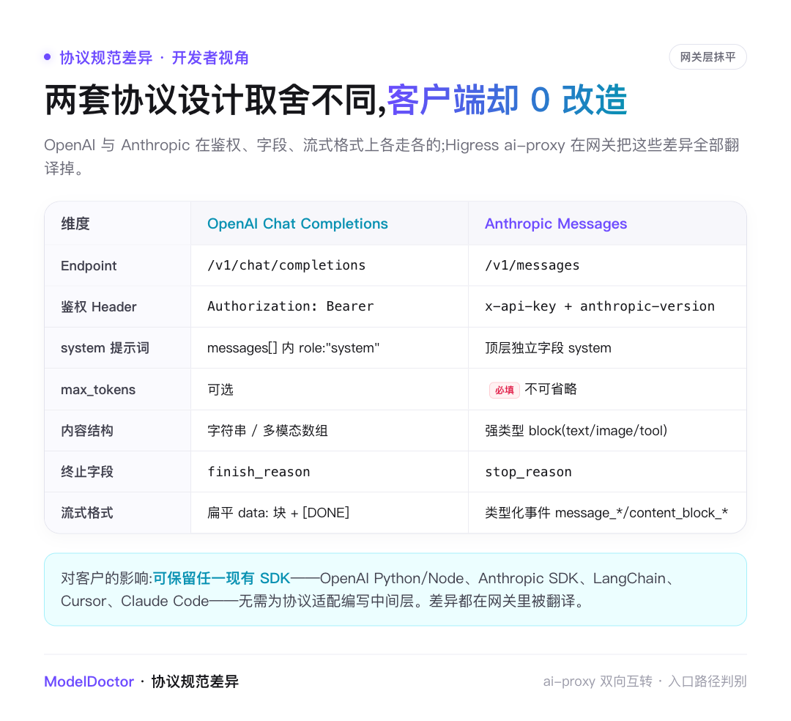
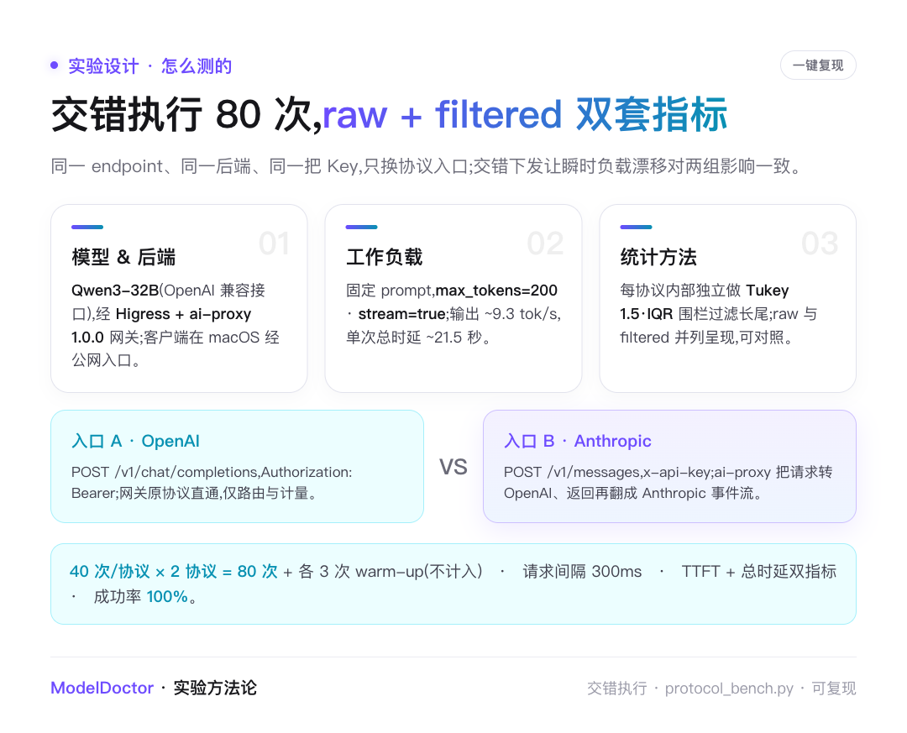
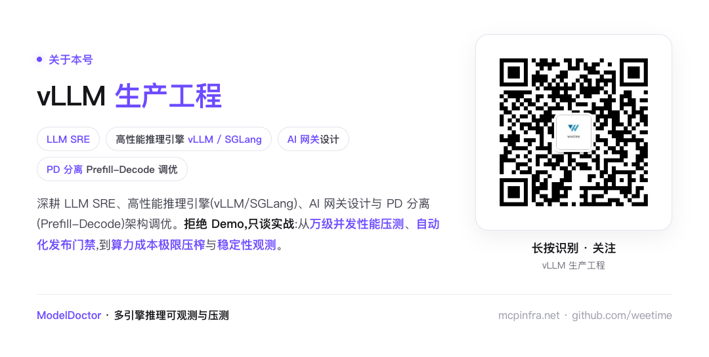

# Higress 实测:OpenAI 与 Anthropic 协议转换,到底有没有损耗?

> 同一 endpoint、同一后端 Qwen3-32B、同一把 API Key,OpenAI 与 Anthropic 两种协议并行承载。本文先以 80 次实测量化"转换是否带来延迟损耗",再从 Higress ai-proxy 源码说明"为何不带来损耗",最后界定转换的适用范围:哪些模型类型适用、哪些不适用。

---

## 背景与结论

在多团队、多副本的推理平台上,客户端协议往往并不统一:一部分使用 OpenAI SDK,一部分使用 Anthropic SDK(含 Claude Code、Cursor 等),也有经 LangChain 接入的。要在同一后端上同时支持这两类客户端,常见做法是自建一层协议适配——将 Anthropic 的 `/v1/messages` 请求转换为 OpenAI 的 `/v1/chat/completions`,并将响应反向转换。

这层适配既是工程维护成本,也是一处潜在的延迟来源。Higress 的 ai-proxy 插件将其内置于网关:同一 endpoint 同时接受两种协议,按入口路径返回对应格式。由此,问题归结为一点:**网关执行的这层协议转换,是否会引入客户端可观测的延迟?**



实测结论是不会。在 200 输出 tokens、Qwen3-32B 后端、相同 prompt 的条件下,经 Tukey 1.5·IQR 滤波后,**双协议 P50 TTFT 相差 6.6 ms(2.2%)、总时延 P50 相差 28 ms(0.1%)**,两个差值均小于各自协议的样本标准差。在该参数下,协议转换未产生可测的延迟。

下文分三部分展开:实测数据、零损耗的源码层成因、以及转换的适用范围。

---

## 一、双协议四项指标无显著差异



每协议采集 40 次,经 Tukey 1.5·IQR 滤除长尾后,四项核心指标如下:

- **TTFT P50**:OpenAI 304.2 / Anthropic 297.6 ms,差 2.2%
- **TTFT P95**:594.6 / 566.0 ms,差 4.8%
- **总时延 P50**:21 538 / 21 510 ms,差 0.1%
- **总时延 P95**:21 779 / 21 680 ms,差 0.5%

滤波后所有 Δ 为负,即 Anthropic 侧略快;但其幅度(P50 为 6.6 ms)远小于该协议自身的样本标准差(σ≈109 ms),不构成有效差异。可下的结论是:在该参数下两协议性能无可测差异,微弱领先属样本随机波动。

---

## 二、零损耗的成因:无状态流式转码



ai-proxy 由 Go 经 tinygo(`-target=wasi -scheduler=none`)编译为 WebAssembly,以 proxy-wasm 形式运行于 Envoy。在本文场景——**Anthropic 客户端 + OpenAI 兼容后端(Qwen3-32B)**——下,转换逻辑位于 `provider/claude_to_openai.go` 的 `ClaudeToOpenAIConverter`(反向的"OpenAI 客户端 + Claude 后端"位于 `provider/claude.go`,本文不涉及),由一对转换函数完成请求映射与流式响应回译,链路如下:



请求方向由 `ConvertClaudeRequestToOpenAI()` 将 Anthropic 请求体映射为 OpenAI `/v1/chat/completions` 形态;响应方向由 `ConvertOpenAIStreamResponseToClaude()` 将后端 OpenAI SSE 分块逐块翻译为 Anthropic 类型化事件(`message_start → content_block_start / content_block_delta → message_delta → message_stop`)。

转换按分块进行,不缓冲完整响应,也不重新执行推理:后端每产生一个分块,插件即对其重新封装、重命名字段并按 Anthropic SSE 重新成帧。该过程是无状态的结构性重映射——JSON 解析、字段搬运、SSE 重新成帧,CPU 开销与 token 数成正比、常数极小,且与网络收发、后端推理重叠。

因此零损耗并非实验偶然,而是量级决定的结果:转换开销在毫秒量级,而总时延的 99% 以上来自后端推理(输出 200 tokens 约 21.5 秒,≈9.3 tok/s)。毫秒级开销无法在 20 秒量级的总时延中体现。需指出,此结论以"总时延由推理主导"为前提;在超短输出或极低延迟后端场景下,协议层占比上升,需重新评估。

---

## 三、转换的适用范围:按模型类型界定



协议转换仅在两种协议存在结构等价表示的范围内成立。Anthropic Messages API 的请求/响应 schema 描述的是一次 chat-completion 形态的交互——文本、图像、工具调用(`tool_use` / `tool_result`)与思维链(`thinking`);ai-proxy 正是在这组 content block 上与 OpenAI Chat Completions 建立双向映射。超出该 schema 的能力在 Messages 协议中无对应表示,无法转码。

边界在源码中明确。Claude provider 的能力表 `DefaultCapabilities()`(`provider/claude.go`)定义如下:

```go
ApiNameChatCompletion:    PathAnthropicMessages,   // /v1/messages —— 执行转换
ApiNameCompletion:        PathAnthropicComplete,   // /v1/complete
ApiNameAnthropicMessages: PathAnthropicMessages,   // /v1/messages
ApiNameEmbeddings:        PathOpenAIEmbeddings,    // 回退至 OpenAI 端点
ApiNameModels:            PathOpenAIModels,        // 回退至 OpenAI 端点
```

仅 Chat Completion 类请求映射至 `/v1/messages` 并执行真实转换;Embeddings 回退至 OpenAI 的 `/v1/embeddings`;图像生成、音频、视频等 ApiName 未在 Claude provider 注册,仅由 OpenAI provider 提供(`/v1/images/*`、`/v1/audio/*`、`/v1/videos`)。

**适用(可经 Anthropic 协议接入,转换无损耗):**

- **文本 / 对话类 LLM**:OpenAI 兼容后端(Qwen、DeepSeek、Llama 等),覆盖多轮对话、`system`、`max_tokens`、`stop_reason`;
- **视觉输入的多模态 LLM**:`image` content block(base64 / URL)与 OpenAI `image_url` 双向映射(`claude_to_openai.go`,`case "image"`);
- **工具调用与推理**:`tool_use ↔ tool_calls`、`thinking ↔ reasoning` 双向覆盖,`cache_control` 透传。

**不适用(Messages 协议无对应表示,须使用 OpenAI 或原生端点):**

- **文本嵌入 / 重排序**:输出为向量,schema 无对应字段;
- **图像生成 / 扩散模型**:输出为图像而非 token 流,Messages 无法承载;
- **语音合成 / 识别(TTS / ASR)**:转换器无 audio 分支,亦无 `/v1/audio/*` 的 Anthropic 路由;
- **视频生成 / 理解**:仅 OpenAI provider 提供 `/v1/videos`。

需补充一项 schema 层约束:即便后端为多模态 LLM,转换器也仅处理 `text` / `image` / `tool_use` / `tool_result` 四类 content block(`claude_to_openai.go`);音频、视频输入无对应分支,未识别类型经 `log.Errorf("Unsupported content type")` 丢弃(`claude.go:642`)。即视觉输入可转换,音视频输入不可转换。

综上,转换的适用范围由 Messages schema 的表达能力界定:schema 内的交互可无损耗互转,schema 外的能力(向量、图像、音频、视频)无转换路径,须使用相应原生端点。

---

## 四、长尾归因:网络抖动而非协议



原始数据中,Anthropic 侧出现 3 个 TTFT 长尾(806 / 1170 / 1390 ms),OpenAI 侧无长尾。为排除转换层引入抖动的可能,作如下核验:

- 上述长尾发生时,同期(±0.5 s)OpenAI 调用 TTFT 均落在 280–450 ms 正常区间,排除整体网络拥塞与网关因素;
- 两协议共用同一网关、鉴权与后端,协议侧路径基本对称;
- 长尾占比 7.5%(40 次中 3 次),分布稀疏且无时间聚集,不符合 GC 或冷调度特征。

据此归因为客户端至网关链路的网络因素(TCP 重传、DNS、出口拥塞)。在 SLA 评估中,该部分应单独建模,不计入协议开销。

统计方法上采用 Tukey 而非 Z-score:Tukey 围栏以四分位距(median + IQR)为判据,自身不受离群点污染;Z-score 的 mean/std 会被长尾拉偏。长尾分布下 Tukey 更稳健。

---

## 五、协议差异由网关屏蔽



两种协议在规范层面存在多处差异,对自建适配层而言均为实现成本:

- **鉴权**:`Authorization: Bearer` vs `x-api-key` + `anthropic-version`
- **system**:置于 `messages[]` vs 顶层独立字段
- **max_tokens**:可选 vs 必填
- **内容结构**:字符串/数组 vs 强类型 block(text / image / tool_use / thinking)
- **终止字段**:`finish_reason` vs `stop_reason`
- **流式格式**:扁平 `data:` + `[DONE]` vs 类型化事件 + 增量 usage

上述差异均由 ai-proxy 在网关层屏蔽(对应第二节的 block 映射)。对客户端而言,仅需保留现有 SDK 并替换 `base_url`:OpenAI Python/Node、Anthropic SDK、LangChain、Cursor、Claude Code、Dify / FastGPT / n8n 均无需中间层。

```python
# OpenAI 客户端:替换 base_url
from openai import OpenAI
client = OpenAI(base_url="https://<higress-gateway>/v1", api_key="<API_KEY>")

# Anthropic SDK / Claude Code / Cursor:同一网关、同一后端
from anthropic import Anthropic
client = Anthropic(base_url="https://<higress-gateway>", api_key="<API_KEY>")
```

---

## 六、测试方法



- **后端与网关**:Qwen3-32B(OpenAI 兼容接口),前置 Higress + ai-proxy 1.0.0,客户端位于 macOS,经公网入口;
- **负载**:固定 prompt,`max_tokens=200`、`stream=true`;
- **样本**:每协议 40 次,共 80 次;另含每协议 3 次 warm-up(排除连接建立与后端冷调度,不计入聚合);
- **顺序**:交错下发(OpenAI → Anthropic → OpenAI → …),使后端瞬时负载漂移对两组影响一致;请求间隔 300 ms;
- **指标**:TTFT 与总时延,各计 mean / P50 / P95 / std,raw 与 filtered 并列;每协议独立施加 Tukey 1.5·IQR;
- **成功率**:80/80,100%。

唯一变量为协议入口,其余条件固定。

---

## 适用条件与边界

本测试反映短期一致性,不构成 7×24 稳定性结论。投产前需注意:

- 延迟实测仅覆盖纯文本;图像、tool_use 在源码层支持(见第三节),但其转换延迟未单独测量,需自行验证;
- `max_tokens` 为行为差异而非延迟问题:Anthropic 侧必填,该值透传至后端,可能使回答提前结束,应按业务设定上限;
- 零损耗以"总时延由推理主导"为前提;超短输出或极低延迟后端场景需重新评估;
- 模型类型边界见第三节:嵌入、图像生成、音频、视频无 Anthropic 协议表示,须使用 OpenAI 或原生端点;
- 网络抖动应单独建模:本次长尾均源于客户端至网关链路,生产环境应对网络出口加监控,并以真实流量执行小时级压测,关注 P99 与失败率。

小结:对长输出的文本 / 多模态对话类 LLM,双协议互通可直接接入,保留现有 SDK、无需中间层;非对话类模型(嵌入、图像生成、音视频)无转换路径,须使用相应原生端点。

---

## 关于作者

聚焦 LLM 推理的生产工程:让 vLLM / SGLang / MindIE 在国产卡、多集群网关(Higress)、P/D 分离下稳定落地。长期从事推理编排(Dynamo / llm-d / AIBrix)、runtime 数据面验证、可观测性与 SRE。相关实践沉淀为部署配方库 **recipes.mcpinfra.net** 与压测工具 **ModelDoctor**。

> 水平有限,以上内容更多来自真实部署与压测,而非某种"标准答案":数据取自单次实测,源码结论基于 Higress 当前主干 ai-proxy 插件;换数据集 / 参数 / 版本,结论可能变化。欢迎在评论区不吝指正,也欢迎以自有流量复现。


