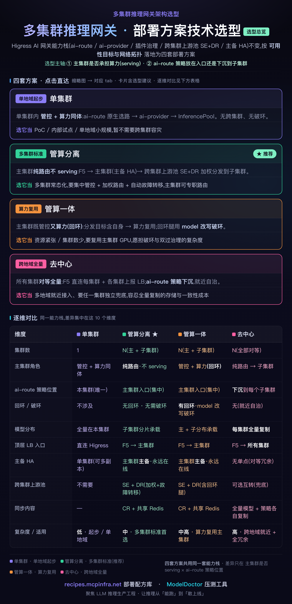
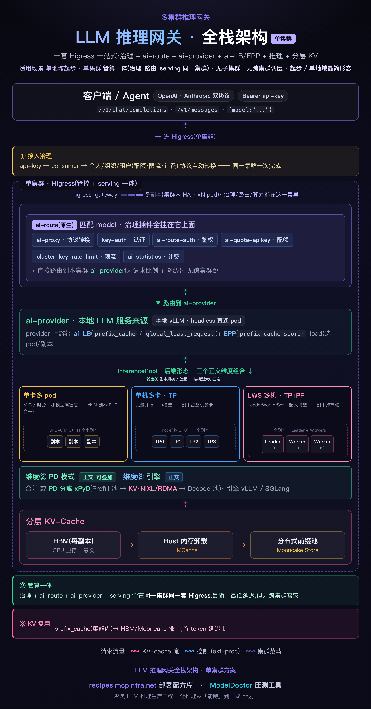
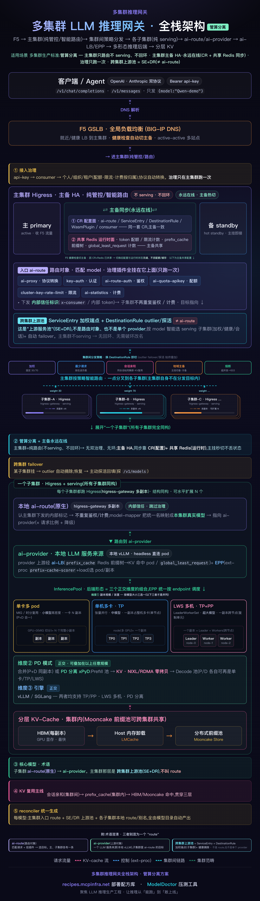
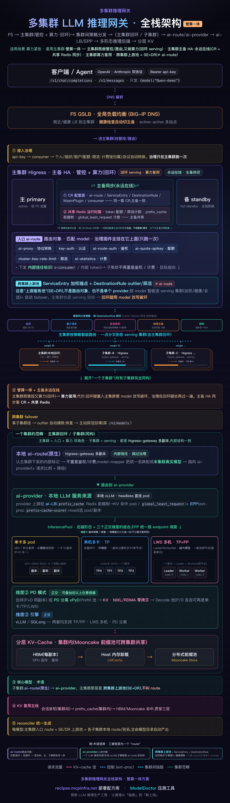
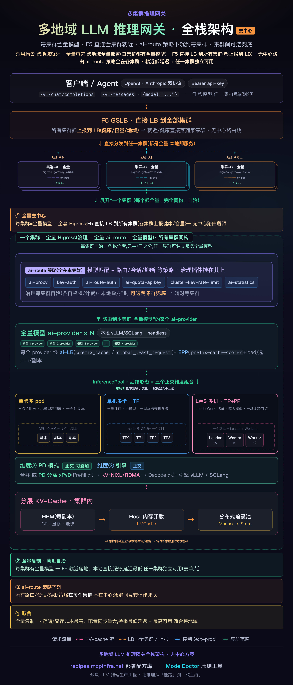

# Higress 推理网关多集群部署技术选型

> 从高可用、故障转移,到同城多活、异地灾备 —— 一套 Higress 能力栈保持不变,按**可用性目标**与**业务场景**,选不同的网络拓扑和 ai-route 策略位置,落成四套部署方案。跨集群加权与故障转移**全声明式、零 EnvoyFilter**,已在主集群 + 子集群双集群真实 vLLM 跑通。本文按技术选型调研的方式展开:先给选型框架,再逐套讲清「什么场景、为什么这么选、方案内有哪些路由策略、各自代表什么、如何取舍」。

---

## 一、先问一个问题:推理服务多集群,怎么选型?

单集群把模型跑起来不难。难的是它要**上生产**——这一步绕不开 SRE 的老问题:可用性做到几个 9、故障域(blast radius)怎么切、单点挂了怎么转移、容灾要不要跨地域。

推理服务比普通无状态服务还多两条硬约束,直接影响拓扑决策:

- **GPU 算力贵**:副本不能像 web 服务那样随便堆,算力放哪、复不复用,是成本与可用性的第一权衡。
- **KV-Cache 有状态**:同一会话落到同一副本才能复用前缀缓存,路由必须能做会话亲和,否则多轮对话成本翻倍。

把这两点摊开,多集群选型其实**只有两根轴**,而这两根轴恰好各对应一个 SRE 决策:

1. **主集群自己要不要承担算力(serving)?** —— 决定**控制面与数据面是否隔离**。分开,则网关故障不牵连推理、推理过载不拖垮路由,blast radius 天然收窄。
2. **ai-route 策略放主集群入口,还是下沉到每个子集群?** —— 决定**故障域的自治程度与就近能力**。下沉得越彻底,越接近同城多活 / 异地灾备。

两轴一交叉,落成四套方案,可用性从「单点起步」一路铺到「异地灾备」。下面这张图是选型的总坐标系:



四套方案共用同一条能力栈(ai-route / ai-provider / 治理插件 / ai-LB + EPP / P/D 分离 / 分层 KV),**差异只在拓扑和「策略放哪」**。所以选型不是选能力,是选**故障域怎么切、可用性做到哪一级、愿意为此付多少算力和复杂度**。逐套来看。

---

## 二、方案一 · 单集群:起步基线,先不谈跨集群容灾



一套 Higress 同时做**治理 + serving**,客户端直连,ai-route 原生选路到本地模型。没有跨集群、没有回环、不需要破环改名——它是后面三套方案的地基。

**取舍**:结构最简单,但它**没有跨集群高可用**,整套就是一个故障域,集群挂了就是全挂。所以它的定位很清楚:先把业务跑通,把容灾这件事**留到下一阶段**再谈。

> **选它当**:最小 MVP、内部试点、单地域起步,暂时不需要跨集群容灾。

---

## 三、方案二 · 管控算力分离(推荐):控制面/数据面隔离 + 主备高可用



这是把 SRE 的「故障隔离」直接落到网关分层上,也是多集群生产的**标准解**:

- **主集群退化为纯路由,不 serving**——它只做控制面(接入治理、鉴权计费、智能选路),算力全在子集群。控制面和数据面**物理隔离**,推理过载不会拖垮路由,路由抖动也不影响正在跑的推理。
- **控制面主备 HA,永远在线**:主备两台 Higress,配置面靠同一套 CR 保持一致、运行时面靠共享 Redis 同步(token 配额、限流计数、prefix_cache 前缀树、global_least_request 计数)。F5 健康检查一旦发现主挂,秒切到备,**切换后配置与运行态无缝、不丢配额/缓存**——这就是高可用。
- **子集群跑模型,跨集群上游池做故障转移**:主集群用 ServiceEntry + DestinationRule 组一个跨集群加权池,按加权 / 健康 / 会话把请求分发到各子集群;某个子集群挂了,outlier detection **自动把它摘除**,恢复后探活**自动回填**——这就是故障隔离 + 故障转移。
- 因为主集群**不 serving**,请求不会回到主集群本身,**无回环、无需破环**——这是它比「管控算力一体」更干净的根本原因。

**取舍**:多一组专职路由的主集群(不吃 GPU,成本低),换来控制面与数据面彻底解耦、故障域清晰、切换与转移全自动。对绝大多数要长期运营的多集群场景,这是**默认推荐**。

> **选它当**:多集群常态化,要集中管控 + 加权路由 + 自动故障转移,且希望控制面与算力互不牵连。

---

## 四、方案三 · 管控算力一体:算力复用,代价是回环破环



与方案二**同构**,只有一处不同:主集群**既路由又自己跑模型**。跨集群上游池的端点里包含主集群自身(本地回环端点),于是一部分请求会**回环**到主集群的推理服务。

- 好处很直接:**省一组子集群,把主集群的 GPU 也用满**,算力复用率最高。
- 代价是回环带来的复杂度:请求重入主集群网关,治理插件会**再过一遍**;而且回环腿必须**破环**,否则入口会无限自我命中、死循环。实测推荐用 **model 名改写**破环(下文详述)。

主备 HA 与故障转移机制和方案二完全一致——它牺牲的是「干净」,换来的是「省」。

**取舍**:用架构复杂度(破环 + 双重治理)去换算力成本。当集群数少、GPU 紧张、又不想为路由单独养一组集群时,这套划算。

> **选它当**:资源紧张 / 集群数少,愿意复用主集群 GPU、接受破环与双重治理的复杂度。
>
> *(下文「落地」一节实测的就是这套:主集群网关既是入口,又以本地回环端点承担 30% 算力。)*

---

## 五、方案四 · 去中心:同城多活 / 异地灾备



每个集群都部署**全量模型 + 全套 Higress**,F5 直连就近入口,无中心路由跳转;ai-route 策略**下沉到各集群自治**。集群之间只在本地异常 / 溢出时互相兜底。

这套对应的是 SRE 谱系里可用性最高的一档:

- **同城多活**:多个集群同时对外服务,F5 就近分流,任一集群整体故障,流量就近漂移到其它集群,用户几乎无感。
- **异地灾备**:跨地域各放全量副本,一个地域整体失联,另一地域独立顶上——因为每集群都是完整自治单元,没有中心依赖。

**取舍**:可用性和就近延迟拉满,代价是**全量复制**——每个集群都要放整套模型,存储 / 显存成本最高,数据一致性也要额外维护。

> **选它当**:多地域就近接入 + 全量容灾,能容忍全量复制的成本。

---

## 六、落地:全声明式,零 EnvoyFilter(已实测)

前面反复提到的「跨集群加权 + 故障转移」,落到配置上没有一条 EnvoyFilter,就**三个 CR**(都 apply 在主集群):

```yaml
# ① ServiceEntry —— 加权池,端点 = 各集群"网关"(不是 vLLM;地址为示例占位)
endpoints:
  - {address: <主集群网关>, ports: {http: 80},    weight: 30}   # 本地回环
  - {address: <子集群网关>, ports: {http: 30888}, weight: 70}
# ② DestinationRule —— outlier 故障转移
outlierDetection: {consecutiveGatewayErrors: 3, interval: 10s,
                   baseEjectionTime: 30s, maxEjectionPercent: 100}
# ③ Ingress —— HA 入口 + 破环改写
```

- **权重在 SE、故障转移在 DR**:SE 管「分多少」,DR 管「坏了怎么办」,合起来 = 加权 + 自动 failover。这是把「负载均衡」和「故障转移」两个 SRE 动作拆到两个 CR、各自可独立调。
- **破环(管控算力一体才需要)**:HA 入口按「客户端发的名字」匹配,回环腿不能再命中它。实测推荐用 **model 名改写**——客户端发标准 `{model: Qwen-demo}`(无需带特殊 Host),入口匹配 `Qwen-demo`、经 model-mapper 改成本地 canonical 名 `Qwen-test` 后转发;回环腿带 `Qwen-test` 只命中本地别名,不再自我命中,死循环消失。
- **统一 canonical 名**:各集群把 `Qwen-test` 映射到本地真实部署名(各集群后端可不同)——这是「跨集群用同一个名字做 failover」的前提。
- 部署只需装 Istio CRD(**含 v1**)+ 重启 higress-controller;`enableIstioAPI` 默认开、Pilot 自动 reconcile,**不装 Istio 组件、不改 values**。

**实测(主集群 + 子集群,真实 vLLM)**:正常按 30/70 分发;把子集群打死 → outlier 自动摘除 → 流量切到 100/0(仅摘除瞬间少量失败);子集群恢复 → 自动回填 ~30/70。全程 0 死循环。这验证了故障转移链路真的能自动收敛。

---

## 七、方案内的路由策略:换一个 DestinationRule 就换一种取舍

选定拓扑之后,真正决定「流量怎么分、坏了怎么办」的,是 DestinationRule 里的 `loadBalancer`。池子端点和入口都不动,**只覆盖这一段**就即时切策略。这五种策略与上面四套拓扑**正交**(任意叠加),每一种对应一个明确的 SRE 目标:

| 路由策略 | DestinationRule 配置 | 代表什么(SRE 目标) | 如何取舍 | 实测 |
|---|---|---|---|---|
| 加权轮询 | `simple: ROUND_ROBIN` + SE 权重 | 按容量固定配比 / 灰度放量 | 比例可控,但不感知实时负载 | ✓ 30/70 |
| 最少请求 | `simple: LEAST_REQUEST` | 负载均衡 · 防单点热点 | 自适应负载,但优势只在并发下显现 | ✓ 并发下显差异 |
| 会话亲和 | `consistentHash: {httpHeaderName: x-session-id}` | 有状态一致性 · KV 复用 | 多轮省成本,但可能牺牲均衡 | ✓ 固定 session 20/20 全粘 |
| 熔断过载 | `connectionPool: {http2MaxRequests: N}` | 过载保护 · 防雪崩 | 保住存活实例,超限请求被快速拒 | ✓ 限 1 并发 → ~28×503 |
| 地域主备 | `localityLbSetting: {failover: 主地域→备地域}` | 同城多活 / 异地灾备(冷备) | 就近优先、故障漂移,需 region 标签 | ⚠ 需 region 标签 · 未实测 |

几点权衡值得展开:

- **会话亲和**对 LLM 最有价值也最干净:固定 `x-session-id` 的 20 个请求 100% 粘同一集群 → 端到端 KV 复用,多轮对话成本大幅下降。代价是极端情况下负载可能不均——用它是拿「均衡」换「一致性 + 成本」。
- **最少请求**的优势只在并发下才显现,顺序压测看不出差异;它是负载天然不均、要防某个副本被压垮时的选择。
- **熔断过载**是过载保护的最后一道闸:超过并发上限的请求直接快速失败(503),牺牲这部分请求,**保住存活实例不被打雪崩**。
- **地域主备**(`localityLbSetting`)是把 SRE 的「同城多活 / 异地灾备」交给 Istio 原生能力:就近地域优先,故障时按 region 漂移到备地域。它需要给节点打 region 标签,因此更适合已有明确地域规划的部署。

换句话说:**拓扑决定故障域和可用性上限,路由策略决定这个故障域内部怎么调度**。两者组合,才是一次完整的选型。

---

## 八、N 个模型 = 一个 reconciler

上面这套(SE / DR / Ingress / 本地别名)全部按 `<model>` 前缀派生。一个 reconciler 从「模型目录」(谁在哪些集群、权重多少、本地真实名)算出期望资源,**server-side apply 幂等下发 + 按标签 GC**:某集群扩缩容就 patch SE 端点(秒级生效),某模型下线就回收整组。于是「加权 + failover」不再是一次性手工配置,而是沉淀成平台的一类**标准产物**——每个模型一个独立池,互不干扰,天然可运维。

---

## 九、选型建议(按可用性目标倒推)

| 你的场景 / 可用性目标 | 选哪套 |
|---|---|
| 单地域起步 / 最小 MVP,暂不谈容灾 | 单集群 |
| 多集群常态、集中管控 + 自动故障转移,控制面与算力隔离 | 管控算力分离(推荐) |
| 算力紧、集群少,想复用主集群 GPU | 管控算力一体 |
| 多地域就近 + 同城多活 / 异地灾备 | 去中心 |

四套方案没有高下,只有是否匹配你的**集群数、地域分布、可用性目标与算力预算**。选型的正确姿势是:先定可用性目标(单点起步?自动故障转移?异地灾备?),再倒推拓扑,最后在拓扑内挑路由策略。

---

## 十、适用边界(踩过的坑)

- **主动探活(可选 EnvoyFilter)必须设 `http_health_check.host`**:否则 Envoy 拿 cluster 名当 `:authority`,`|` 会让网关 400 → 整池被误判为死。
- **端点 = 2 时**被动 outlier 要配 `healthy_panic_threshold: 0`(或改用主动探活);端点 ≥3 摘 1 个才不踩 panic 阈值。SE 权重和 = 100。
- **地域主备未实测**:靠节点 `topology.kubernetes.io/region` 标签,会影响节点上其它负载,未在生产强行打标;机制是标准 Istio,打标后即可用。
- **熔断 / 最少请求阈值是占位**,生产前按单集群真实容量与并发重新标定。
- **静态端点**:SE 里写死网关地址,地址变了要更新(靠 catalog 维护)。探针 token 若明文落在 EnvoyFilter 有安全隐患,生产用内部免鉴权健康路径 / 低权限 key。

---

## 关于作者

聚焦 LLM 推理的生产工程:让 vLLM / SGLang / MindIE 在国产卡、多集群网关(Higress)、P/D 分离下稳定落地。长期做推理编排(Dynamo / llm-d / AIBrix)、runtime 数据面验证、可观测性与 SRE。相关实践沉淀成部署配方库 **recipes.mcpinfra.net** 与压测工具 **ModelDoctor**。让推理服务从「能跑」到「敢上线」。

> 文中拓扑为能力编排参考,实测数字来自单次真实双集群验证,并非普适「标准答案」——换集群数 / 地域 / 模型规模,权重与阈值都要重标。欢迎拿你自己的环境复现、指正。


