# 昇腾 910B4 实测:Qwen3-32B 在 vLLM / MindIE / SGLang 上的吞吐、延迟与引擎内部指标

> 同一台 Ascend 910B4、同一个 Qwen3-32B、同一份 ShareGPT 真实流量,只更换推理引擎。c8–c128 五档并发,每档跑 3 次取中位数;除客户端指标外,同时采集 KV-cache 使用率与调度排队深度。本文给出全量数据与归因。

---

## 结论速览

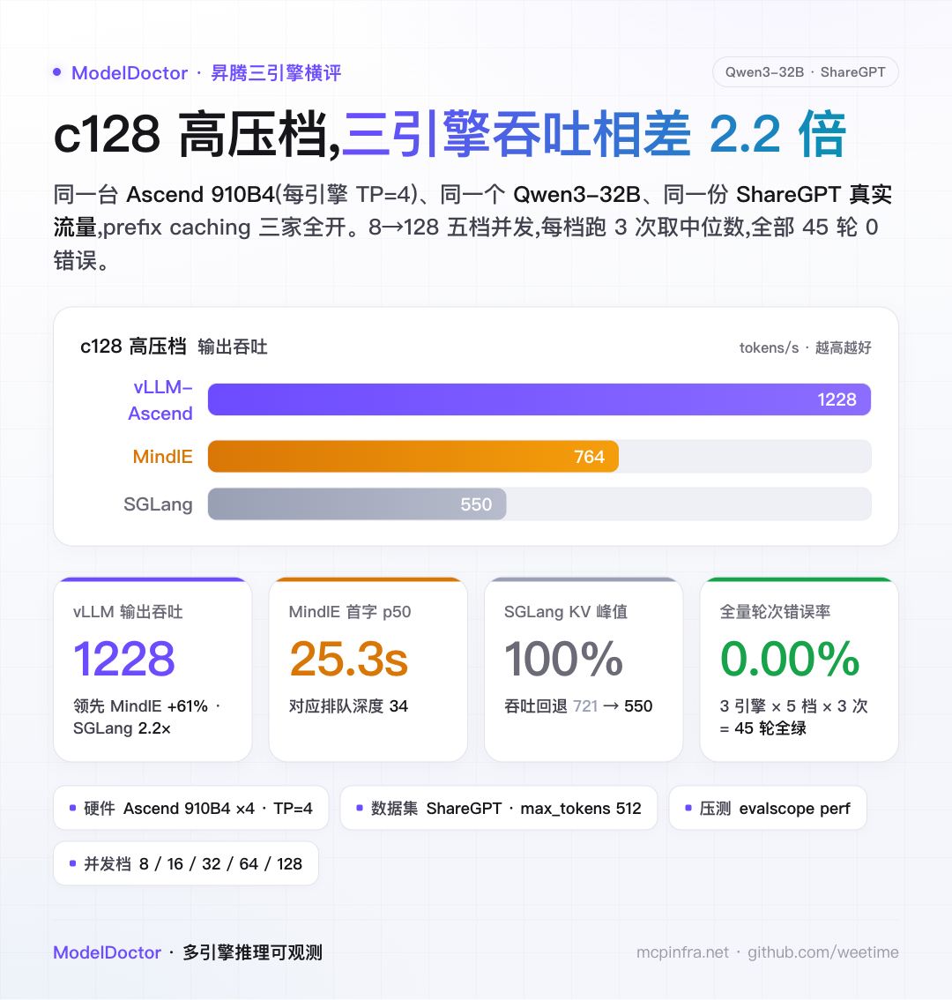

c128 高压档下的核心数据(基线 vLLM-Ascend):

- **输出吞吐**:vLLM 1228 tok/s、MindIE 764、SGLang 550,最高相差 2.2 倍;
- **TTFT p50**:vLLM 1.2s、SGLang 9.0s、MindIE 25.3s;
- **ITL p50**:vLLM 100ms、MindIE 106ms、SGLang 202ms;
- **引擎内部**:MindIE 调度排队深度 34、SGLang KV-cache 峰值 100%、vLLM 排队 3.1 / KV 均值 44.6%;
- 全部 45 轮(3 引擎 × 5 并发 × 3 次)errorRate = 0.00%。

下文按吞吐、延迟、内部归因三部分展开,每部分附本测试的原始图与全量数据表。

---

## 测试配置

| 项 | 取值 |
|---|---|
| 硬件 | Ascend 910B4 ×4(每引擎 TP=4,单副本,bf16) |
| 模型 | Qwen3-32B(同一份权重,thinking 关闭) |
| 数据集 | ShareGPT(evalscope `share_gpt_en`,seed=42,max_tokens=512) |
| 上下文 / 显存 | max-model-len 8192 · gpu-memory-utilization 0.9 |
| Prefix caching | 三引擎全部开启(对称) |
| 并发档 | 8 / 16 / 32 / 64 / 128,请求数 100 / 160 / 320 / 480 / 640 |
| 重复 | 每档 3 次取中位数(带预热) |
| 压测 / 内部指标 | evalscope perf · Prometheus `infer:*` 归一化 recording rule |
| 引擎版本 | vLLM-Ascend v0.18.0rc1 · MindIE 2.1.RC1-800I-A2 · SGLang 0.5.12.post1(cann8.5) |

唯一变量是引擎本身,三引擎喂入完全相同的请求序列。

---

## 一、吞吐与扩展性

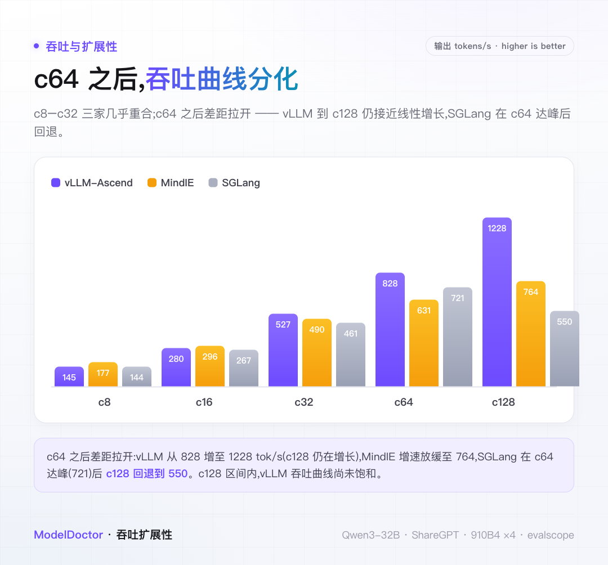

本测试原始图(输出吞吐 vs 并发):

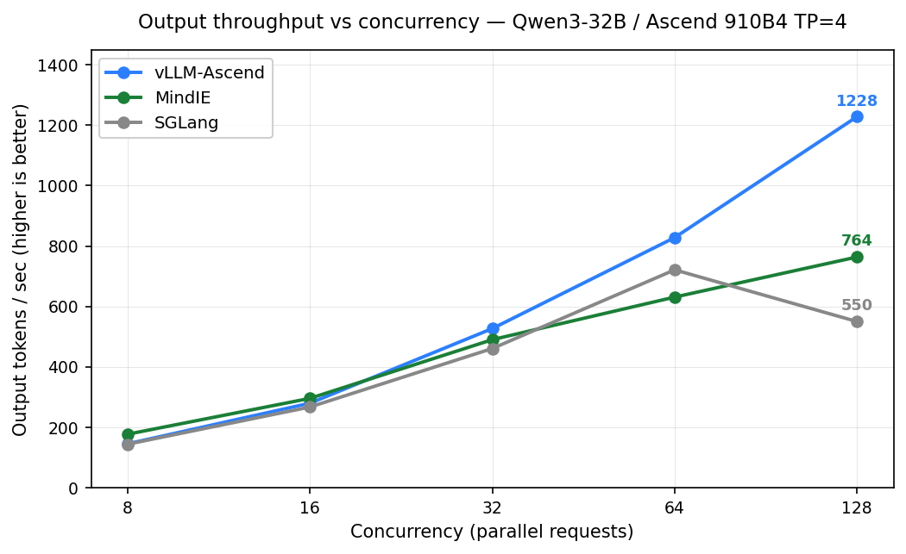

c8–c32 三引擎几乎重合(c32:vLLM 527 / MindIE 490 / SGLang 461)。c64 之后曲线分化:vLLM 从 828 增至 c128 的 1228 tok/s,该区间内仍接近线性、未饱和;MindIE 增速放缓至 764;SGLang 在 c64 达峰(721)后,c128 回退至 550。

---

## 二、延迟分布(TTFT / ITL / E2E)

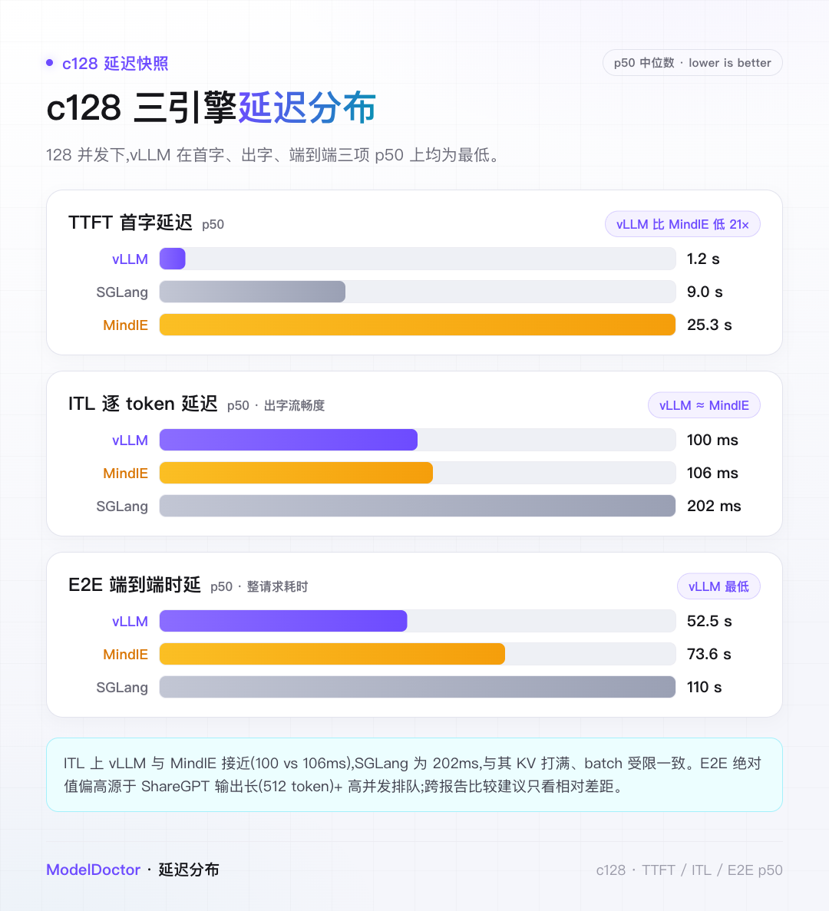

本测试原始图(p50 实线、p95 虚线随并发变化):

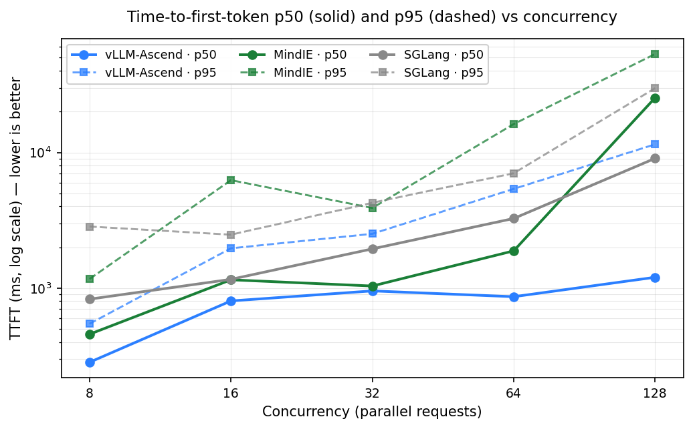
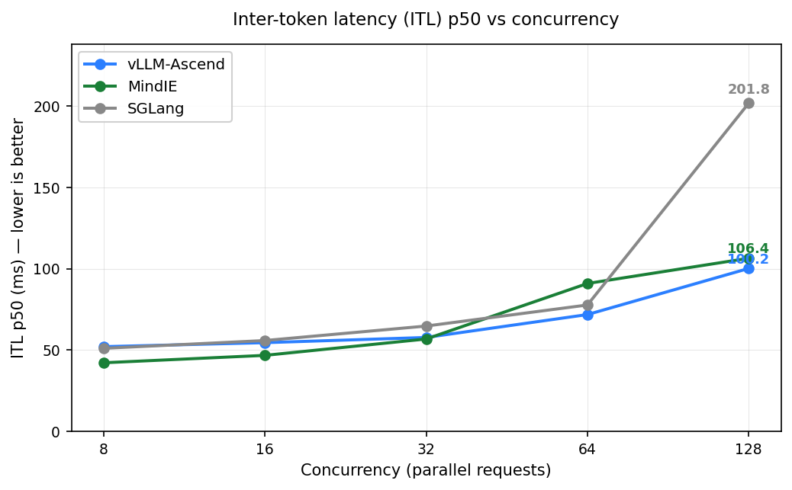
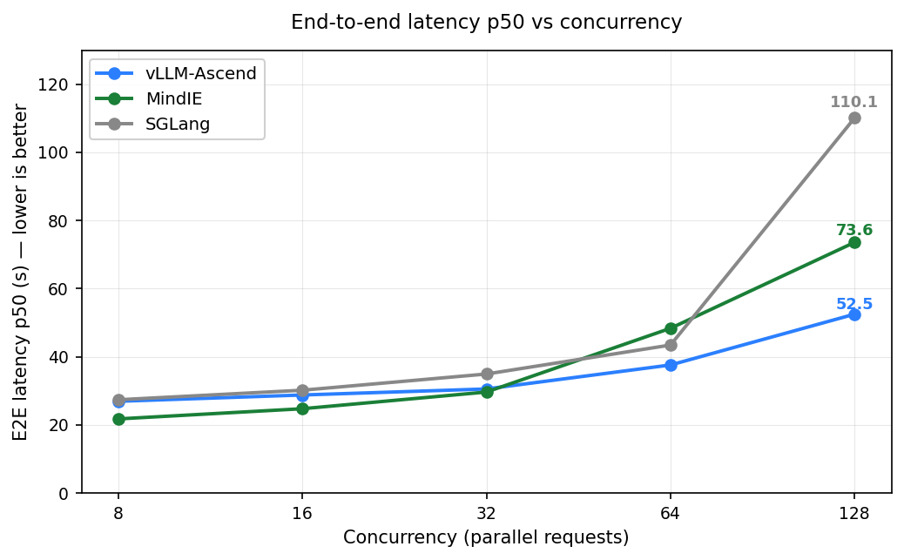

- **TTFT**:低并发三引擎接近(c8:vLLM 283ms / MindIE 456ms / SGLang 828ms);c64→c128 段 MindIE p50 由 1880ms 升至 25298ms,SGLang 升至 9041ms,vLLM 保持在 1200ms。
- **ITL**:vLLM 与 MindIE 全程接近(c128 为 100ms / 106ms);SGLang c128 为 202ms。
- **E2E**:c128 为 vLLM 52.5s < MindIE 73.6s < SGLang 110.1s。E2E 绝对值偏高源于 ShareGPT 输出长(512 token)+ 高并发排队,跨报告比较建议只看相对差距。

---

## 三、引擎内部归因(KV-cache 与排队深度)

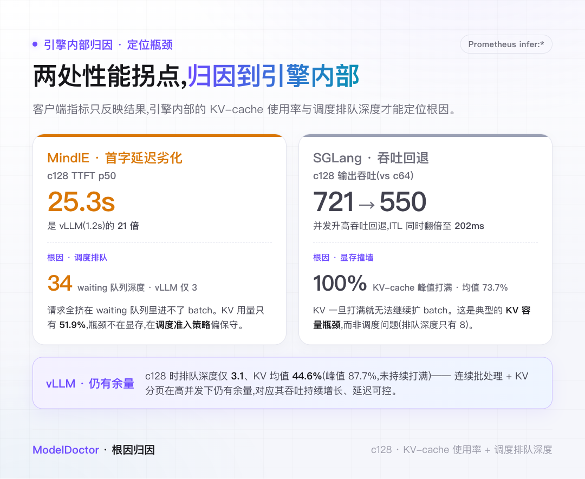

客户端指标只反映结果;KV-cache 使用率与调度排队深度用于定位根因。本测试原始图:

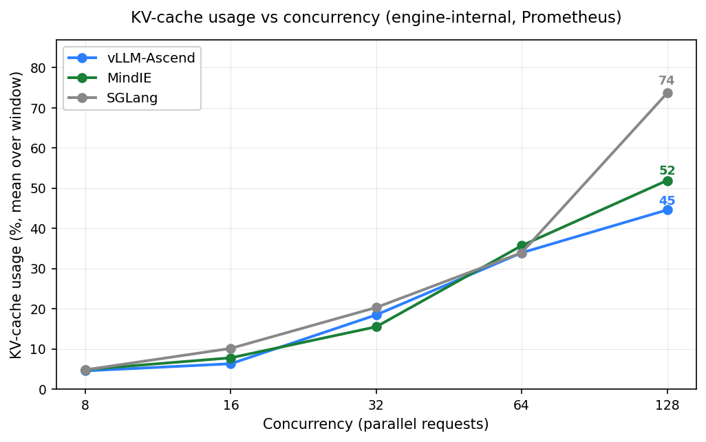
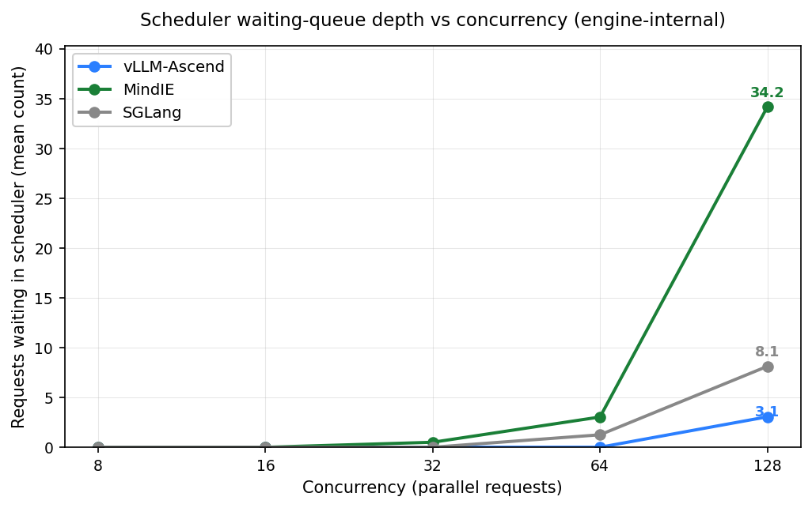

- **MindIE,c128 TTFT 25.3s**:对应调度 waiting 队列深度 34(vLLM 为 3),请求在队列中等待进入 batch;同档 KV 使用率 51.9%,未达上限,瓶颈出现在调度准入而非显存。
- **SGLang,c128 吞吐回退**:对应 KV-cache 均值 73.7%、峰值 100%,为三引擎最高;KV 打满后无法继续扩大并发 batch,吞吐由 721 回退至 550、ITL 同时升至 202ms。
- **vLLM**:c128 排队深度 3.1、KV 均值 44.6%(峰值 87.7%,未持续打满),仍有余量,对应其吞吐持续增长、延迟可控。三引擎抢占率(preemption)全程约 0。

---

## 全量数据矩阵

3 引擎 × 5 并发,均为 3 次中位数,errorRate 全 0.00%。粗体为该并发档输出吞吐最高者。

| 引擎 | 并发 | 输出 tok/s | RPS | TTFT p50 | TTFT p95 | ITL p50 | E2E p50 | KV 均值/峰值 | 排队深度 |
|---|---|---|---|---|---|---|---|---|---|
| vLLM | 8 | 145 | 0.29 | 283ms | 545ms | 52.1ms | 26.9s | 4.5 / 6.6% | 0 |
| MindIE | 8 | **177** | 0.40 | 456ms | 1166ms | 42.2ms | 21.8s | 4.9 / 6.9% | 0 |
| SGLang | 8 | 144 | 0.29 | 828ms | 2842ms | 51.1ms | 27.4s | 4.8 / 7.0% | 0 |
| vLLM | 16 | 280 | 0.56 | 803ms | 1963ms | 54.5ms | 28.8s | 6.3 / 8% | 0 |
| MindIE | 16 | **296** | 0.66 | 1150ms | 6245ms | 46.7ms | 24.7s | 7.8 / 11% | 0 |
| SGLang | 16 | 267 | 0.53 | 1159ms | 2474ms | 55.9ms | 30.2s | 10.1 / 14% | 0 |
| vLLM | 32 | **527** | 1.04 | 952ms | 2511ms | 57.7ms | 30.5s | 18.5 / 23% | 0 |
| MindIE | 32 | 490 | 1.08 | 1035ms | 3895ms | 56.8ms | 29.6s | 15.5 / 21% | 0.5 |
| SGLang | 32 | 461 | 0.91 | 1944ms | 4254ms | 64.8ms | 34.9s | 20.3 / 28% | 0 |
| vLLM | 64 | **828** | 1.64 | 863ms | 5386ms | 71.8ms | 37.6s | 33.9 / 46% | 0 |
| MindIE | 64 | 631 | 1.24 | 1880ms | 16191ms | 90.9ms | 48.4s | 35.7 / 46% | 3.0 |
| SGLang | 64 | 721 | 1.43 | 3258ms | 7023ms | 77.7ms | 43.4s | 34.0 / 49% | 1.2 |
| vLLM | 128 | **1228** | 2.43 | 1200ms | 11482ms | 100.2ms | 52.5s | 44.6 / 88% | 3.1 |
| MindIE | 128 | 764 | 1.51 | 25298ms | 53210ms | 106.4ms | 73.6s | 51.9 / 66% | 34.2 |
| SGLang | 128 | 550 | 1.09 | 9041ms | 29785ms | 201.8ms | 110.1s | 73.7 / 100% | 8.1 |

---

## 选型建议

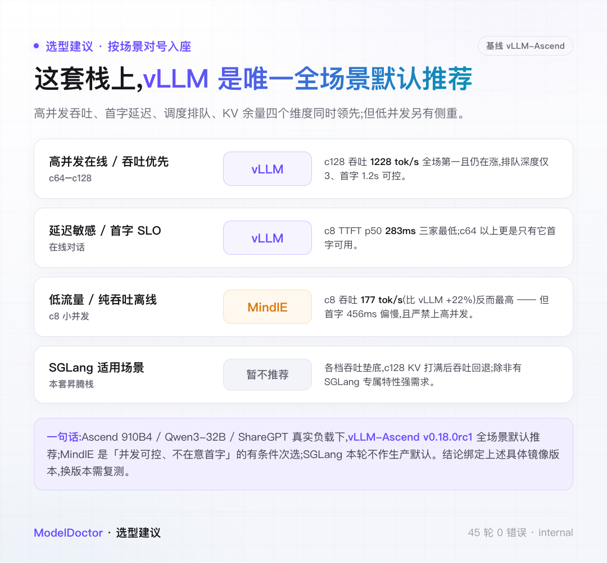

基于本测试(Ascend 910B4 / Qwen3-32B / ShareGPT)的数据:

| 场景 | 数据依据 |
|---|---|
| 高并发在线 / 吞吐优先(c64–c128) | vLLM c128 吞吐 1228 tok/s、排队 3.1、TTFT 1.2s |
| 延迟敏感 / 首字 SLO | vLLM c8 TTFT p50 283ms,三引擎最低 |
| 低流量 / 纯吞吐离线(c8) | MindIE c8 吞吐 177 tok/s(+22%),但 TTFT 456ms 偏高 |
| SGLang(本套昇腾栈) | 各档吞吐居末,c128 KV 打满后吞吐回退 |

---

## 适用边界

- **单副本单 TP 档**:每引擎固定 TP=4、单副本,结论不外推到多副本水平扩展或 PD 分离编排。
- **prefix-cache 命中率已剔除**:该指标在三引擎间归一化口径不一致,数据不可信,本测试不做对比。
- **KV / 排队为时间窗聚合标量(均值 + 峰值)**,用于趋势归因,不反映窗口内瞬时形态。
- **版本绑定**:结论绑定上表具体镜像版本;引擎迭代较快,换版本需复测。

---

## 关于作者

聚焦 LLM 推理的生产工程:让 vLLM / SGLang / MindIE 在国产卡、多集群网关(Higress)、P/D 分离下稳定落地。长期做推理编排(Dynamo / llm-d / AIBrix)、runtime 数据面验证、可观测性与 SRE。相关实践沉淀成部署配方库 **recipes.mcpinfra.net** 与压测工具 **ModelDoctor**。让推理服务从「能跑」到「敢上线」。

> 文中数字均来自单次真实压测,并非普适「标准答案」——换数据集 / 参数,结论可能就变。欢迎拿你自己的流量复现、指正。

