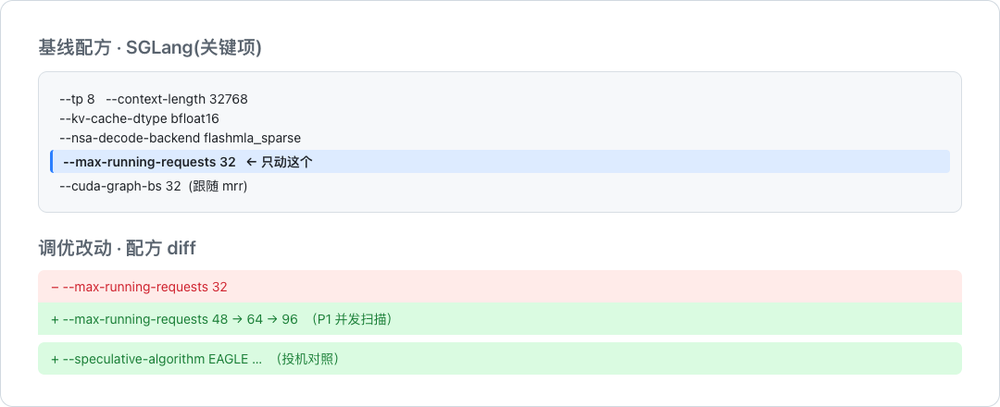
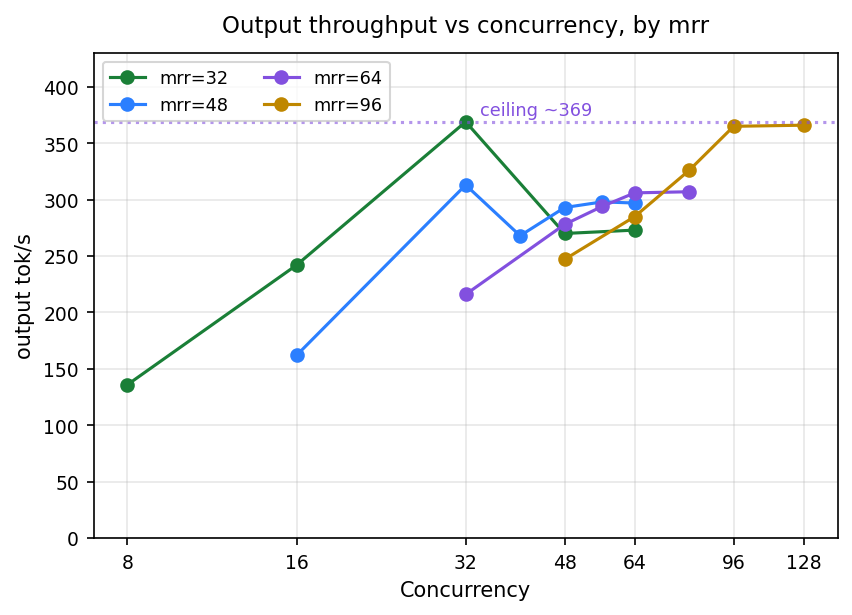
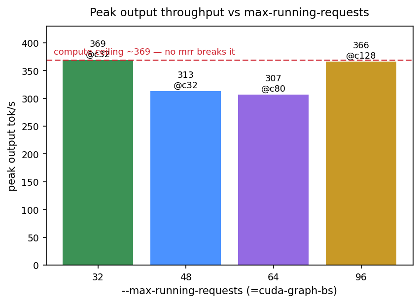
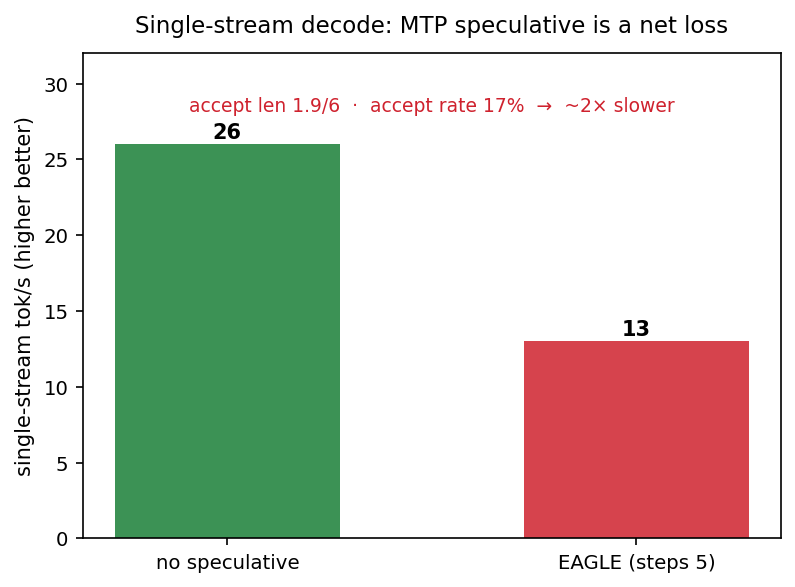

# GLM-5.2-W4A8 × SGLang @ 8 卡 PPU：部署与性能调优

> 固定硬件与模型,用「一次一因子」量化 SGLang 调参对吞吐/延迟的影响,并观察单副本的算力边界在哪。本文记录环境、方法、实测数据与作用域,供复现与判断。

## 摘要

- 在固定的 **8 卡 PPU-ZW810E(sm80 / Ampere 级)+ SGLang 0.5.12** 上部署 **GLM-5.2-W4A8**(744B 总参 / 39B 激活的 MoE,DeepSeek-V3.2 式 DSA 稀疏注意力)。
- **Chat 基线**:单副本峰值输出 **~369 tok/s**(并发 32),单流 ~25 tok/s,低延迟区间在并发 ≤8;超过并发 32,首字延迟从 0.66 秒骤升到 15、30 秒。
- **参数调优(P1)**:把并发上限 `max-running-requests` 从 32 抬到 48/64/96,峰值吞吐**没有一档突破 369**——GLM 在并发 32 已使 8 卡算力饱和,提上限是负优化。
- **投机解码(MTP/EAGLE)**:开了反而慢 2×,草稿接受率仅约 17%。
- **口径**:基线每点 3 次取中位(轮间抖动 <1.5%);测量在共享服务上进行。

## 一、目的与假设

很多部署沿用默认参数上线。默认参数是稳妥的基线;本实验想在固定的 8 卡硬件与模型下,弄清**给定 SLO 后单副本是否存在定向优化空间,以及瓶颈落在哪里**。

**假设**:基线 `max-running-requests=32`(本次设定)的并发拐点是配置画出的,而非硬件极限;像小模型那样上调并发上限,应能把 SLO 内峰值吞吐推高,存在一个甜点。后文会看到,对这个大模型,这个假设**不成立**——瓶颈换了位置。

## 二、环境(可复现契约)

| 项 | 值 |
|---|---|
| 硬件 | PPU-ZW810E ×8 · 单节点 · sm80 / Ampere 级 · 96GB/卡 · 无 FP8 |
| 引擎 | SGLang 0.5.12(sail 镜像) |
| 模型 / 量化 | GLM-5.2-W4A8 · mixed_precision_w4 · 744B/39B 激活 · DSA 稀疏注意力 |
| 归因数据 | SGLang `/metrics` + 客户端 evalscope |

**完整启动命令**(可复现基线;参数调优即在此命令上单因子改动 `--max-running-requests`):

```bash
python3 -m sglang.launch_server \
  --model-path /model/GLM-5.2-W4A8 \
  --served-model-name GLM-5.2-W4A8 \
  --host 0.0.0.0 --port 8000 \
  --tp 8 \
  --trust-remote-code \
  --enable-metrics \
  --context-length 32768 \
  --kv-cache-dtype bfloat16 \
  --nsa-prefill-backend flashmla_sparse \
  --nsa-decode-backend flashmla_sparse \
  --mem-fraction-static 0.75 \
  --chunked-prefill-size 8192 \
  --max-running-requests 32 \
  --cuda-graph-bs 32 \
  --disable-piecewise-cuda-graph \
  --reasoning-parser glm45 \
  --tool-call-parser glm47
```

其中:该模型为 DSA 稀疏注意力,NSA 的 prefill/decode 后端统一用 `flashmla_sparse`;量化从模型 config 自动识别,不显式传 `--quantization`;思考的开关是**每请求参数** `chat_template_kwargs.enable_thinking=false`,不进启动参数。工具调用经验证正常(`finish_reason=tool_calls`,支持一轮并行多工具)。

**这次只动两组参数,其余全部固定**(下图 diff 标出改动):



- **P1(主实验)**:一次一档,只把 `mrr`(max-running-requests)从 32 抬到 48 / 64 / 96(`cgb` 同步),量它对峰值吞吐的影响。
- **投机对照**:在基线上单独加一组 EAGLE flag(`--speculative-algorithm EAGLE --speculative-num-steps 5 ...`)。
- 其余 flag(TP、量化、上下文、KV dtype、nsa 后端、mem-fraction……)全程不变。

## 三、方法

**实验设计(一次一因子 OFAT)**

| 维度 | 设置 |
|---|---|
| 搜索方式 | OFAT,一次只动一个因子 |
| 被调参数 | `max-running-requests` = 32 / 48 / 64 / 96(`cuda-graph-bs` 跟随) |
| 固定项 | `mem-fraction-static` 0.75 · TP 8 · 上下文 32768 · nsa 后端 flashmla_sparse |

**负载、指标与口径**

| 项 | 设置 |
|---|---|
| Chat 负载 | evalscope perf · ShareGPT · 输入 ~800 / 输出 256·1024 token · 流式 |
| 关思考 | `enable_thinking=false`(已验证 reasoning_tokens=0)· 输出形状可控、可对比 |
| 分词器 | GLM-5.2 本体 tokenizer(挂载,非近似) |
| 指标 | 输出吞吐 tok/s · TTFT · ITL · TPOT · E2E · p50/p95/p99 |
| 采样 / 重复 | `seed=42` · temp=0 · 基线每点 **3 次取中位**(轮间抖动 <1.5%) |

## 四、结果

### 4.1 基线:峰值在并发 32,超过即过载



基线配置(`max-running-requests=32`)在不同并发下:输出吞吐在**并发 32 达峰 369 tok/s**,超过后不升反降(并发 48/64 回落到约 270),而首字延迟从 0.66 秒急剧上升到 14.9 秒、30.5 秒——因为该配置把在跑请求锁在 32,更多请求只能排队。单流(并发 1)约 25 tok/s;低延迟区间在**并发 ≤8**(TTFT<0.5s、ITL~50ms)。

作为横向参照:同一批卡、同一引擎上,更小的 DeepSeek-V4-Flash(约 9B 激活)峰值可达 568 tok/s——GLM-5.2 约为其 65%,差距主因是**激活参数大 3.3 倍**,不是量化差。

### 4.2 抬高并发上限:没有一档突破 369



把 `max-running-requests` 逐档放开到 48/64/96,取每档峰值吞吐:

| mrr | 峰值 tok/s | @并发 | 峰值时 TTFT p50 | 峰值时 ITL p50 |
|--:|--:|--:|--:|--:|
| **32(基线)** | **368.9** | 32 | 664ms | 59.7ms |
| 48 | 313.1 | 32 | 888ms | 72.8 |
| 64 | 307.2 | 80 | 18.5s | 89.2 |
| 96 | 366.4 | 128 | 25.2s | 104.5 |

**四档全部收敛到 307–369,没有一档突破基线的 369**;mrr96 勉强追平(366),但要把并发堆到 128、首字延迟到 25 秒才够。基线 mrr32 在吞吐和延迟上双赢。

**为什么与小模型相反?** 小模型(DeepSeek-Flash)在同并发下没吃满算力,抬上限能 +45%;GLM-5.2 激活 39B,**并发 32 已使 8 张卡算力饱和**,再放并发进来不但不涨,还因 `cuda-graph-bs` 增大带来固定开销把吞吐拉低。**~369 tok/s 是这 8 张卡对该模型的硬算力天花板,调参突破不了。**

### 4.3 投机解码(MTP/EAGLE):负优化



GLM-5.2 自带 NextN/MTP 头,官方配方默认开 EAGLE 投机。实测(steps 5 / draft 6,官方数字):单流从 ~26 tok/s **掉到 ~13 tok/s(慢 2×)**。归因:草稿每步投 6 个 token,只有约 1.9 个被接受(接受率约 **17%**);草稿开销(5 次 MTP 前向 + 验证)远大于这点收益。根因是 **W4A8 量化把 MTP 草稿头压坏了**,命中率天生低,调 num-steps 救不回来。

### 4.4 输出长度的影响

把输出从 256 提到 1024(同为基线配置):长输出的聚合吞吐反而更高(并发 32:419 vs 369 tok/s——decode 占比更大、批处理更满),且高并发不过载(长请求周转慢、prefill 压力小)。可见吞吐/延迟的权衡还取决于输出长度这一负载形状。

## 五、分析 / 归因

- **算力天花板**:decode 吞吐随「激活参数量 × 每参数字节数」线性变——用 GLM 与 DeepSeek 的规模比可精确对上实测的 ~1.8× 慢,说明单流基本是带宽/kernel 主导,不是并发不够。
- **提 mrr 负优化**:GLM 在并发 32 已算力饱和,更高上限只加排队 + cuda-graph 固定开销。
- **投机失效**:W4A8 下 MTP 草稿头接受率仅 17%,投机净亏。
- **硬件约束**:这颗 PPU 对外 sm80(Ampere 级),**无 FP8**;W8A8 每 token 多读一倍字节、单流更慢;**W4A8 已是这颗卡上的最优格式**,单流慢卡在 W4A8 kernel 尚未充分优化。

## 六、局限与有效性威胁

- **共享服务**:测量在共享推理服务上进行,可能受少量其它流量影响。
- **P1 单轮**:基线为 3 次中位,P1 各 mrr 档为单轮(≥300 请求/点,p95 已稳)。
- **仅 Chat 短输入**:本次只测 ShareGPT(输入 ~800);Agent 长输入(prefill 重)未覆盖。
- **关思考口径**:主表关思考,测的是引擎能力,而非线上开启思考(thinking-on)时的真实负载。
- **未采集**:PPU 设备利用率未采集,算力饱和由吞吐间接推断。

## 七、结论(带作用域)

- **单副本最优 = 基线 mrr32,不用调。** 峰值 ~369 tok/s、单流 ~25 tok/s、低延迟区间并发 ≤8。
- **~369 tok/s 是 8 卡对 GLM-5.2 的硬算力天花板**,三条调参路(提 mrr、投机、换 8-bit 量化)全部证明突破不了。
- **要更高吞吐 = 加卡(多副本)**,靠调参做不到;要更快单流 = 等 W4A8 kernel 优化或换更小模型。

## 八、后续规划

按优先级:

1. **2 副本(16 卡)聚合吞吐**:空闲的另 8 卡起独立实例 + 前置路由,验证聚合吞吐能否 ~2×(~740 tok/s)。
2. **Thinking-on 真实负载校准**:补测开启思考(reasoning)时的负载,量真实 TTFT / 每 token 延迟的放大倍数。
3. **W8A8 权重 → 投机复评**:若拿到 INT8 权重(草稿头不被压坏),重评 MTP 投机是否转正 + 单流对比(需自量化 BF16→INT8)。
4. **长上下文 / prefill 调优**:针对 Agent 长输入扫 `chunked-prefill-size` 与调度参数(本次只测 Chat 短输入)。
5. **PD 分离**:agent 长输入的根本解法,拆分 prefill/decode 池;先做可行性验证再投入。
6. **W4A8 kernel 优化跟进**:单流天花板靠这个;或换 Qwen3-Coder-30B-A3B 这类激活参数更小的模型。

---

## 关于作者

聚焦 LLM 推理的生产工程:让 vLLM / SGLang / MindIE 在国产卡、多集群网关(Higress)、P/D 分离下稳定落地。长期做推理编排(Dynamo / llm-d / AIBrix)、runtime 数据面验证、可观测性与 SRE。相关实践沉淀成部署配方库 **recipes.mcpinfra.net** 与压测工具 **ModelDoctor**。让推理服务从「能跑」到「敢上线」。

> 文中数字均来自单次真实压测,并非普适「标准答案」——换数据集 / 参数,结论可能就变。欢迎拿你自己的流量复现、指正。


