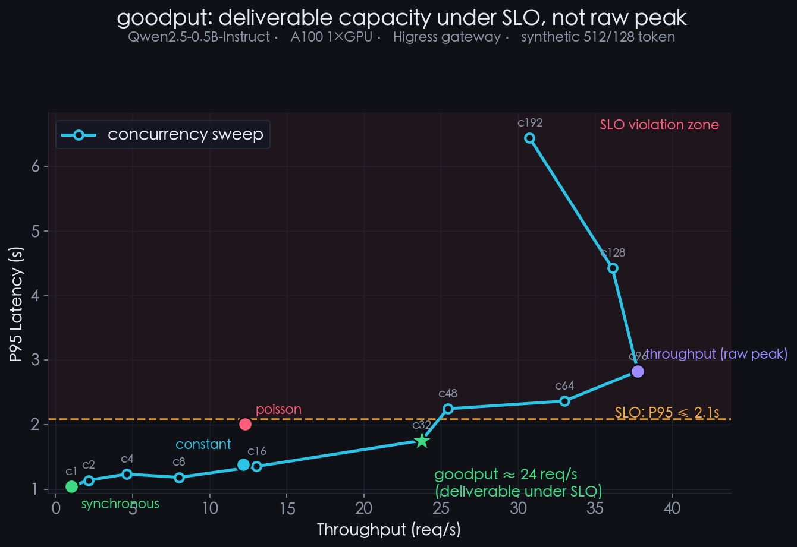
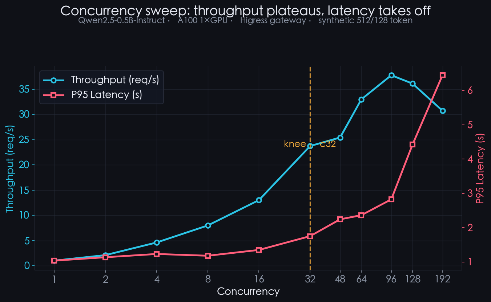
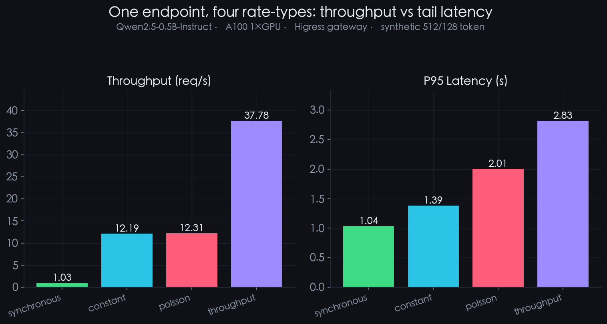
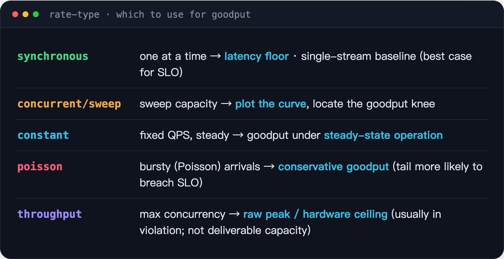
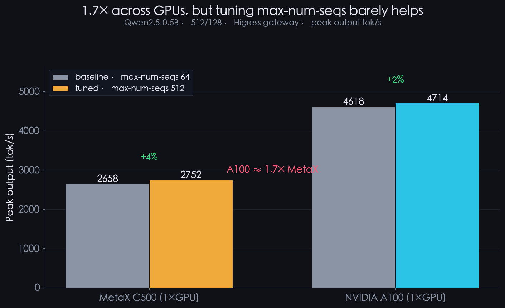
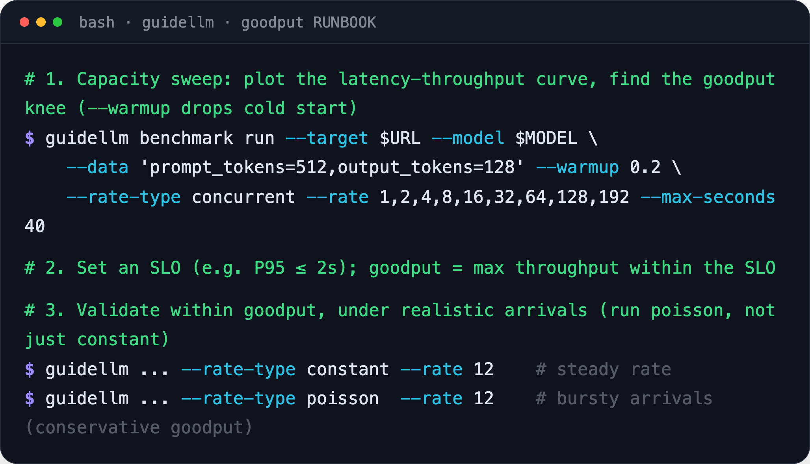

# 私有化小模型快速摸底,带你熟悉压测工具 GuideLLM

> **《私有化部署大模型服务 · 性能测试工具》系列 · 第 4 篇**
>
> 私有化部署上线前需要回答一个问题:服务在 SLO 约束下能交付多少产能。常见做法是报峰值 throughput,但峰值往往包含大量已违反 SLO(延迟超标)的请求,并非可交付产能。本文用 vLLM 官方压测器 **GuideLLM** 绘制 latency-throughput 曲线,评估 SLO 约束下的有效吞吐(**goodput**)。方法为主、工具中立;绝对值随模型、引擎、硬件、网关而变,以自身口径为准。

上图是全文骨架:一条并发扫描曲线,一条 SLO 线;线以下是可交付的 goodput(绿星),线以上为违约区,裸峰值(紫点)落在其中。下面逐段展开。

---

## 0 · GuideLLM 简介

GuideLLM 是 vLLM / Neural Magic 生态的参考压测器:一条 `guidellm benchmark run` 对 OpenAI 兼容端点发压,指标口径完整、可复现。两项能力直接服务于 goodput 评估——内置合成负载(`--data` 精确锁定输入/输出 token 形状,无需数据集即可复现)、以及 **rate-type** 家族(决定请求以何种方式注入,直接影响所测得的 goodput)。同类工具还有 evalscope、AIPerf、vllm bench serve,可依引擎生态选择。

> 本次实测:**Qwen2.5-0.5B-Instruct**,部署于 **NVIDIA A100 单卡**,经 Higress 网关暴露为 OpenAI 兼容端点;合成负载 input 512 / output 128 token;GuideLLM 0.4。绝对值仅对该软硬件组合成立,方法可迁移至任意端点。

---

## 1 · 绘制 latency-throughput 曲线

以 `--rate-type=concurrent` 将并发从 1 扫至 192,观察 throughput 与 latency 随并发的变化:

- **throughput**:自并发 1 的 1 req/s 持续上升,并发 96 处达到峰值约 38 req/s。
- **P95 latency**:低并发区几乎不变(约 1s),越过某点后急剧上升,最终超过 6s;并发 128、192 时系统进入过饱和,throughput 不升反降。

关键在于:**throughput 的峰值与 latency 的崩溃并不出现在同一并发点。** 二者之间的落差,正是 goodput 的意义所在。

---

## 2 · goodput:SLO 约束下的最大 throughput

设定 SLO,例如 **P95 latency ≤ 2s**(约为单请求基线 1.04s 的 2 倍),将其画到 latency-throughput 曲线上(见首图):

- **SLO 线以下**:latency 达标,请求可交付。SLO 内可达到的最大 throughput 即 **goodput ≈ 24 req/s(并发 32)**,是该服务在保障体验前提下的产能。
- **SLO 线以上(违约区)**:throughput 仍可升至裸峰值约 **38 req/s**,但该处 P95 已达 2.8s,过饱和后进一步升至 6.4s——这些请求全部违约,不可交付。

**若上线前以裸峰值 38 而非 goodput 24 作为产能,将高估约 60%。** 据此规划副本、制定 SLA,会在真实流量下被击穿。goodput 与裸峰值之间的差距,即「能运行」与「可上线」的区别。

---

## 3 · rate-type 影响所测得的 goodput

goodput 并非固定值——**施压方式(rate-type)不同,测得的 goodput 也不同**,这是最易被忽略的变量。

将 `constant`(匀速)与 `poisson`(泊松突发,贴近真实到达)均设为 12 req/s 的稳态点:均值相同,仅到达节奏不同。结果——**constant 的 P95 为 1.39s,poisson 升至 2.01s,已逼近 SLO 线。** 即同一负载下,到达一旦呈突发,尾延迟更易越过 SLO,真实可交付的 goodput 随之降低。

**因此评估 goodput 应采用贴近真实到达的 `poisson`;`constant` 匀速给出的是乐观上界。** 各 rate-type 在 goodput 评估中的分工:

---

## 4 · 基于 goodput 的容量规划

得到 goodput 后,容量规划有了正确的分母:

**副本数 = 目标 QPS ÷ 单副本 goodput**(而非 ÷ 裸峰值)

以 goodput 24 计,承载 100 QPS 约需 5 副本;若误以裸峰值 38 计,仅规划 3 副本,上线即违约。**以 goodput 规划方有安全余量;以裸峰值规划则埋下容量隐患。**

---

## 5 · 换硬件、调参数:两组对照

在同一方法下,进一步做两组对照——更换硬件(国产 **MetaX C500** ↔ **A100**),以及调整常被优先尝试的参数(`--max-num-seqs` 由 64 增至 512):

- **硬件差异真实,但幅度有限** —— A100 峰值约为 MetaX C500 的 **1.7×**(4618 vs 2658 output tok/s),反映两者的算力差。
- **调整 `--max-num-seqs` 几乎无效** —— 0.5B 模型 KV cache 很小,理论上可容纳数百并发;但将上限由 64 增至 512,两张卡峰值 throughput 仅提升 **2~4%**。**并发上限并非瓶颈。**

瓶颈何在?两张卡运行 0.5B 均仅达数千 tok/s,**远低于该体量应有水平**。限制更可能位于算力之外的共享链路:Higress 网关逐 token 转发、512-token 的 prefill、以及压测客户端与网络路径。**客观而言:这并非硬件不足或参数未调优,而是整条链路的上限——提升产能应排查网关、就近压测,而非调整 vLLM 参数。**

这与本文主线一致:**压测度量的是整条链路,而非单张 GPU;评估 goodput 前,需先定位瓶颈所在。**

---

## RUNBOOK

更换端点即可复现——先扫容量绘制曲线,设定 SLO 读取 goodput,再以真实到达验证:

---

## 结论

1. **报 goodput,而非裸峰值** —— 本次实测 SLO(P95 ≤ 2s)内 goodput ≈ 24 req/s,裸峰值约 38 req/s 已落入违约区,混用二者将高估产能约 60%。
2. **goodput = 曲线与 SLO 线的交点** —— 先以 `concurrent` 扫出 latency-throughput 曲线,再以自身 SLO 截取。拐点之后 throughput 虚高、latency 崩溃,不应计入产能。
3. **以真实到达评估 goodput** —— 同为 12 req/s,`poisson` 突发的 P95 高于 `constant` 匀速并逼近 SLO;`constant` 为乐观上界,`poisson` 为保守估计。
4. **容量规划除以 goodput** —— 除以裸峰值将导致副本不足、上线即违约。绝对值随模型、引擎、硬件、网关而变,方法可迁移,数字以自身口径为准。

---

## 关于作者

聚焦 LLM 推理的生产工程:让 vLLM / SGLang / MindIE 在国产卡、多集群网关(Higress)、P/D 分离下稳定落地。长期从事推理编排(Dynamo / llm-d / AIBrix)、runtime 数据面验证、可观测性与 SRE。相关实践沉淀为部署配方库 recipes.mcpinfra.net 与压测工具 ModelDoctor。让推理服务从「能运行」到「可上线」。

> 本文实测结论绑定「Qwen2.5-0.5B-Instruct + NVIDIA A100 单卡 + Higress 网关 + 512/128 合成负载 + P95 ≤ 2s 的 SLO 口径」,并非普适:更换模型、硬件、负载或 SLO,goodput 均会变化。**方法可迁移,数字以自身口径为准。**
