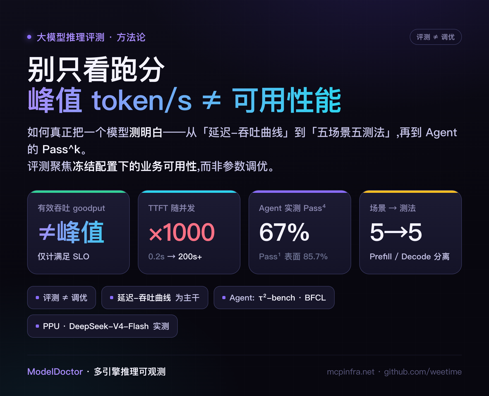
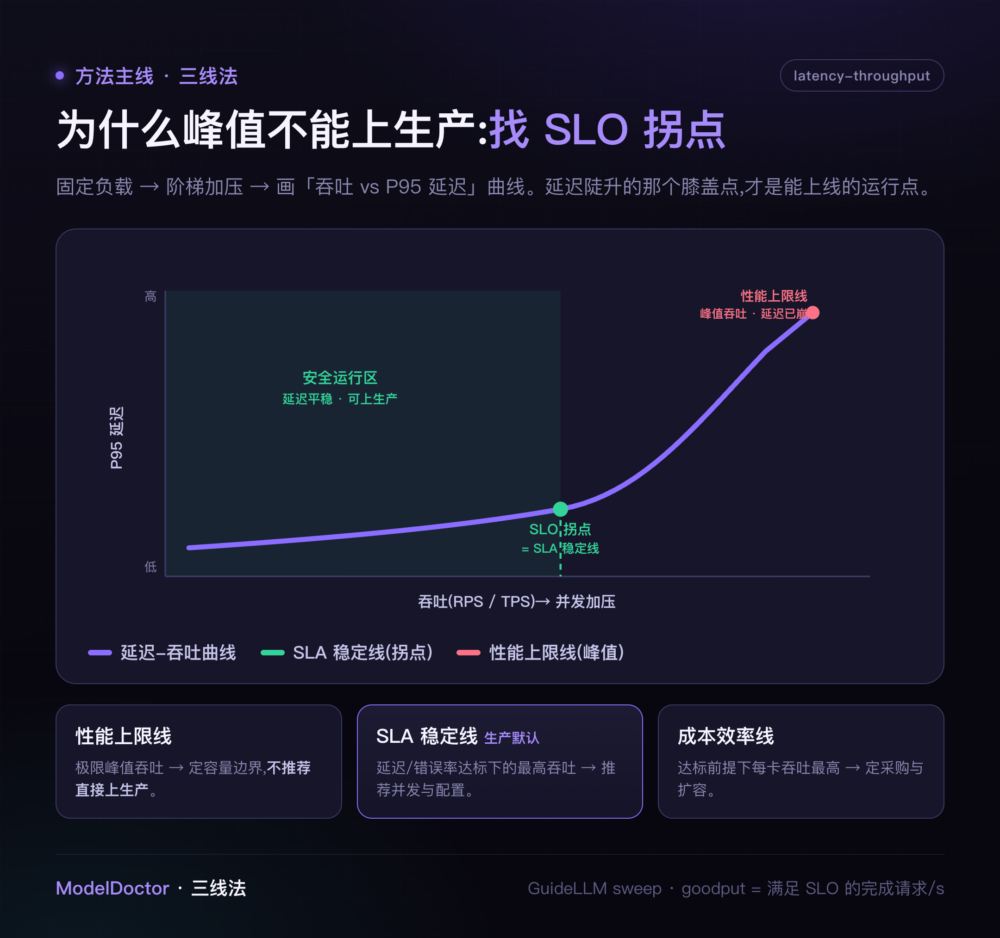
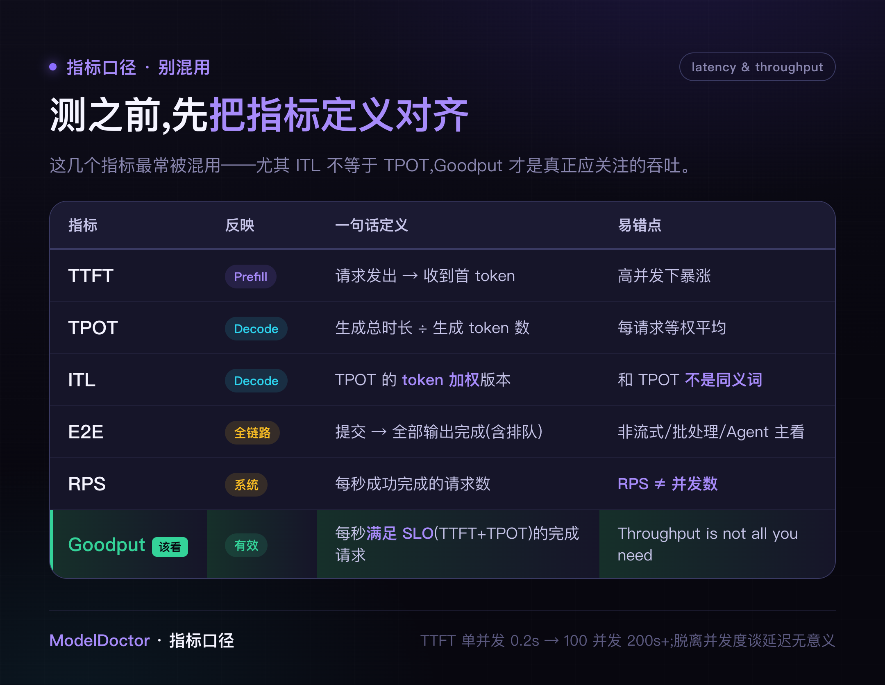
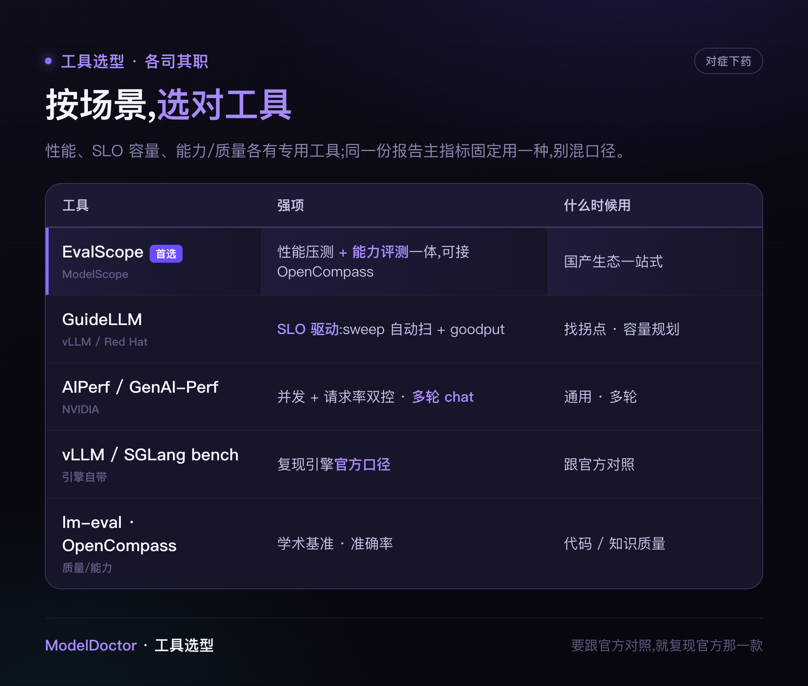
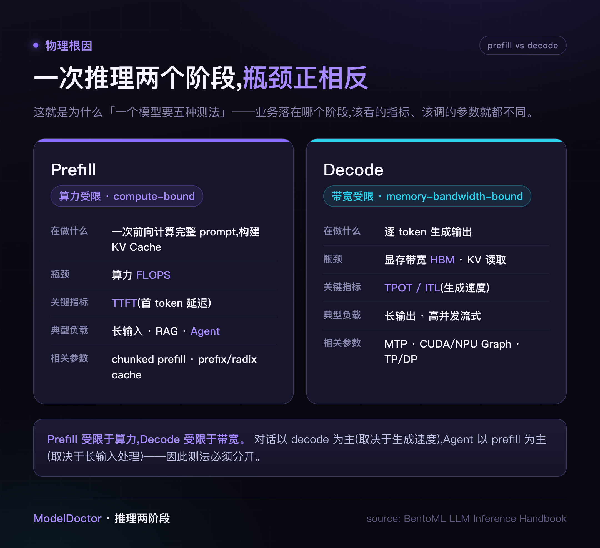
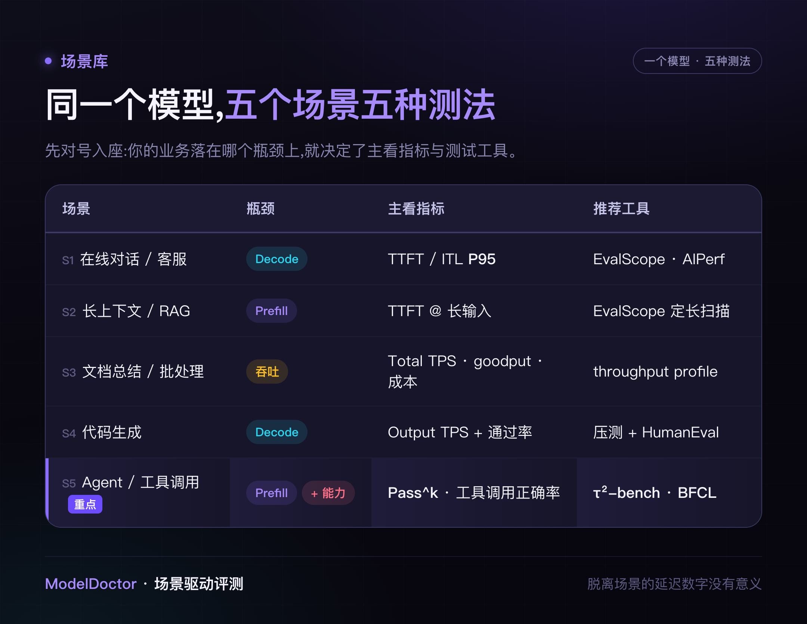
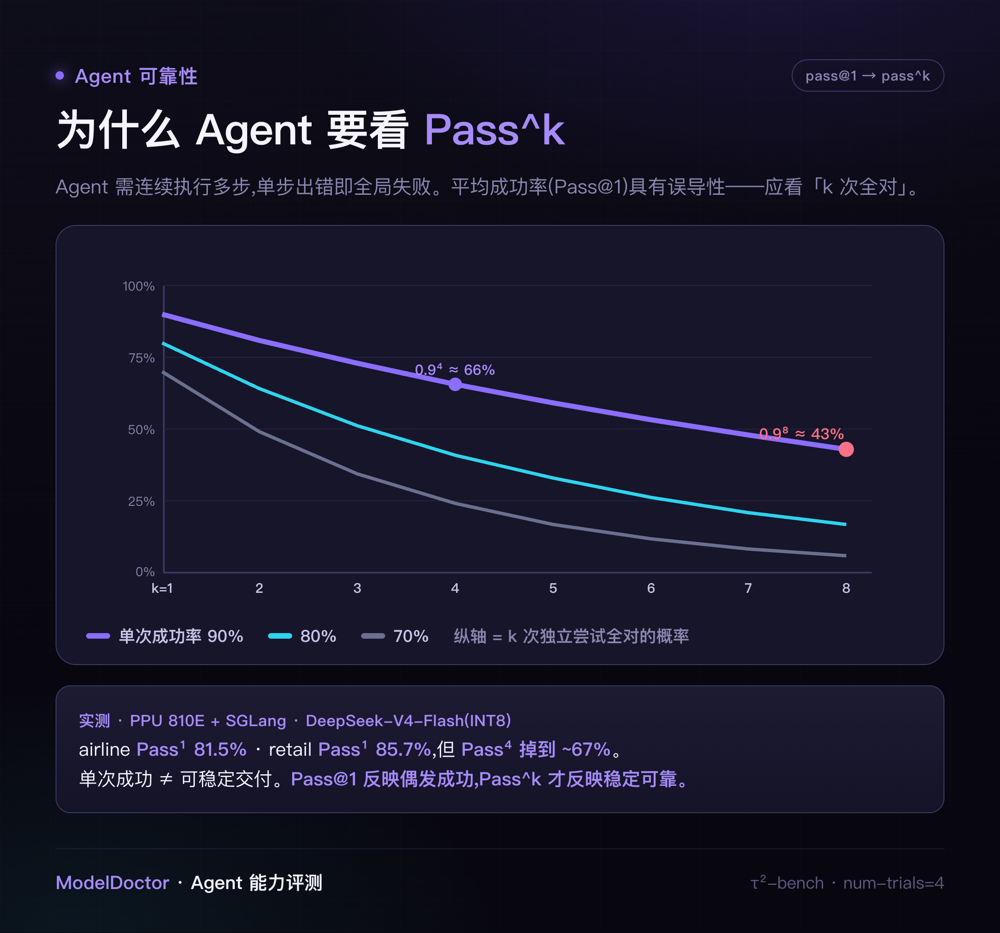

# 大模型推理评测:从「跑分幻觉」到「场景验收」

> 峰值 token/s 只是宣传口径,不等于可用性能。如何真正把一个模型测明白——从延迟-吞吐曲线,到五场景五测法,再到 Agent 的 Pass^k。含国产卡 DeepSeek-V4-Flash 实测数据。

做私有化推理选型时,拿到的第一份材料,往往是供应商给出的一行指标:「某卡某引擎,DeepSeek-V4 单机吞吐 **XXXX token/s**」。这个数字该不该信?能否据此签约、据此做容量规划?

先别急于开测——很多评测从一开始方向就偏了,问题不在工具,而在几个常见误区。本文先从厘清误区讲起。内容偏硬核,建议收藏。

## 一、先破三个误区

开测之前,先厘清三个最常见的误区——它们在很大程度上决定了后续测试的正确性。

**误区一:「有公开的打榜数据,直接沿用即可。」**

打榜(MMLU、GPQA、MLPerf 这类标准化基准)回答的是「模型 / 系统在标准题集上的排名」,模型提供方通常也会公开这类结果。但它无法直接套用到咱们的私有化部署:

- **硬件**:公开数据通常只覆盖特定几款加速卡,未必包含咱们采用的型号;
- **推理引擎**:公开数据多在**模型提供方自研的闭源引擎**上产出,而私有化部署普遍使用开源引擎(vLLM / SGLang)或厂商特殊适配镜像,引擎不同,结果不可比;
- **部署形态**:PD 分离、并行策略、量化精度,叠加咱们自身的 prompt 分布,都是显著的差异来源。

结论:公开数据与「咱们的加速卡 × 推理引擎 × 部署形态 × 真实负载」并非同一工况,不可直接挪用。

**误区二:「性能测试就是比谁的 token/s 更高。」**

峰值 token/s 是在「并发打满、仅统计输出 token、多次取最高」条件下得到的数值。即便是业内金标准 **MLPerf Inference**,也不采信裸峰值吞吐——它只将**满足延迟约束**的吞吐计入成绩(交互档要求 p99 TTFT ≤ 450ms、TPOT ≤ 40ms;较新版本已纳入 DeepSeek-R1、Llama3.1-405B)。峰值仅代表容量上限,并非可上线的运行点。

**误区三:「调优和测试是一回事,测一次就够了。」**

两者其实分属不同阶段、目标不同:

- **参数调优测试(调优阶段)**:目标是**寻找更优配置**——调整参数、并行策略、量化、缓存,比较不同组合在速度 / 成本 / 稳定性上的表现。**自变量是配置**,产出是一套推荐配置。
- **业务可用性测试(验收阶段)**:目标是在**冻结配置**下、按业务场景,验证「是否可用、可承载多少、单位成本几何、是否稳定」。**自变量是负载**,产出是可支撑决策的量化指标。

两者有交集、常相互衔接(调优后需验收,验收暴露的瓶颈又反馈至下一轮调优),但**本文只聚焦业务可用性测试**——它才是选型、扩容、上线真正需要背书的环节。

## 二、性能这条线:一个主干方法,不是一堆方法

先看**性能**(延迟 / 吞吐 / 成本)这条线。它表面上方法繁多,主干其实只有一条:

> 固定负载 → 阶梯加压 → 绘制「延迟-吞吐曲线」→ 定位 **SLO 拐点**。

所谓「单请求」「并发递增」「长上下文」……并非并列的多种测法,而是**同一套扫描在不同 workload 上的重复执行**——更换负载即得到另一条曲线(这正是后文「五场景」的由来)。曲线上的三个关键点,即**三线法**。

vLLM 官方的 GuideLLM,其 `sweep` 模式即这一方法的工具化实现:自动从延迟下界扫描至吞吐上界。**峰值决定容量上限,拐点才是生产运行点。**

> 注:此处指**性能**主干。**能力**——即 Agent 能否正确完成任务——是另一条线,以 Pass^k 衡量,详见第六节。

## 三、先把指标定义对齐

性能评测的第一道关卡不是执行压测,而是**避免指标口径被混用**。下表厘清最易混淆的几项:

两个重点:

- **ITL ≠ TPOT**——ITL 是 TPOT 的 token 加权版本。
- **Goodput 才是应关注的吞吐**——仅统计满足 SLO 的请求。这是 DistServe 用以修正「唯吞吐论」的指标,论文标题即点题:*Throughput is Not All You Need*。

一个反直觉的数据(EvalScope 官方):TTFT 在单并发下约 0.2 秒,100 并发下可攀升至 200 秒以上。**脱离并发度谈延迟没有意义。**

## 四、工具选型:一种测试用一种工具

性能压测、SLO 容量摸底、能力 / 质量评测,各有专用工具,不应混用:

一条原则:**同一份报告的主指标固定采用同一种工具**;若需与官方结果对照,则复现官方所用的那一款。

## 五、为什么一个模型要五种测法

关键在此。推理分为两个阶段,硬件瓶颈恰好相反:

**Prefill 受限于算力,Decode 受限于带宽。** 业务落在哪个阶段,应关注的指标与相关参数就不同。因此,同一个模型对应五个场景、五种测法:

按场景对号入座即可。**脱离场景的延迟数字没有意义。**

## 六、重点:Agent 为什么又慢又不稳定

同一个模型,用于对话很流畅,用于 Agent 却频频出问题——症结不在快慢,而在稳定性与正确性。

**为什么慢:本质上是 prefill-bound。** Agent 的单次请求包含 system prompt + 工具定义 + 多轮历史 + 工具返回;每增加一轮,输入更长,且每轮都需重新 Prefill。因此应关注每轮 TTFT,而非峰值 tok/s。

**为什么不稳定:单步出错即全局失败。** 平均成功率参考价值有限,应关注 Pass^k(k 次尝试全部正确的概率)。

- **能力**:τ²-bench(tool-agent-user)+ BFCL V4(函数调用准确率)。
- **性能**:以 agentic 负载扫描并发会话,关注每轮 TTFT / 单任务 E2E,**保持配置冻结**。
- **相关参数**:长上下文、Radix / prefix cache、chunked prefill、PD 分离、正确的 tool / reasoning parser。
- **量化的陷阱**:INT8 往往不损失吞吐,却会降低工具调用的稳定性——必须在目标量化精度下测试。

**实测**:国产 PPU 810E + SGLang 运行 DeepSeek-V4-Flash(INT8),airline **Pass¹ 81.5%**、retail **Pass¹ 85.7%**,单次成功率可观;但 **Pass⁴ 降至约 67%**。仅看 85% 会误判为可上线,结合 67% 才能看清可靠性差距。

## 七、最后:科学纪律 + 对照官方

遵循以下几条,评测才称得上「科学」而非「主观估计」:

单变量控制 · 每档 ≥3 次、取中位数并报告 P95 / P99 · 固定数据集与随机种子 · 充分 warmup · errorRate > 5% 则重跑 · 绑定软件版本 · 闭环采集监控指标。

与官方对照分三步:**口径对齐 → 复现官方配置 → 差异归因**。差异往往源于口径不一致,而非硬件本身不足。

---

评测不是跑分,而是**在冻结配置下、按业务场景、通过扫描负载定位 SLO 拐点**。指标关注 goodput,场景区分 Prefill / Decode,Agent 关注 Pass^k。测得扎实,选型、扩容、上线才有据可依。

## 关于作者

聚焦 LLM 推理的生产工程:让 vLLM / SGLang / MindIE 在国产卡、多集群网关、P/D 分离下稳定落地。长期从事推理编排、runtime 数据面验证、可观测性与 SRE。拒绝 Demo,只谈实战——从万级并发压测、自动化发布门禁,到算力成本极限压榨与稳定性观测。

> 文中数字均来自单次真实压测,并非普适「标准答案」——更换数据集 / 参数,结论可能随之改变。欢迎各位以自身真实流量复现、指正。

