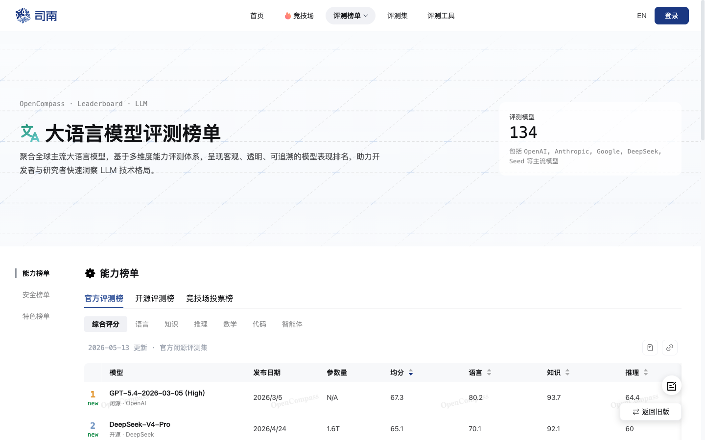
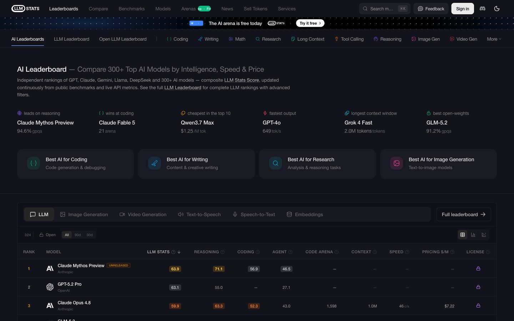
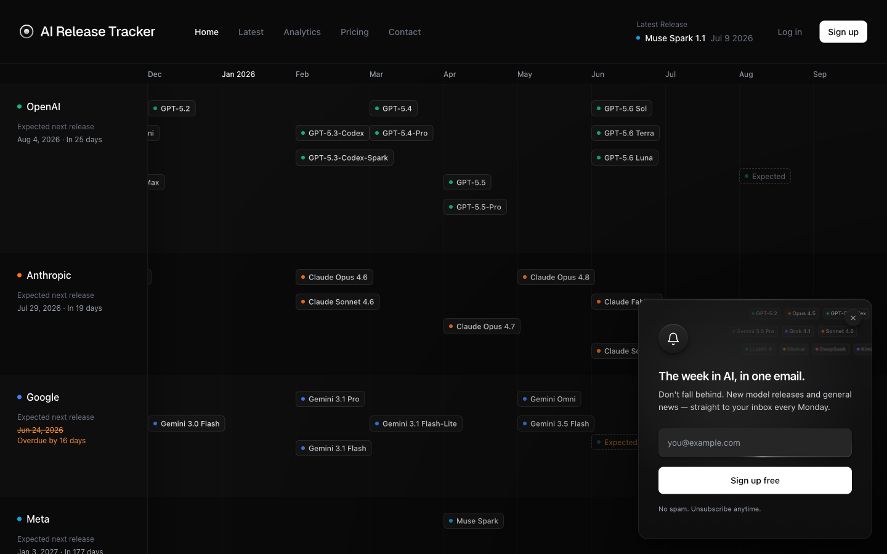
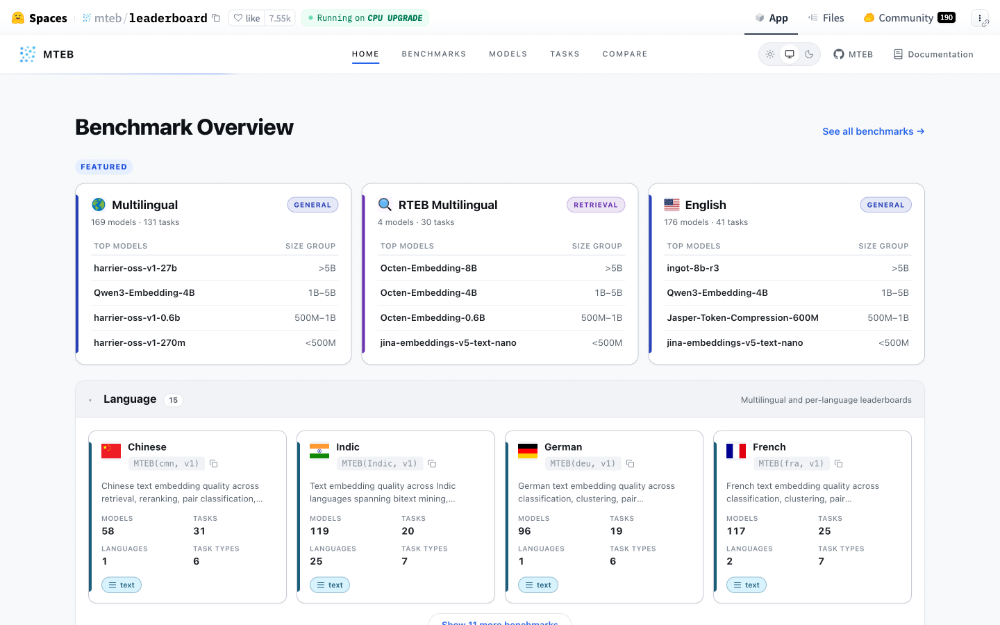
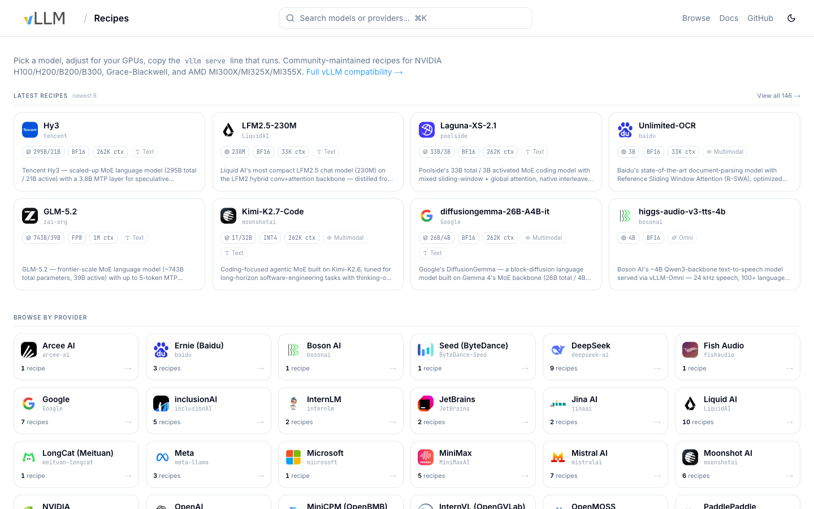

# 盘点大模型网站全景图:从「看榜」到「敢上线」,我常开的这几十个站

> 每次有人问我「现在到底哪个模型强、该上哪个、怎么部署」,我都得连着甩十几个链接。这篇干脆把它们一次性摊开——不是收藏夹式的堆网址,而是按我真实的工作动线,把「看榜 → 选型 → 拿模型 → 落地 → 看趋势」这条链路上,每一步该打开哪些站、怎么看、坑在哪,讲清楚。

先说结论,这是一张「链路地图」而不是「网址大全」:

```
看榜         选型定价        垂直能力        拿模型         落地部署         看趋势
谁最强?  →  上哪个多少钱? → 我的活谁行? → 从哪调/本地? → 真跑起来?  →  往哪走?
竞技场/       llm-stats/      SWE-bench/     OpenRouter/    recipes/         Epoch/
中文榜        AA              MTEB           HF/Ollama      vLLM·SGLang      HAI
```

一条链路从左走到右,大多数人卡在最左边(天天刷榜、越刷越焦虑)和最右边接不上(榜看得再多,真部署起来还是一脸懵)。中间那几步——「这榜到底测的是什么」「综合分是谁的加权」「我这活该看哪张专项榜」——恰恰是最容易踩空的地方。

举个我常遇到的场景:业务同学甩来一句「XX 模型 Arena 排第一,咱们上它吧」。可 Arena 测的是人类偏好、不是你的任务准确率;它标称的 200 万上下文,真喂进去 50 万就开始丢针;换到你的国产卡上,吞吐可能只有官方数字的一半。**从「榜上第一」到「你的生产环境敢上线」,中间隔着四五个站、和一堆没人替你踩的坑。** 我自己的差异化正好在最右边那一格——让推理服务从「能跑」到「敢上线」。下面按这条链路,一站一站走。

> ⏱️ 全文约 5000 字,14 张实拍截图,每一类末尾都附**全量表格**可直接收藏。看完你手里就有一张能贴在工位上的链路图。

---

## 第一站 · 看榜:「谁最强」

新模型一天一个,想知道「谁强」,先分清两种榜:**人类偏好**和**客观评测**。它们经常打架,是所有误读的源头。

### 人类盲测:LMArena(现已改名 arena.ai)

最常被引用的「人类偏好」榜。真人对同一个问题拿到两个匿名回答,盲投谁更好,再用国际象棋那套 Elo 算分,每月上千万对局。

⚠️ **第一个要更新的认知**:老域名 `lmarena.ai` 在 2026 年初已经整体升级、301 跳到了 **arena.ai**,品牌就叫「Arena」。子竞技场也大幅扩充——Text / Vision / WebDev / Search / **Agent** / 文生图 / 图生视频 全都拆开了。旧文里写 lmarena 的链接,现在都会跳转。


**怎么看**:想知道「真人用起来更喜欢谁」「新模型口碑热度」时打开它。
**坑**:偏好 ≠ 事实。Arena 测的是「哪个回答更讨人喜欢」,受回答风格、长度、Markdown 排版影响很大(官方加了 Style Control 来缓解,但没根治)。而且现在头部模型的 Elo 常常挤在同一个置信区间里——**是「统计并列」,不是真第一**。看榜时一定看误差棒(±x),别只看排名数字。

### 中文场景:SuperCLUE

公众号读者最该关心的一张榜。国内最有影响力的中文通用综合榜,月度更新、发年度报告。


2026 年 5 月这期覆盖数学推理、科学推理、代码生成、精确指令遵循、幻觉控制、智能体(任务规划)六大任务,共 492 道新题、24 个国内外模型。它的价值不在「总分第一是谁」,而在**把国产 vs 海外的梯队差距、以及每个模型的价格/生成耗时摆在同一张图上**——这是国外榜很少给的视角。

**坑**:它是 JS 渲染的单页应用,分总榜/专项榜(金融、营销)/多模态榜好几张,别只截总榜就下结论。

### 学术式全维度:OpenCompass 司南

上海 AI Lab 的评测体系。如果说 Arena 是「群众投票」,司南就是「学术考试」——客观、透明、可追溯,覆盖语言/知识/数学/代码/长文本/智能体等 12 个一级维度。



它把「官方评测榜」「开源评测榜」「竞技场投票榜」三种口径放在一起——**客观打分和人类投票口径不同,别混着比**。想查国产模型在某个细分学科的强弱,这里比 Arena 细。

### ⚠️ 一个时代的落幕:HuggingFace Open LLM Leaderboard 已退役

写「看榜」绕不开它,但必须说清:这张开源老榜 **2025 年已经正式停更、归档**,不再接受新模型提交。别再当活榜推荐了——它现在是一个时代的符号,接棒的是下面各种专项榜。

> **看榜第一课**:MMLU、HumanEval 这些经典基准早已「饱和」(头部都 90 分往上,区分不出高低);Arena 测偏好不测事实。看榜看的是**方向信号,不是绝对真理**。

**📌 看榜·全量表格(综合 + 中文)**

| 站点 | 网址 | 定位 / 用法 |
|---|---|---|
| **LMArena → Arena** | arena.ai | 真人盲测 Elo,业界最常引用;看口碑热度,注意偏好≠事实、看误差棒 |
| OpenLM.ai Arena+ | openlm.ai/chatbot-arena | 把 Arena Elo + 硬基准拉到一张对照表 |
| Vellum Leaderboard | vellum.ai/llm-leaderboard | 只收 2024.4 后模型,分能力维度 + 速度/成本 |
| Onyx Leaderboard | onyx.app/llm-leaderboard | 开/闭源对比,关注自部署;更新偏慢 |
| LLMReference | llmreference.com/benchmarks | 纯基准数据库,按你的负载挑基准查 leader |
| BenchLM | benchlm.ai | 281+ 模型聚合,区分「暂定/已验证」分数 |
| ~~HF Open LLM~~ | huggingface.co | ⚠️ 已退役归档,仅存历史 |
| **SuperCLUE** | superclueai.com | 中文通用综合榜,月度更新;梯队 + 价格 + 耗时同图 |
| **OpenCompass 司南** | rank.opencompass.org.cn | 上海 AI Lab,学术式全维度 + 三种榜口径 |
| FlagEval 天秤 | flageval.baai.ac.cn | 智源,多模态、跨语言评测 |
| C-Eval | cevalbenchmark.com | 中文 52 学科经典集;⚠️ 证书已过期、维护转冷 |
| CMMLU | github.com/haonan-li/CMMLU | 中文本土化 67 学科(含驾考等),数据集非实时榜 |

---

## 第二站 · 选型定价:「上哪个、多少钱」

知道了谁强,下一个问题是工程问题:**在质量、速度、价格之间怎么选?** 这一层是我打开频率最高的。

要先破一个误区:llm-stats、Artificial Analysis、司南给的「综合分」看着都是一个数字,但**背后的加权口径完全不同**——有的偏推理、有的偏性价比、有的按端到端实测。所以三家的排名经常对不上,这不是谁错了,而是它们在回答不同的问题。选型时别纠结「到底信哪家」,而要反过来想:**我这次选型最在乎的是什么(质量?延迟?每百万 token 成本?),就去看对应口径的那张榜。**

### 综合选型:LLM-Stats

把「验证过的 benchmark 分」和「每 token 价格」合成一个可比的综合分,覆盖 300+ 模型。首页那排小卡片特别实用:领跑推理的、编程最佳的、Top10 里最便宜的、输出最快的、上下文最长的、最强开源权重的——一眼扫完。



**坑**:它的数据源里会混入「未发布的 preview 模型」(截图里榜首那个就标着 UNRELEASED)。选型时别把 preview 当已上线的能力;综合分权重是它自定的,别只认单一总分。

### 事实标准:Artificial Analysis

如果只让我留一个选型站,是它。**端到端**地测 API 性能——不是跑分,是真的发请求测:Intelligence Index(多项评测合成)、输出速度 tok/s、首 token 延迟、每任务成本,全模态(文/图/视频/语音)都覆盖。


最值钱的是 **API Provider Performance**:同一个开源模型,托管在 Together / Fireworks / Groq 上,速度和价格能差好几倍——这张表直接帮你选「上哪家」。
**坑**:免费版默认只展开一小部分模型(约 28/570),完整数据和自定义图表要订阅。看的时候留意这个默认过滤。

### 发布追踪:AI Release Tracker

不想天天刷推特又怕错过新模型,看它。收录自 2022 年 11 月 ChatGPT 以来所有前沿模型,每条带发布日期、参数量、上下文窗口、开/闭源、以及 GPQA / SWE-Bench / MMMU 三项跑分。免费、无广告、可选邮件订阅。



**📌 选型定价 + 发布追踪·全量表格**

| 站点 | 网址 | 定位 / 用法 |
|---|---|---|
| **LLM-Stats** | llm-stats.com | 智能/速度/价格综合分,300+ 模型;注意 preview 混入 |
| **Artificial Analysis** | artificialanalysis.ai | 事实标准,端到端 API 性能 + provider 横评;免费版有过滤 |
| DemandSphere Tracker | demandsphere.com/research | 前沿模型宏观叙事(节奏/地理/开闭源),走 /research 子路径 |
| Inference.net 价格文 | inference.net/content/... | 30+ 模型价格横评长文;是 provider 软文、数据停在 2 月,当静态参考 |
| ~~Chasing Next~~ | chasingnext.com | ⚠️ 首页已改成培训站,追踪器降级为子页,建议换站 |
| lmmarketcap | lmmarketcap.com | 追 351 模型,LMC 综合分 = 90% 基准 + 10% 能力 |
| LLM-Stats Updates | llm-stats.com/llm-updates | 每小时更新的发布/API 变更页,覆盖 53+ 组织 |

---

## 第三站 · 垂直能力:「我这活,谁行」

综合榜看个大概,真到手上的活——写代码、做 RAG、调工具——得看专项榜。综合第一名在你的场景里未必第一。

### Agent 编码事实标准:SWE-bench

给模型一个真实的 GitHub issue,让它自己改代码、跑测试、修 bug。这是 Agent 编码能力最硬的标尺,没有之一。


**认准 Verified 这个子榜**(500 道人工校验过的题),它是业界最常引用的那个,别截原始榜。
**坑**:榜单成绩是「scaffold(智能体框架)+ 模型」的组合分。**同一个模型换一套 agent 框架,分数会变**——讲解时要说清,别把框架的功劳记在模型头上。

### RAG 选型核心:MTEB / C-MTEB

做检索、做 RAG,选 embedding 模型就看它。56+ 任务、8 大类、112 种语言的权威向量榜,含中文子榜 C-MTEB。



**坑**:注意它是 embedding 榜,不是对话模型榜,别混进「谁最强」那一节。另外它是个 Gradio Space,在 CPU 上要等它把表格 build 出来,加载中直接抓是空壳。

> 这一格和我最近在做的中文 embedding 项目直接相关:选型别只看总榜分,要按你**自己的语料**做一次小规模重排验证——榜上第一名换到你的领域数据上,经常不是第一。

**📌 垂直能力·全量表格**

| 站点 | 网址 | 测什么 |
|---|---|---|
| **SWE-bench** | swebench.com | 真实 GitHub issue 修复,认准 Verified 子榜 |
| **MTEB / C-MTEB** | huggingface.co/spaces/mteb/leaderboard | embedding / RAG 选型权威榜 |
| Aider Polyglot | aider.chat/docs/leaderboards | 多语言代码编辑;⚠️ 数据疑似冻结在 2025-08 |
| BFCL(伯克利) | gorilla.cs.berkeley.edu/leaderboard | 工具/函数调用,现已 V4(agentic + web search)|
| Scale SEAL | labs.scale.com/leaderboard | 私有题库防污染;域名已迁到 labs.scale.com |
| ARC-AGI | arcprize.org | 抽象推理「天花板」,ARC-AGI-3 号称尚未被攻破 |
| LiveBench | livebench.ai | 每月换题防污染,六大类客观可验证 |
| Context Arena | contextarena.ai | 长上下文有效性(MRCR 多针检索),看真实衰减 |
| Fiction.liveBench | epoch.ai/benchmarks/fictionlivebench | 长文深度理解;建议看 Epoch 托管版更稳定 |
| Code / WebDev Arena | arena.ai/code | 前端/设计生成对战,已并入 arena.ai |

---

## 第四站 · 拿模型:「从哪调、本地怎么跑」

选好了模型,得把它弄到手——要么调 API,要么下权重本地跑。

### 统一入口 + 独家数据:OpenRouter

一个 OpenAI 兼容的接口,后面聚合 400+ 模型、70+ 供应商,还能自动 fallback 兜底。但它对我最大的价值是那张**别处没有的排行榜**:基于真实 token 消耗量,告诉你「谁在真实生产里被用得最多」。


跑分榜说的是「谁考得好」,这张用量榜说的是「大家真金白银在用谁」——两者经常不一样,后者更接近工程现实。
**坑**:它统计的是 OpenRouter **自己平台**的流量,不等于全网市场份额,别过度外推。

### 一切的基础设施:Hugging Face

不用多介绍。**200 万+** 模型(早不是「90 万」了)、50 万+ 数据集、100 万+ Spaces,还是无数榜单的宿主。找权重、找数据集、跑 demo,都从这里开始。


### 本地党:Ollama

想在自己机器上跑开源模型,一行命令的事。
⚠️ **注意变化**:Ollama 2026 年已经不只是「纯本地」了,加了云端付费档(Pro / Max)。如果你要强调「纯本地、数据不出门」,得知道它现在也卖云。

**📌 拿模型·全量表格**

| 站点 | 网址 | 定位 |
|---|---|---|
| **OpenRouter** | openrouter.ai | 统一 OpenAI 兼容入口 + 真实 token 用量榜(独家) |
| **Hugging Face** | huggingface.co | 200 万+ 模型库 + Spaces + 榜单宿主 |
| Together AI | together.ai | 开源模型托管推理 + 微调 + GPU 集群 |
| Fireworks AI | fireworks.ai | 主打「最快推理」的开源模型服务 |
| Groq | groq.com | 自研 LPU,吞吐/延迟标杆 |
| Replicate | replicate.com | 一行代码调开源模型(图/音/视频/LLM) |
| Ollama | ollama.com | 本地模型库;现已加云端付费档 |

---

## 第五站 · 落地部署:「真跑起来」(我的主场)

这是链路上最难、也最少人讲清楚的一格。榜看得再熟,真要在你的 A100 / 4090 / 910B 上把模型 serve 起来、扛住并发、控住延迟,又是另一回事。

### 按「模型 × GPU」给命令:recipes.vllm.ai

vLLM 官方社区的配方站,一句话概括:**选一个模型、告诉它你的 GPU,它给你一条能直接复制的 `vllm serve` 命令**。目前 140+ 条配方,覆盖 Qwen / DeepSeek / GLM 等 30+ 家、NVIDIA H100/H200/B200 到 AMD MI300X 等主流硬件。这是我 fork 的上游。



### 多一层 SGLang:recipes.mcpinfra.net

这是我自己搭的部署配方站,和官方站同构,但**多做了一件事:vLLM 和 SGLang 两种 serve 命令都给**,还带镜像选择器。同样一个 GLM-5.2 / Nemotron 3 Ultra,你可以直接对比两种引擎的启动方式,省掉自己翻文档拼参数的功夫。


配方只是起点。真正的落地还要往上叠一层「生产工程」:

- **vLLM production-stack** — K8s 原生参考栈,router 路由 + Prometheus/Grafana 可观测 + LMCache KV offload。
- **SGLang**(文档已迁到 `docs.sglang.io`)— 结构化生成 + RadixAttention,前缀复用场景吞吐很能打。
- **NVIDIA Dynamo / llm-d** — 数据中心级编排:prefill/decode 分离、KV-cache 感知路由、自动扩缩;llm-d 已进 CNCF sandbox。
- **MLPerf Inference** — 想要「硬件推理」的行业标准数字,看 MLCommons 的公开结果表。

> 大多数榜只回答「模型跑得多好」,几乎没人回答「在你这张卡上、这个并发下,TTFT 和吞吐到底是多少」。这中间的鸿沟,就是我做压测工具 **ModelDoctor** 和这个配方站想填的坑——让选型的结论,能一路走到「敢上线」。

**📌 落地部署·全量表格**

| 站点 | 网址 | 定位 |
|---|---|---|
| **recipes.vllm.ai** | recipes.vllm.ai | vLLM 官方配方,模型 × GPU 给可复制命令 |
| **recipes.mcpinfra.net** | recipes.mcpinfra.net | 自建配方站,多给 SGLang + 镜像选择器 |
| vLLM production-stack | github.com/vllm-project/production-stack | K8s 生产参考栈(router + LMCache + 观测) |
| SGLang | docs.sglang.io | 结构化生成 + RadixAttention |
| TensorRT-LLM | nvidia.github.io/TensorRT-LLM | NVIDIA 峰值吞吐路线 |
| NVIDIA Dynamo | github.com/ai-dynamo/dynamo | 分离式服务 + SLA 感知调度 |
| llm-d | llm-d.ai | KV-cache 感知多 Pod 路由,CNCF sandbox |
| MLPerf Inference | mlcommons.org | 硬件推理基准的行业标准 |

---

## 第六站 · 看趋势:「往哪走」

最后退一步看宏观。写「行业视角」段落、给老板做汇报,这几个站的数据最能镇场。

### 一张图看清所有增长曲线:Epoch AI

前沿 AI 的增长趋势仪表盘。几个数字直接可以引用:**推理成本每年降约 40×(每两个月腰斩)、上下文窗口每年涨约 30×、前沿训练算力每年 5×**。背后还挂着 Models / Data Centers / Hardware 的完整数据库。


配合另外两个:**Stanford HAI AI Index**(年度权威报告,2026 版核心论点是「AI 能力与治理准备度的差距在扩大」)和 **a16z LLMflation**(推理成本下降的经典论述——注意这是 2024 年 11 月的旧文,引用时标好日期,或用 Epoch 的实时数据交叉印证)。

**📌 趋势·全量表格**

| 站点 | 网址 | 用法 |
|---|---|---|
| **Epoch AI** | epoch.ai/trends | 成本/上下文/算力增长曲线 + 数据库,数字可直接引 |
| Stanford HAI AI Index | hai.stanford.edu/ai-index | 年度权威报告,2026 版 |
| a16z LLMflation | a16z.com/llmflation-llm-inference-cost | 推理成本下降经典论述(2024.11 旧文,注明日期) |

---

## 收尾:三条避坑 + 我的一条动线

盘到这里,与其记住 50 个网址,不如记住三条判断:

1. **偏好 ≠ 事实,标称 ≠ 有效**。Arena 测的是讨不讨喜;标称 200 万上下文,不等于 200 万都真的「用得上」(去 Context Arena 看真实衰减)。看榜先看它测的到底是什么。
2. **综合分是「别人的加权」**。llm-stats、AA、司南各有各的权重口径,选型别只认一个总分——按你自己的场景,去对应的**专项榜**看。
3. **榜的尽头不是终点,是起点**。榜告诉你「值得一试的候选」,真正的答案要在你自己的卡、你自己的并发、你自己的语料上跑出来。

而我每天的动线其实很短:**arena / SuperCLUE 扫一眼谁值得关注 → llm-stats / AA 定质量和价格 → SWE-bench / MTEB 核对我这活它到底行不行 → OpenRouter / HF 把它弄到手 → recipes 把它 serve 起来 → ModelDoctor 压出真实的 TTFT 和吞吐 → 才敢说这个模型能上线。**

从「看榜」到「敢上线」,就差这一条链路走通。这张图,建议收藏。

---

## 关于作者

聚焦 LLM 推理的生产工程:让 vLLM / SGLang / MindIE 在国产卡、多集群网关(Higress)、P/D 分离下稳定落地。长期做推理编排(Dynamo / llm-d / AIBrix)、runtime 数据面验证、可观测性与 SRE。相关实践沉淀成部署配方库 **recipes.mcpinfra.net** 与压测工具 **ModelDoctor**。让推理服务从「能跑」到「敢上线」。

> 文中站点状态与截图为 2026 年 7 月实访核对——大模型网站改版、迁移、退役都很快(仅这次盘点就撞上 LMArena 改名 arena.ai、HF Open LLM 榜退役、Scale 迁域名),链接以你打开时为准,欢迎指正补充。


