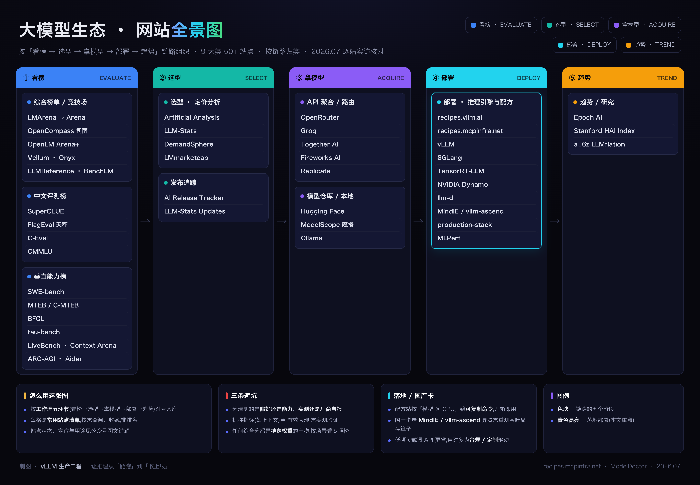
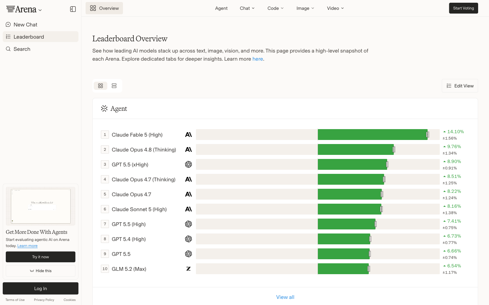
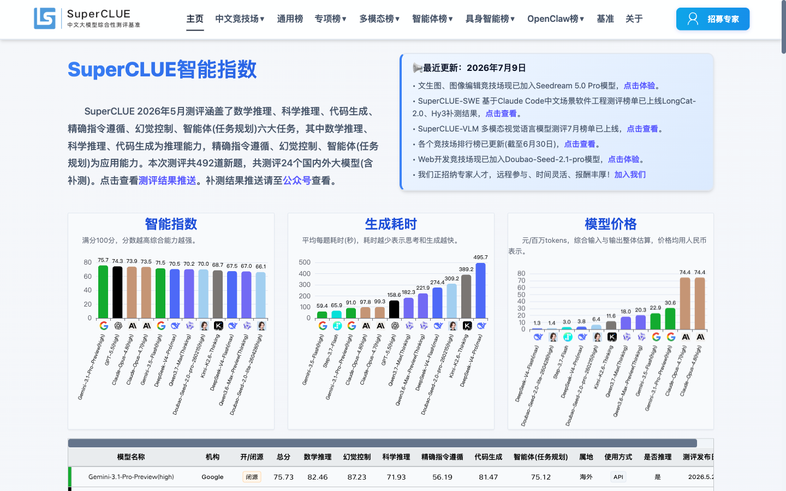
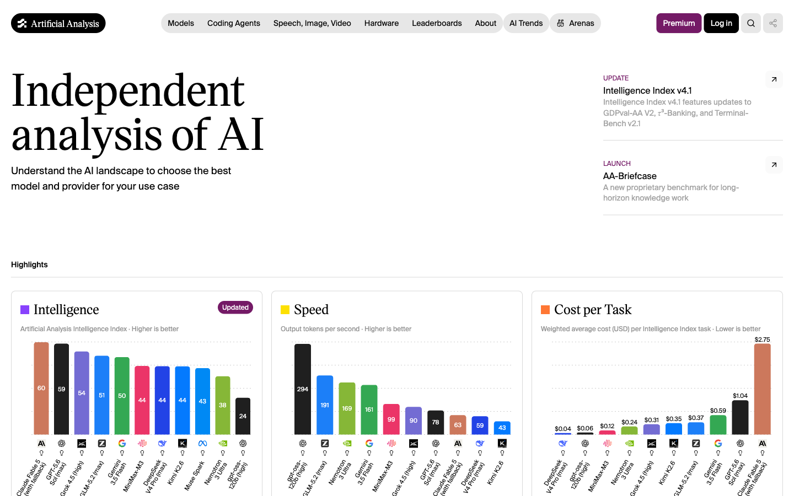
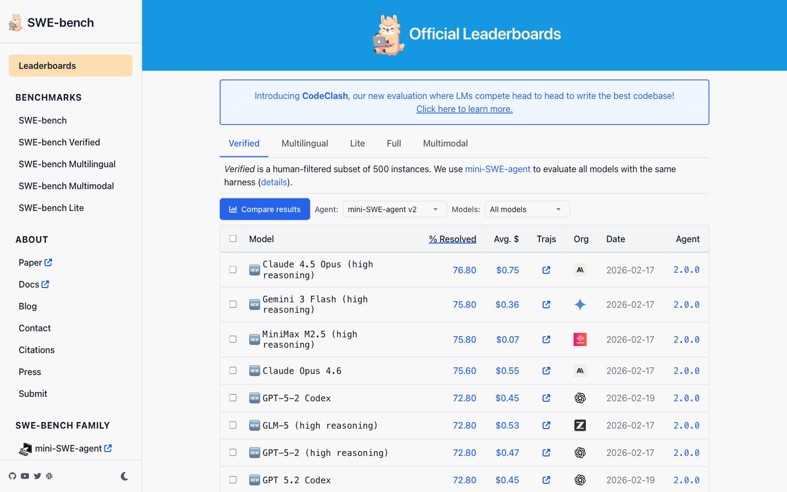
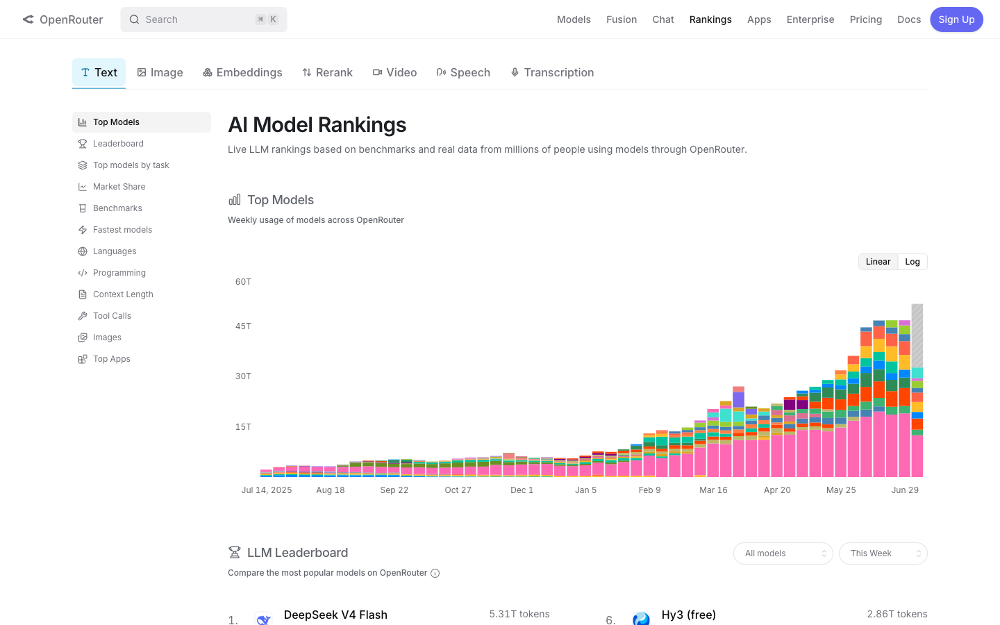
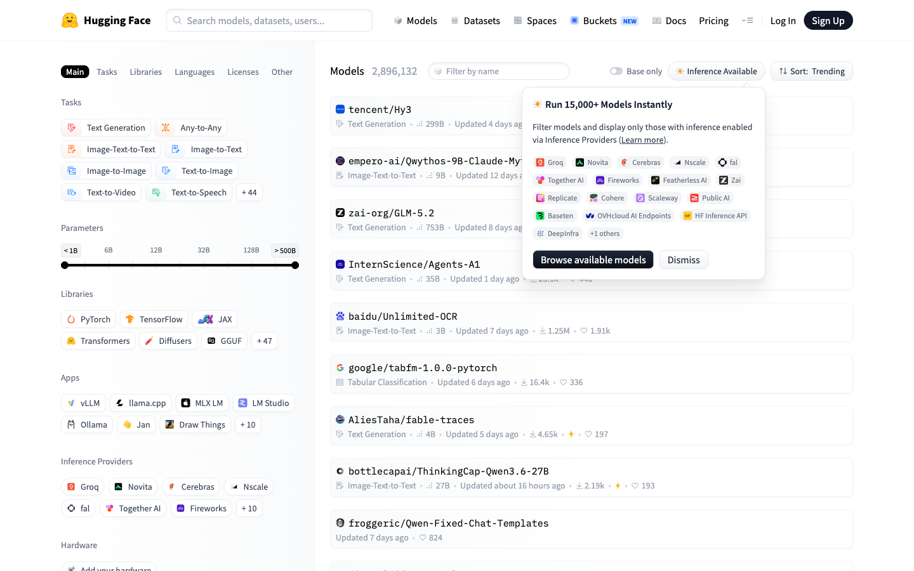
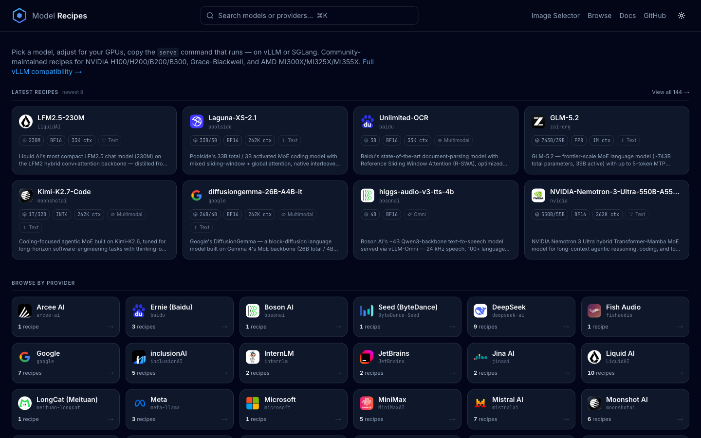
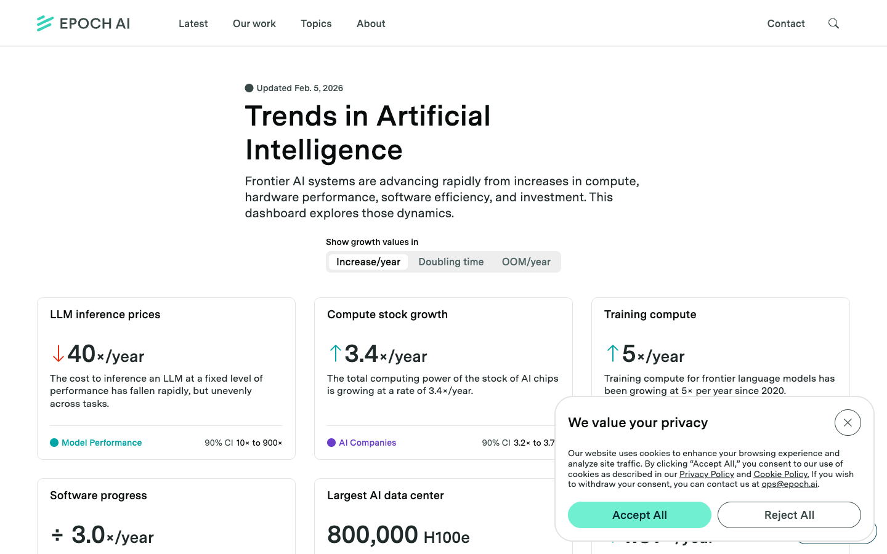

# 大模型生态常用网站全景盘点:9 大类 50+ 站点,附推荐指数

> 大模型相关的工具站点极多,信息分散。本文按实际工作流的五个环节——**看榜 → 选型 → 拿模型 → 部署 → 趋势**——把常用站点归类整理成一张全景图,并对每个站点给出客观定位、上榜理由与推荐指数,便于按需查阅与收藏。所有站点状态为 2026 年 7 月逐站实访核对。

## 一张图看全:大模型网站全景图

**推荐指数说明**:推荐指数(★,满分五星)= **权威性 × 不可替代性**,即「行业引用度/公信力」与「是否有独家价值、能否被替代」两个维度的综合评估,不代表站点质量的绝对排序。

- ★★★★★ 事实标准,该环节几乎必用;
- ★★★★☆ 高价值,常用;
- ★★★☆☆ 特定场景补充,或已停更/定位漂移。

**阅读须知**:榜单反映的是**方向信号而非绝对真理**。评测普遍存在数据污染、题目饱和、口径差异等问题;合成类「综合分」由各站自定权重,不同站点排名不一致属正常现象。选型的最终结论,应在自身业务数据与目标硬件上验证。

---

## 一、综合榜单 / 竞技场

用于快速了解模型的综合能力位次。分**人类偏好**(真人盲测投票)与**客观评测**(标准化基准)两类口径,二者结论常有差异,需分别看待。

### LMArena(现 arena.ai)｜★★★★★

基于真人盲测投票的模型偏好排行,采用 Elo 评分,含 Text / Vision / WebDev / Agent 等多个子竞技场。

**上榜理由** · 业界引用度最高的「人类偏好」基准,反映真实使用中的主观体验与口碑热度。

**注意** · 2026 年初已由 `lmarena.ai` 整体更名并跳转至 **arena.ai**;偏好评分受回答风格、长度、排版影响(已引入 Style Control 缓解),头部模型 Elo 常处于同一置信区间,属统计并列,阅读时应关注误差范围。

**其余站点**

| 站点 | 推荐指数 · 定位 · 上榜理由 |
|---|---|
| **OpenLM Arena+** | ★★★☆☆ · 将 Arena Elo 与多项硬基准并置对照。适合把「主观偏好」与「客观基准」放在同一视图比较。 `openlm.ai/chatbot-arena` |
| **Vellum Leaderboard** | ★★★☆☆ · 厂商维护的 SOTA 基准聚合,附速度/成本。按能力维度快速查询当前领先者。 `vellum.ai/llm-leaderboard` |
| **Onyx Leaderboard** | ★★★☆☆ · 开/闭源对比,含自部署视角。关注可自托管模型时的参考;更新频率偏低。 `onyx.app/llm-leaderboard` |
| **LLMReference** | ★★★☆☆ · 纯基准数据库,按任务列当前领先者。适合按具体工作负载反查对应基准。 `llmreference.com/benchmarks` |
| **BenchLM** | ★★★☆☆ · 聚合 281+ 模型、区分「暂定/已验证」分数。一站式对比质量、成本、上下文,并标注置信度。 `benchlm.ai` |

> **说明**:老牌的 HuggingFace Open LLM Leaderboard 已于 2025 年正式停更归档,不再接受新提交,建议作为历史参考,不再当作活跃榜单。

---

## 二、中文评测榜

面向中文场景的评测体系,是国内选型与对标的重要依据,也是海外榜单较少覆盖的视角。

### SuperCLUE｜★★★★★

国内影响力最大的中文通用综合榜,月度更新,覆盖数学推理、科学推理、代码、指令遵循、幻觉控制、智能体等任务。

**上榜理由** · 能直观呈现国产与海外模型的能力梯队差距,并将综合分、价格、生成耗时并置,兼具选型参考价值。

**注意** · 为单页应用,含总榜与多个专项/多模态子榜,引用时应注明具体榜单与期次。

**其余站点**

| 站点 | 推荐指数 · 定位 · 上榜理由 |
|---|---|
| **OpenCompass 司南** | ★★★★★ · 上海 AI Lab 的评测体系,覆盖 12 个一级维度,含官方评测榜、开源评测榜与竞技场投票榜三种口径。学术式全维度评测,中立、可追溯,细分学科表现查询能力强。 `rank.opencompass.org.cn` |
| **FlagEval 天秤** | ★★★☆☆ · 智源研究院的开放评测,支持多模态与多语言。关注多模态/跨模态基础模型评测时的参考。 `flageval.baai.ac.cn` |
| **C-Eval** | ★★★☆☆ · 中文 52 学科评测集(NeurIPS 2023)。中文学科知识评测的经典引用来源;站点证书已过期、维护转冷,访问时会有安全提示。 `cevalbenchmark.com` |
| **CMMLU** | ★★★☆☆ · 中文本土化 67 学科数据集(含中国特有题型)。需要可复现的中文语境评测数据集时使用;更新依赖社区提交。 `github.com/haonan-li/CMMLU` |

---

## 三、选型 / 定价分析

在明确候选模型后,用于在质量、速度、价格之间做工程权衡。这是选型阶段打开频率最高的一类。

### Artificial Analysis｜★★★★★

独立的端到端 API 分析平台,通过真实发起请求测量输出速度、首 token 延迟、每任务成本,覆盖全模态,并提供同一模型在不同 provider 上的性能横评。

**上榜理由** · 速度、价格、延迟等**第三方实测**数据是其核心价值,provider 横评可直接支撑「上哪家」的决策。

**注意** · 其 Intelligence Index(智能合成分)仍是自定加权指标,宜作参考而非唯一依据;免费版默认仅展开部分模型,完整数据需订阅。

**其余站点**

| 站点 | 推荐指数 · 定位 · 上榜理由 |
|---|---|
| **LLM-Stats** | ★★★★☆ · 将验证过的基准分与每 token 价格合成综合分,覆盖 300+ 模型。首页快照卡片可一眼获取各维度领先者;数据含未发布 preview 模型,需注意区分。 `llm-stats.com` |
| **DemandSphere Frontier Model Tracker** | ★★★☆☆ · 偏发布节奏、地理与开闭源格局的宏观追踪。做行业趋势叙事时的素材来源。 `demandsphere.com/research` |
| **LMmarketcap** | ★★★☆☆ · 追踪 351 个模型,综合分含基准与能力权重。一站式对比 Elo、性价比、速度、上下文与价格。 `lmmarketcap.com` |

---

## 四、垂直 / 细分能力榜

综合榜只能反映整体水平,具体任务需看专项榜。同一模型在不同任务上的排名差异往往很大。

### SWE-bench｜★★★★★

以真实 GitHub issue 为题的编码修复基准,要求模型自主改代码、跑测试、修 bug。

**上榜理由** · 目前最贴近真实工程的编码 Agent 基准之一,其中 Verified 子榜(500 道人工校验题)为业界最常引用口径。

**注意** · 成绩是「scaffold(智能体框架)+ 模型」的组合分,更换框架分数会变;且题目源自公开仓库,存在训练数据污染与时间截止争议,宜作方向参考。

**其余站点**

| 站点 | 推荐指数 · 定位 · 上榜理由 |
|---|---|
| **MTEB / C-MTEB** | ★★★★★ · 文本向量权威榜,覆盖检索、重排、分类等数十类任务与上百种语言,含中文子榜。RAG/检索的 embedding 选型标准;需注意其被刷榜/过拟合较多,应结合自有语料验证。 `huggingface.co/spaces/mteb/leaderboard` |
| **BFCL(伯克利函数调用榜)** | ★★★★☆ · 工具/函数调用评测,已至 V4(agentic + web search)。Agent 工具调用能力的主要参考;注意区分原生 FC 与 prompt 两种口径。 `gorilla.cs.berkeley.edu/leaderboard` |
| **tau-bench(τ-bench)** | ★★★★☆ · 多轮对话 + 用户模拟 + 数据库状态的任务型 Agent 评测。补足 SWE-bench 覆盖不到的对话式 Agent 场景(如客服/工单)。 `github.com/sierra-research/tau-bench` |
| **LiveBench** | ★★★★☆ · 每月更换题目以防污染,六大类客观可验证。关注抗污染、抗过拟合的动态评测时使用。 `livebench.ai` |
| **Context Arena** | ★★★★☆ · 长上下文有效性可视化,基于多针检索看真实衰减。验证「标称上下文 ≠ 有效上下文」的专用工具。 `contextarena.ai` |
| **ARC-AGI** | ★★★☆☆ · 抽象推理基准。衡量前沿推理上限;ARC-AGI-1 已于 2024 年底被 o3 大幅推进(约 87%),当前难点在 ARC-AGI-2/-3。 `arcprize.org` |
| **Aider Polyglot** | ★★★☆☆ · 多语言代码编辑能力榜。代码编辑维度的参考;数据疑似冻结在 2025-08,引用需注明。 `aider.chat/docs/leaderboards` |

---

## 五、模型发布追踪

用于跟踪新模型发布节奏,避免遗漏,替代碎片化的社交媒体信息。

| 站点 | 推荐指数 · 定位 · 上榜理由 |
|---|---|
| **AI Release Tracker** | ★★★★☆ · 收录自 ChatGPT 以来的全部前沿模型,含发布日期、参数量、上下文、开闭源及三项基准。免费无广告的完整发布时间线;所列跑分多为厂商自报,不宜作为能力裁判。 `aireleasetracker.com` |
| **LLM-Stats Updates** | ★★★★☆ · 每小时更新的发布/API 变更页,覆盖 53+ 组织。需要高频跟踪发布与接口变化时使用。 `llm-stats.com/llm-updates` |
| **LMmarketcap** | ★★★☆☆ · 发布追踪 + 周报 + newsletter。偏好邮件订阅式聚合信息时的补充。 `lmmarketcap.com` |

---

## 六、API 聚合 / 路由

用于以统一方式接入多家模型服务,或对比不同供应商的价格与性能。

### OpenRouter｜★★★★★

OpenAI 兼容的统一接口,聚合 400+ 模型、多家供应商,支持自动故障回落。

**上榜理由** · 提供基于**真实 token 消耗量**的独家用量排行,反映生产环境中模型的实际采用度,与跑分榜形成互补。

**注意** · 用量数据来自其自身平台流量,不等于全网市场份额,不宜过度外推。

**其余站点**

| 站点 | 推荐指数 · 定位 · 上榜理由 |
|---|---|
| **Groq** | ★★★★☆ · 自研 LPU,主打吞吐与延迟。低延迟推理场景的性能标杆。 `groq.com` |
| **Together AI** | ★★★★☆ · 开源模型托管推理 + 微调 + GPU 集群。开源模型托管与定制的一站式平台。 `together.ai` |
| **Fireworks AI** | ★★★★☆ · 主打高性能开源模型推理。追求推理速度的开源模型服务选项。 `fireworks.ai` |
| **Replicate** | ★★★☆☆ · 以一行代码调用开源模型(含多模态)。快速试用/集成开源模型时的便捷入口。 `replicate.com` |

---

## 七、模型仓库 / 本地运行

用于获取模型权重与数据集,或在本地运行开源模型。

### Hugging Face｜★★★★★

AI 社区的基础设施,托管 200 万+ 模型、大量数据集与 Spaces,同时是众多榜单的宿主。

**上榜理由** · 开源模型、数据集与演示的默认来源,几乎所有开源工作流的起点。

**注意** · 部分模型为 gated 需申请;Spaces 可能休眠需重启。

**其余站点**

| 站点 | 推荐指数 · 定位 · 上榜理由 |
|---|---|
| **ModelScope 魔搭** | ★★★★☆ · 阿里主导的国内模型社区,模型/数据集/创空间齐备。国内访问稳定、国产模型首发多,是 Hugging Face 的国内重要补充。 `modelscope.cn` |
| **Ollama** | ★★★★☆ · 本地运行开源模型的便捷工具。一行命令即可本地起模型;注意其已新增云端付费档,不再是纯本地方案。 `ollama.com` |

---

## 八、部署 / 推理引擎与配方

将模型在自有硬件上稳定 serve 起来、控制延迟与成本,是落地环节的核心,也是本文着墨最多的一类。

### 部署配方:recipes.vllm.ai / recipes.mcpinfra.net｜★★★★★

部署配方站,按「模型 × GPU」直接给出可复制的 serve 命令。`recipes.vllm.ai` 为 vLLM 官方社区配方;`recipes.mcpinfra.net` 在其基础上同时提供 **vLLM 与 SGLang** 两种命令并附镜像选择器。

**上榜理由** · 把「如何部署某模型」从翻文档拼参数,变为**开箱即用**的可复制命令,覆盖主流 GPU 与量化组合,显著降低起步成本。

**注意** · 配方以 NVIDIA/AMD 为主,国产卡场景需结合下述昇腾链路。

**推理引擎与生产栈**

| 站点 | 推荐指数 · 定位 · 上榜理由 |
|---|---|
| **vLLM** | ★★★★★ · 高吞吐推理引擎,PagedAttention,社区事实标准。开源推理服务的默认选型。 `docs.vllm.ai` |
| **SGLang** | ★★★★☆ · 结构化生成 + RadixAttention。前缀复用密集场景吞吐表现突出;文档域名已由 .ai 迁至 .io。 `docs.sglang.io` |
| **TensorRT-LLM** | ★★★★☆ · NVIDIA 官方优化路线。追求 NVIDIA 硬件峰值吞吐时使用。 `nvidia.github.io/TensorRT-LLM` |
| **NVIDIA Dynamo** | ★★★★☆ · 数据中心级推理编排,prefill/decode 分离、KV 感知路由。大规模服务的分离式调度参考实现。 `github.com/ai-dynamo/dynamo` |
| **llm-d** | ★★★★☆ · Kubernetes 原生分布式推理,已入 CNCF sandbox。K8s 上做 KV 感知多 Pod 路由的开源方案。 `llm-d.ai` |
| **MindIE / vllm-ascend** | ★★★★☆ · 昇腾 910B 部署主力路径。信创/国产卡场景绕不开的推理链路;上游 NVIDIA 数字不能直接照搬,需按昇腾重新验证吞吐、显存与算子支持。 `hiascend.com` · `github.com/vllm-project/vllm-ascend` |
| **vLLM production-stack** | ★★★★☆ · K8s 生产参考栈(router + LMCache + 可观测)。从单机 serve 走向生产集群的参考架构。 `github.com/vllm-project/production-stack` |
| **MLPerf Inference** | ★★★☆☆ · 硬件推理基准的行业标准。需要权威硬件推理数字时的官方结果表。 `mlcommons.org` |

> **几条落地经验(经验值,需按自身负载核实)**:高并发 + 长 prompt/输出场景,P/D 分离对 TTFT 收益明显,低并发则不划算;FP8 量化通常质量损失小、吞吐提升明显,INT4 更省但精度敏感场景需先验证;长 system prompt / 多轮共享上下文的场景优先开启前缀复用(vLLM prefix cache / SGLang RadixAttention),近乎零成本换吞吐。官方 TTFT/吞吐数字仅供参考,应按「自身硬件 × 并发 × 输入输出长度」自行压测。

---

## 九、趋势 / 研究数据

用于宏观视角与对外汇报,提供可引用的行业数据。

### Epoch AI｜★★★★★

前沿 AI 增长趋势仪表盘,背后附 Models / Data Centers / Hardware 数据库。

**上榜理由** · 提供成本、上下文、算力等可引用的量级趋势(如推理成本每年约降 40×、上下文每年约涨 30×)。

**注意** · 这些是**带定义前提、误差不小的量级估算**(如「成本降 40×」为固定能力档位下的估算),宜作趋势参照,不宜当精确值。

**其余站点**

| 站点 | 推荐指数 · 定位 · 上榜理由 |
|---|---|
| **Stanford HAI AI Index** | ★★★★☆ · 年度权威报告(2026 版)。技术、投资、治理、社会影响的系统性年度数据,适合汇报引用。 `hai.stanford.edu/ai-index` |
| **a16z LLMflation** | ★★★☆☆ · 推理成本下降的经典论述。阐述成本趋势的常引用来源;原文发布于 2024 年 11 月,引用需注明日期。 `a16z.com/llmflation-llm-inference-cost` |

---

## 补充:自建部署,还是直接调用 API?

第八类「部署」并非所有团队都需要。进入自建之前,建议先判断:

| 场景 | 更合适的选择 |
|---|---|
| 量不大、可用公有云 API、无强合规要求 | 直接调用 API(OpenRouter / 官方 / 国内云) |
| 数据不能出内网、或有信创/等保要求 | 私有化自建部署 |
| 长期高并发、token 量大 | 自建通常更省 |
| 需用开源权重做深度定制/微调 | 自建 |

一个参考判断:**低频、波动大的负载,调用 API 通常更划算**——无需为闲置算力付费;考虑到推理单价仍在快速下降(见第九类 Epoch 数据),为「省钱」而自建的窗口在收窄,真正驱动自建的多是**数据合规、可控性与定制化**需求。

---

## 结语

以上 9 大类、50+ 站点构成了大模型生态从「看榜」到「部署」的常用工具地图。使用时建议把握三点:其一,分清榜单测的是**偏好还是能力**、是**实测还是自报**;其二,标称指标(如上下文长度)与有效表现常有差距,需实测验证;其三,任何综合分都是特定权重下的产物,最终选型应回到自身业务数据与目标硬件上确认。建议收藏本文的全景图,按需查阅。

---

## 关于作者

聚焦 LLM 推理的生产工程:让 vLLM / SGLang / MindIE 在国产卡、多集群网关(Higress)、P/D 分离下稳定落地。长期做推理编排(Dynamo / llm-d / AIBrix)、runtime 数据面验证、可观测性与 SRE。相关实践沉淀成部署配方库 **recipes.mcpinfra.net** 与压测工具 **ModelDoctor**。

> 文中站点状态与截图为 2026 年 7 月实访核对——大模型网站改版、迁移、退役较快(本次盘点即遇 LMArena 更名 arena.ai、HF Open LLM 榜退役、Scale 迁域名等),链接与数据以访问时为准,欢迎指正补充。

—— 关注**「vLLM 生产工程」**,与我一起把推理从「能跑」做到「敢上线」。部署配方 **recipes.mcpinfra.net**,压测工具 **ModelDoctor**。
