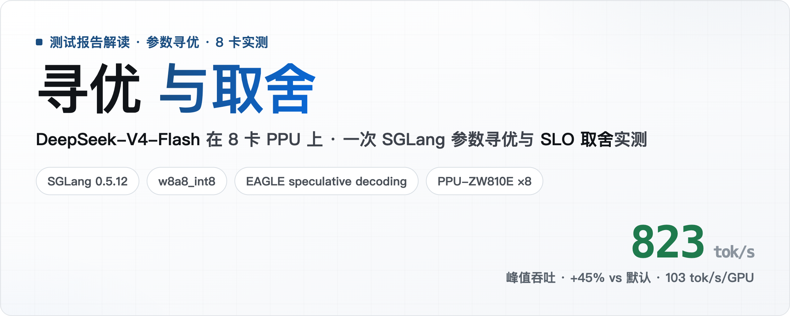
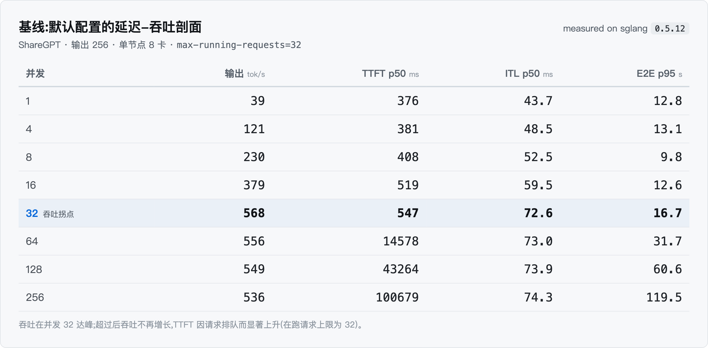
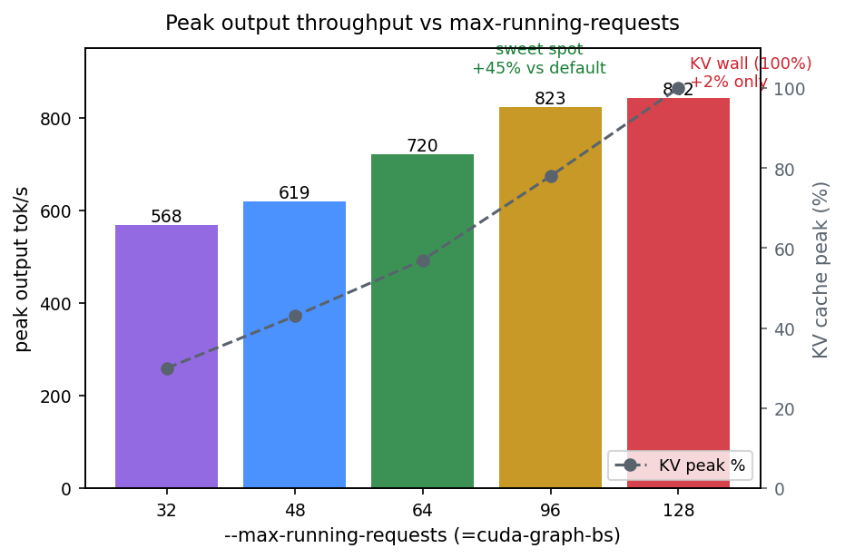
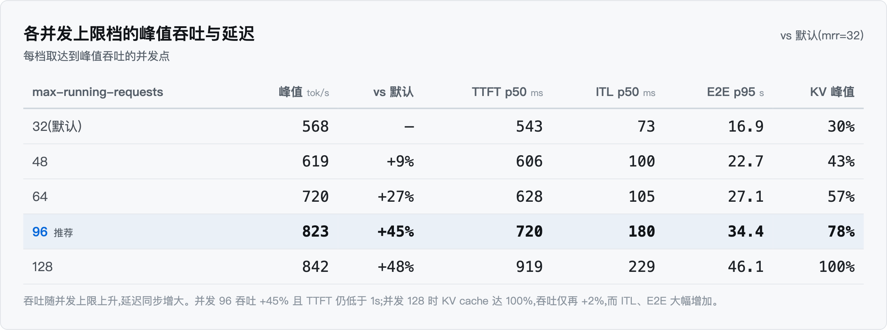
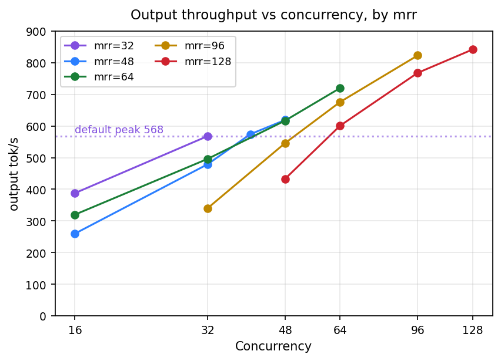
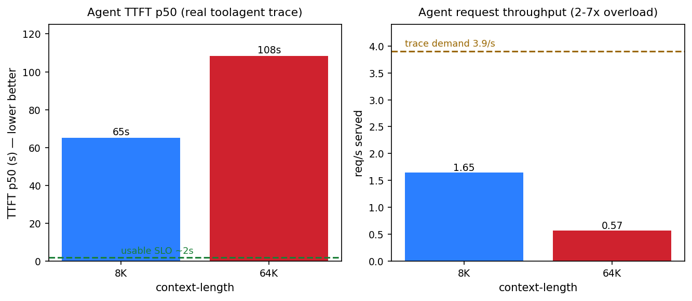
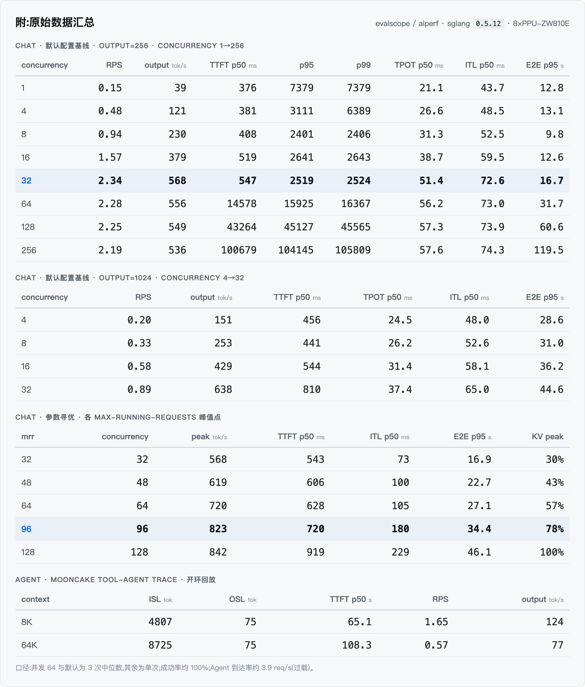

# DeepSeek-V4-Flash 在 8 卡 PPU 上的 SGLang 寻优与取舍



> 固定硬件与模型,只调 SGLang 参数,量化并发上限对吞吐/延迟的影响,并观察 Chat 与 Agent 两类负载下的行为差异。本文记录目的、方法、实测数据与边界,供复现与判断。

## 摘要

- 在固定的 **8 卡 PPU-ZW810E + SGLang 0.5.12 + DeepSeek-V4-Flash-INT8** 上,以「一次一因子」的方式只调并发上限 `max-running-requests`(32→128)。
- **Chat 短对话**:峰值输出从 568 tok/s(默认 32)升到 823 tok/s(并发 96,+45%);到 128 时 KV cache 饱和(100%),吞吐仅再 +2%。
- **Agent 长输入**(真实工具调用轨迹):默认单实例首字延迟 p50 达 65–108 秒,请求吞吐 0.6–1.7 req/s,而轨迹到达率约 3.9 req/s,过载 2–7 倍。
- **上下文**:8K 会拒掉真实 Agent 约 24% 的请求;`--context-length` 提到 64K 并不额外占用 KV 池。
- **口径**:并发 64 与默认为 3 次取中位,其余为单次;测量在共享服务上进行。

## 一、目的与假设

很多部署沿用默认参数上线。默认参数是稳妥的基线;本实验想在固定的 8 卡硬件与模型下,弄清**给定 SLO 后是否存在定向优化空间,以及不同负载各自的瓶颈所在**。

**假设**:现网默认 `max-running-requests=32` 是配置画出的拐点,而非硬件极限;上调并发上限能把 SLO 内峰值吞吐推高,且存在一个明确的甜点;而长输入的 Agent 负载与短对话的瓶颈不同,可能无法靠同一套调参解决。

## 二、环境(可复现契约)

| 项 | 值 |
|---|---|
| 硬件 | PPU-ZW810E ×8 · 单节点 · 已启用拓扑感知调度 |
| 引擎 | SGLang 0.5.12 |
| 模型 / 量化 | DeepSeek-V4-Flash-INT8 · w8a8_int8 · EAGLE speculative decoding |
| 归因数据 | SGLang `/metrics`(KV 使用率、抢占)+ Prometheus |

**完整启动命令**(可复现基线;参数寻优即在此命令上单因子改动 `--max-running-requests`):

```bash
export GPU_COUNT=8
export NODE_COUNT=1
export PORT=8000
export SGLANG_OPT_USE_MULTI_STREAM_OVERLAP=1
export SGLANG_DEEPEP_NUM_MAX_DISPATCH_TOKENS_PER_RANK=512
export SGLANG_OPT_USE_COMPRESSOR_V2=0
export SGLANG_OPT_FUSE_WQA_WKV=0
export SGLANG_DSV4_FP4_EXPERTS=0
export SGLANG_OPT_USE_FUSED_STORE_CACHE=0

python3 -m sglang.launch_server --model-path deepseek-ai/DeepSeek-V4-Flash \
  --trust-remote-code \
  --tp 8 \
  --enable-metrics \
  --context-length 8192 \
  --quantization w8a8_int8 \
  --attention-context-parallel-size 8 \
  --enable-nsa-prefill-context-parallel \
  --moe-a2a-backend deepep \
  --disable-shared-experts-fusion \
  --max-running-requests 32 \
  --cuda-graph-bs 32 \
  --mem-fraction-static 0.75 \
  --chunked-prefill-size 8192 \
  --kv-cache-dtype bfloat16 \
  --disable-piecewise-cuda-graph \
  --speculative-algo EAGLE \
  --speculative-num-steps 2 \
  --speculative-eagle-topk 1 \
  --speculative-num-draft-tokens 2 \
  --tool-call-parser deepseekv4 \
  --reasoning-parser deepseek-v4
```

本次实验只扫 `--max-running-requests` 一个参数,其余 flag 与环境变量作为固定基线保持不变;其中多个 `SGLANG_OPT_*` 优化开关默认关闭(见后续规划)。

## 三、方法

**实验设计(一次一因子 OFAT)**

| 维度 | 设置 |
|---|---|
| 搜索方式 | OFAT 坐标下降,一次只动一个因子 |
| 被调参数 | `max-running-requests` = 32 / 48 / 64 / 96 / 128 |
| 固定项 | `cuda-graph-bs` 跟随 mrr · `mem-fraction-static` 0.75 · TP 8 · 上下文 8192 |

**负载、指标与口径**

| 项 | 设置 |
|---|---|
| Chat 负载 | evalscope perf · ShareGPT · 输入 ~800 / 输出 ~256 token · 流式 |
| Agent 负载 | aiperf · mooncake 工具调用轨迹(真实)· 长输入 + 前缀复用 · 开环回放 |
| 指标 | 输出吞吐 tok/s、首字延迟 TTFT、词间延迟 ITL、请求吞吐 req/s |
| 分位 | p50 / p95 / p99 |
| 采样 / 重复 | `seed=42` · 并发扫描 · 并发 64 与默认取 3 次中位,其余为单次 |
| 流程 | 每个配置滚动重启后压测 |

## 四、结果

### 4.1 基线:默认配置的延迟-吞吐剖面

先看默认配置(`max-running-requests=32`)在不同并发下的表现:



**并发 32 就是默认配置画出的拐点**:输出吞吐在此达峰(568 tok/s),超过后不再增长,而首字延迟从约 0.5 秒急剧上升到 14.6 秒、43 秒、100 秒——因为默认把在跑请求锁在 32,更多请求只能排队。

### 4.2 抬高并发上限:峰值吞吐随之上升,直到 KV cache 瓶颈



把 `max-running-requests` 逐档放开,取每档峰值点的吞吐、延迟与显存:



峰值吞吐随并发上限一路上升,但延迟也随之增加。**并发 96 是甜点**:吞吐 +45%、TTFT 仍 <1s、KV 78% 有余量;到 128 时 KV cache 饱和(100%),吞吐仅再 +2%,延迟却大幅恶化(ITL +214%、E2E +173%)——边际收益不足。

换算到单卡:默认约 **71 tok/s/GPU**,甜点约 **103 tok/s/GPU**(峰值 ÷ 8 卡)。

### 4.3 同一并发下,高上限配置反而更慢



在并发 32 这一档,输出吞吐随并发上限上升反而下降:568 → 496 → 340(对应 mrr 32 / 64 / 96)。

### 4.4 Agent:长输入负载下单实例过载

用真实工具调用轨迹(mooncake tool-agent)开环回放,按轨迹时间戳发压。默认单实例配置下测得:



| 上下文 | 输入 ISL | 输出 OSL | 轨迹需求 | 实际服务 | 过载 | TTFT p50 |
|--:|--:|--:|--:|--:|--:|--:|
| 8K | 4807 | 75 | 3.9 req/s | 1.65 req/s | 2.4× | 65 s |
| 64K | 8725 | 75 | 3.9 req/s | 0.57 req/s | 6.8× | 108 s |

**为什么单实例无法承载?**

- **输入长**:Agent 输入中位 5–9K token,是 Chat(~800)的 6–11 倍,prefill 计算量随之激增;
- **输出短**:约 75 token(一次工具调用)就结束,单请求耗时几乎全在 prefill;
- 单实例的 prefill 吞吐跟不上轨迹到达率(3.9 req/s),请求在队列里堆积,首字延迟被推到 65–108 秒。放长上下文(8K→64K)让请求更长、prefill 更重,过载从 2.4× 升到 6.8×——这正是 prefill-bound:瓶颈在 prefill 算力,不在并发或 KV,单机调参无法解决。

### 4.5 上下文长度

该模型官方支持 100 万 token 上下文,部署原锁在 8192。将 `--context-length` 提到 64K,`max_total_num_tokens`(KV 池)保持 124 万 token 不变,仅放行更长请求。8K 上下文会拒掉真实 Agent 轨迹中约 24% 的请求(输入 >8K,个别可达约 124K)。

### 4.6 输出长度的影响

另一个负载维度:把输出从 256 提到 1024(同为默认配置):

| 输出长度(并发=32) | 吞吐 tok/s | TTFT p50 (ms) | E2E p95 (s) |
|--:|--:|--:|--:|
| output=256 | 568 | 547 | 16.7 |
| output=1024 | 638 | 810 | 44.6 |

长输出反而**吞吐更高**(638 vs 568——decode 占比更大、GPU 利用更满),但**首字延迟与端到端都更长**(需要生成 4 倍 token)。可见吞吐/延迟的权衡还取决于输出长度这一负载形状。

## 五、分析 / 归因

- **KV cache 瓶颈**:并发 128 时 Prometheus 实测 KV `token_usage` 达 100%,吞吐见顶并开始抖动——吞吐的上界由 KV 显存决定。
- **低并发惩罚**:并发 96 时 KV 仅 78%、`new_token_ratio` 稳定无抢占,故低并发变慢不是 KV 摊薄,而是 `cuda-graph-bs` 增大带来的固定开销。
- **Agent prefill-bound**:Agent 请求为长输入(prefill 计算重)+ 短输出,瓶颈在 prefill 算力,不在并发或 KV;放长上下文(8K→64K)引入更长请求,prefill 更重,吞吐进一步下降。
- **投机解码效果稳定**:EAGLE speculative decoding 在全部配置下 accept rate ≈ **0.51**、每次迭代解码 ≈ **2.05 token**(约 2× 有效解码),不随并发或 mrr 变化;因此 TPOT 随并发上升来自 batch 增大,而非投机退化。

## 六、局限与有效性威胁

- **多为单次测量**:仅并发 64 与默认为 3 次中位数,并发 48/96/128 与 Agent 为单次;精确数值需补足重复次数。
- **共享服务**:测量在共享推理服务上进行,可能受到少量其它流量影响。
- **Agent 口径**:使用近似分词器,且为过载态(非稳态每请求延迟)。
- **未采集**:PPU 设备利用率未采集,算力饱和由吞吐 / prefill 间接推断。

## 七、结论(带作用域)

给定 SLO,按场景选参数——没有一套配置能通吃全场,按真实负载对号入座:

**Chat · 高吞吐 / 批处理** — `--max-running-requests ≈ 96`
> 823 tok/s(+45% vs 默认)· TTFT 720ms · KV 78%(仍有余量)

**Chat · 低并发 / 延迟敏感** — `--max-running-requests = 32`(默认)
> TTFT 543ms · ITL 73ms · E2E 16.9s · 低并发下吞吐与延迟俱佳

**Agent · 长输入** — PD 分离 + 上下文 ≥ 64K + 多机
> 单实例 TTFT 65–108s · 过载 2–7× · prefill-bound,调参无法解决

## 八、后续规划

按优先级列出接下来要做的实验:

1. **PD 分离部署(针对 Agent)**:把 prefill 与 decode 拆成独立池(SGLang disaggregation),用长输入 Agent 轨迹对比 co-located 单实例的首字延迟与吞吐;扫 prefill : decode 实例配比与 KV 传输开销。
2. **prefill / decode 精调**:`chunked-prefill-size` 与调度参数(`max-prefill-tokens`、schedule 保守度)扫描,平衡长输入首字延迟与对 decode 吞吐的干扰。
3. **speculative decoding 方式对比**:现用 EAGLE 草稿(steps 2 / draft 2);对比 DeepSeek-V4 原生 **MTP(多 token 预测)** 与关闭投机,看接受率、TPOT 与吞吐,为该模型定一套合适的投机配置。
4. **突破 KV cache 瓶颈**:吞吐上界由 KV 显存决定——测 **fp8 KV cache** 能否把 KV 使用率饱和的临界并发从 128 往后推;并扫 `mem-fraction-static`(KV 池大小 vs 可达并发)。
5. **环境变量寻优**:基线中多个 SGLang 优化开关当前为关闭(`USE_COMPRESSOR_V2`、`DSV4_FP4_EXPERTS`、`FUSE_WQA_WKV`、`USE_FUSED_STORE_CACHE`),逐个开启测试吞吐 / 延迟收益——这是本次未覆盖的一个优化维度。
6. **拓扑对比**:TP8 单副本 vs TP4×2 双副本的 SLO-峰值差异(需独占硬件)。
7. **补口径**:mrr 48/96/128 与 Agent 补 3 次中位数;SLO 门控改用 ITL p50 或 TPOT(speculative decoding 下 ITL p95 实测 200–670ms,原 ≤50ms 门限不现实)。

## 九、附录:原始数据

本次三组实验(Chat 基线延迟-吞吐剖面、参数寻优、Agent)的原始数据汇总:


