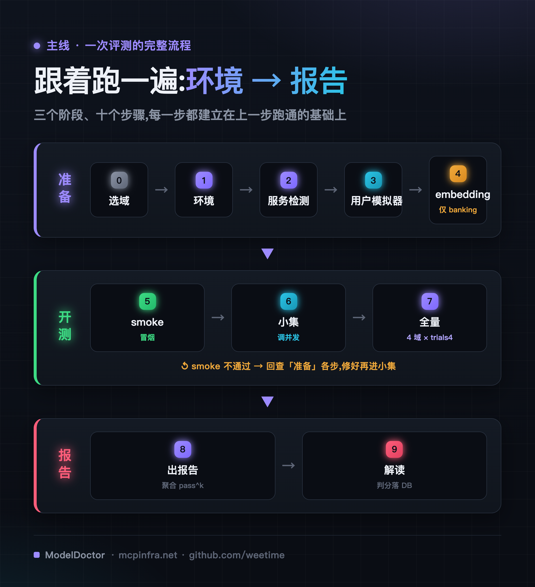
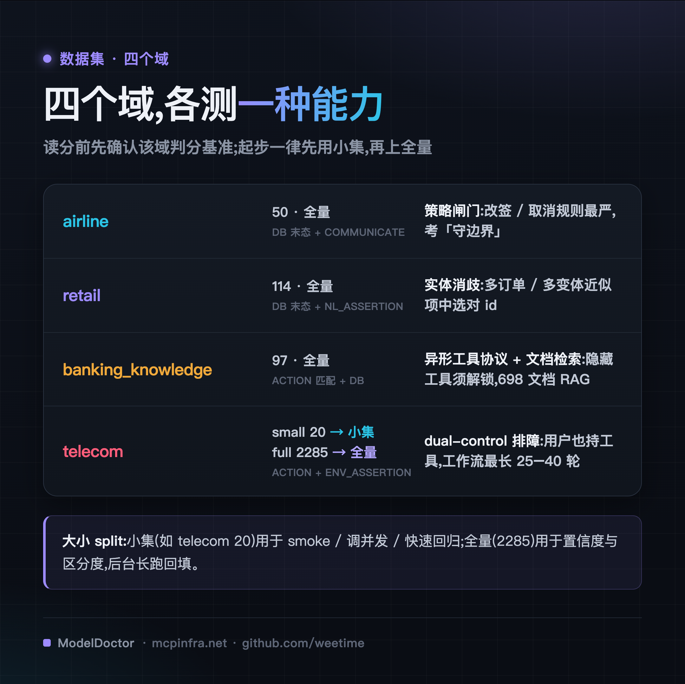
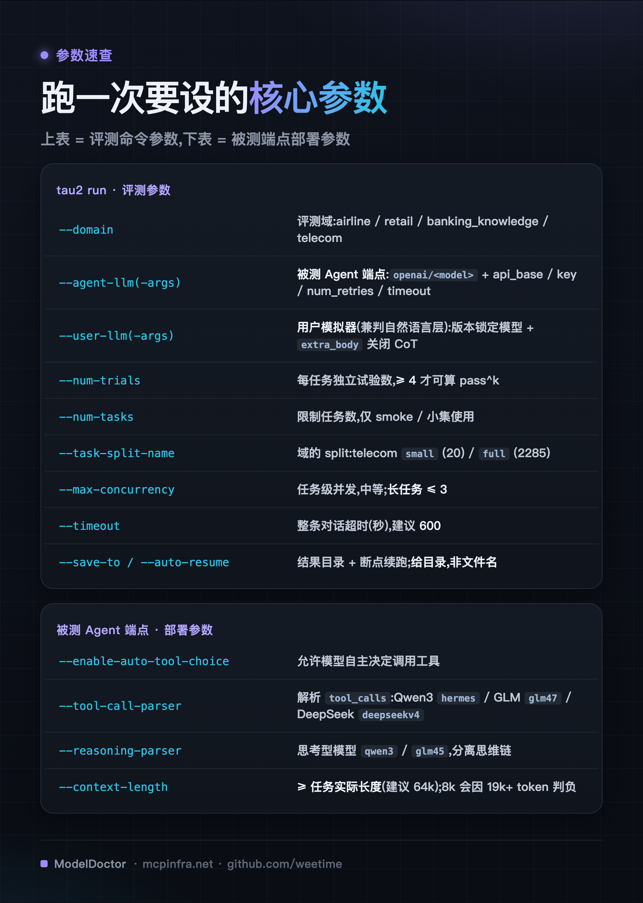
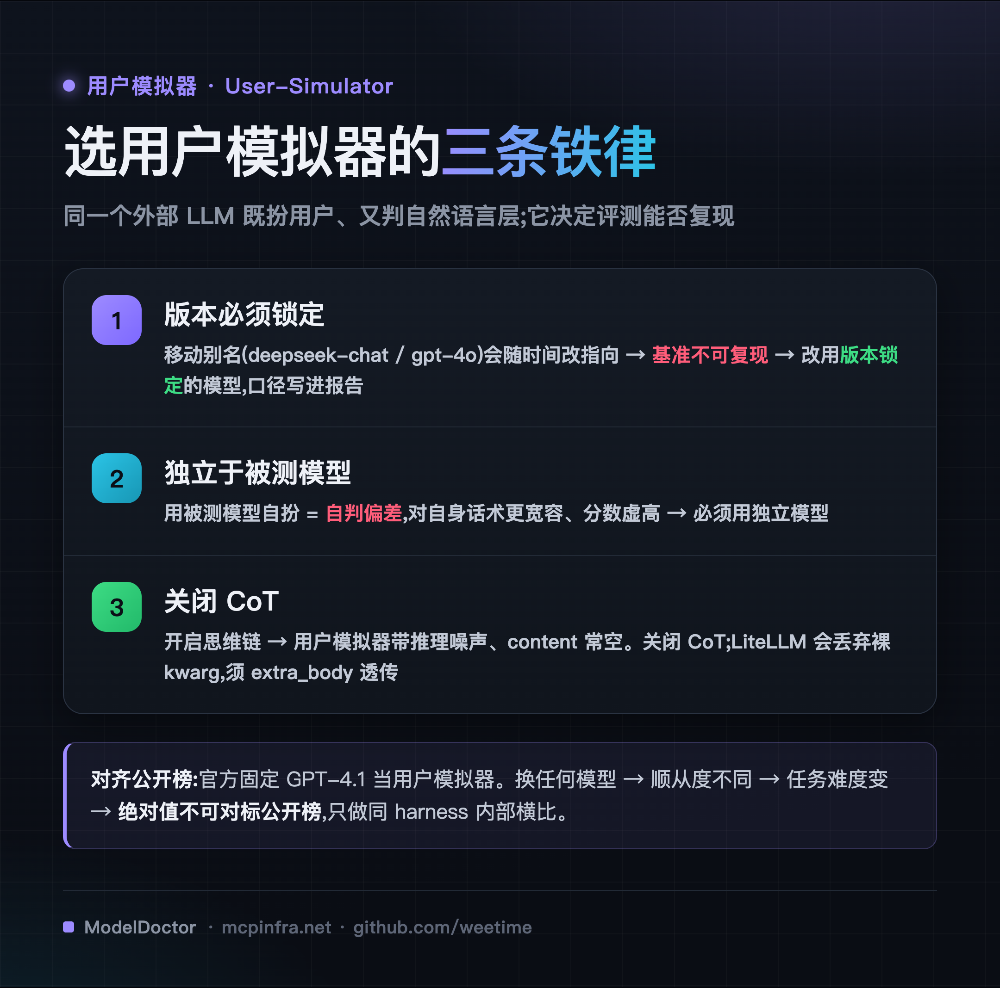
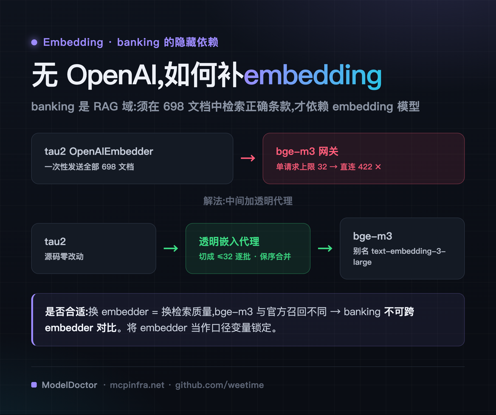
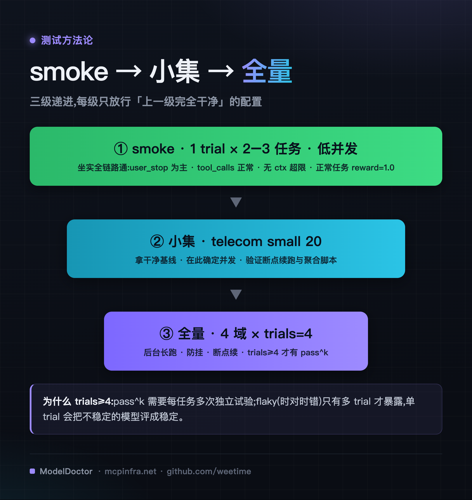
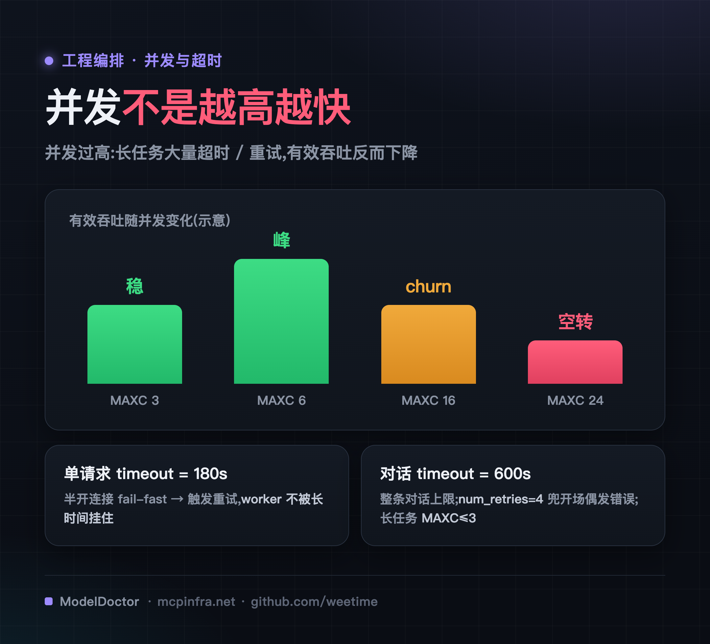
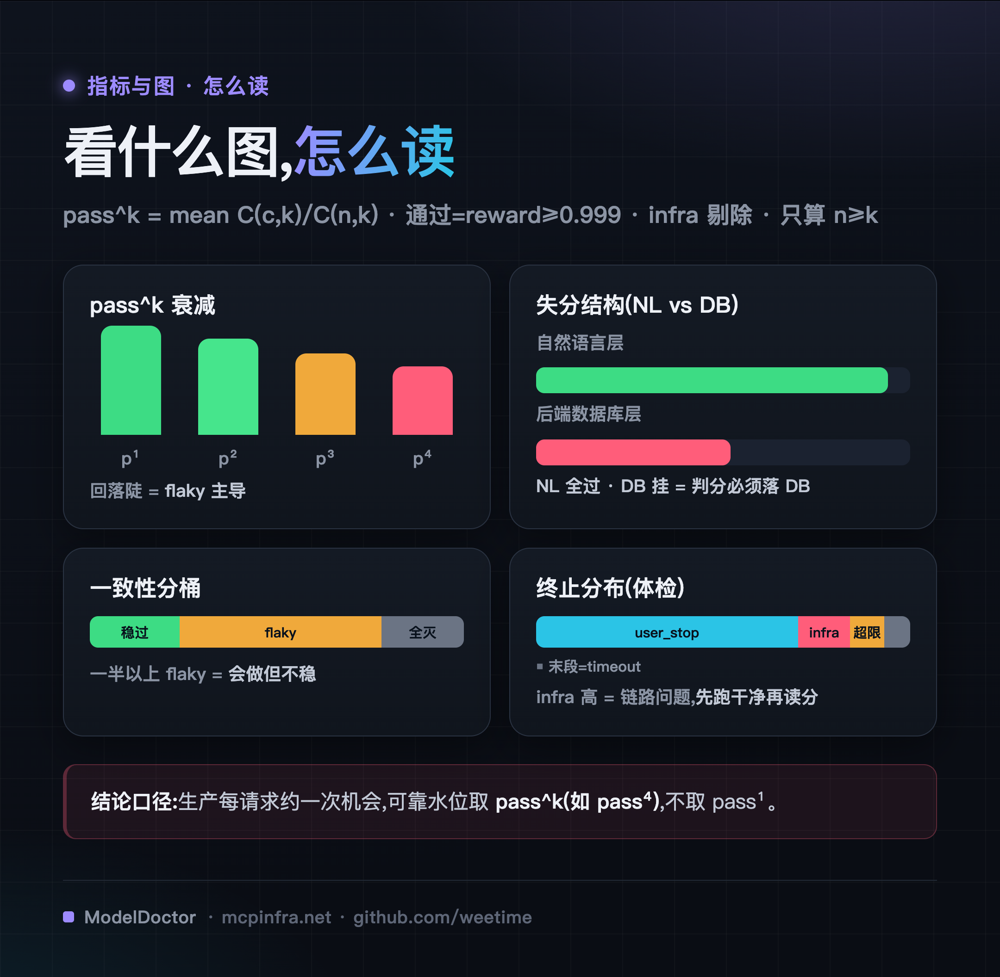
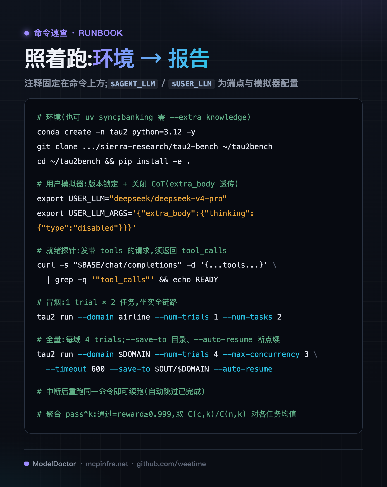

# τ-bench 评测实战:对话式 Agent 基准的方法论与踩坑复盘

> 评测工具箱系列 · 第一篇。τ-bench(Sierra Research)以「按数据库末态判分」著称,是最贴近客服 / 办事型场景的对话式 Agent 基准。难点不在理解它,而在于**把它跑对、跑准、可复现**——用户模拟器选错、并发调高、上下文配小,任一处出错,得到的都是「部署噪声」而非「模型能力」。本文按真实流程完整走一遍,给出每一步的做法、命令与踩过的坑。

上图是全文骨架:**每一步都建立在上一步跑通的基础上**。下面逐步展开。

---

## 0 · 认识 τ-bench:版本与选域

τ-bench 模拟客服 / 办事场景:一个 LLM 扮演用户多轮对话,被测 Agent 调用领域 API 修改后端数据库、并须遵守 policy,最后**按数据库末态判分**,以 pass^k 衡量可靠性。

**版本沿革(τ → τ² → τ³)。** 三代逐步逼近真实场景:

- **τ-bench**(初代):airline、retail 两个域,确立「用户模拟器 + 工具 + policy + pass^k」框架。
- **τ²-bench**:新增 **telecom** 域与 **dual-control(双向控制)**——用户也持有工具、能操作环境,Agent 须引导用户而非独自执行(以 Dec-POMDP 建模)。
- **τ³-bench**:新增 **banking 知识域**(须在文档库中检索政策)与**语音(τ-Voice)**,并修订了前两代的任务。

**τ³-bench 是当前最新、也是最难的一代**——前沿模型在其 banking 知识域的成功率仅约 25%。工程上,`sierra-research/tau2-bench` 的 `main` 包已包含 τ³ 对 airline / retail / telecom / banking 四个**非语音域**的任务修订(与 `dev/tau3` 逐字节一致),因此**自托管评测直接用它即可覆盖 τ³-bench**;语音域依赖 realtime 接口、不便自托管,一般排除。

> **本文即以 τ³-bench(四个非语音域)为评测对象。** 需注意:CLI、包名、仓库仍沿用 τ² 时期的历史命名 —— 安装 `tau2-bench`、命令 `tau2 run`、环境 `tau2` **保持字面不变**(这是可复现的前提)。下文「τ-bench」为家族泛称,「τ³-bench」特指最新代。

**如何选域**:评测对话式办事 Agent,用这四个非语音域即可;起步选与自身业务最像的一两个域的小集。四个域**各测一种不同的能力**:

- **airline** —— 策略闸门。改签 / 取消规则最严,考「守边界」。
- **retail** —— 实体消歧。在多个近似订单 / 变体中,`modify_pending_order_items` 须选对那一个 id。
- **banking_knowledge** —— 异形工具协议 + 文档检索。特权动作被隐藏,须先 `unlock_discoverable_agent_tool` 取得真名、再以 **JSON 字符串**约定调用 `call_discoverable_agent_tool`,同时须在 698 份文档中检索到正确条款(因此额外依赖 embedding,见后文「embedding 准备」)。
- **telecom** —— dual-control。用户也持工具,Agent 须引导其操作,工作流最长。

**telecom 的两个 split 对应两个阶段**:`small`(20)用于冒烟 / 调并发 / 快速回归,`full`(2285)用于最终置信度。**任何域都先从小规模起步。**

一次评测要设的核心参数与被测端点的部署参数,整理如下(下文各步都会用到):

---

## 1 · 环境准备(miniconda)

客户端(运行评测的机器)无需 GPU,只需能连接被测端点与用户模拟器 / embedding 服务。安装用 `conda` + `pip install -e .`(官方新版也支持 `uv sync`;banking 域须带 `--extra knowledge`)——完整命令见文末「命令速查」。两点须提前知晓:

- **使用 `main` 分支**。`dev/tau3` 将 voice 耦合进了 agent 的导入链(import 时即需 pyaudio 等音频 / 云 SDK);而 main 的四个非语音域任务文件与 dev/tau3 **逐字节一致**(md5 相同),已含 τ³ 修订。
- **运行评测时不要使用 `conda run` 包装**。在 retail 等高输出量域上,其 stdout 管道缓冲可能**死锁** worker。应直接调用环境内二进制 `~/miniconda3/envs/tau2/bin/tau2`。

> 目前 τ²/τ³ **没有官方 Docker 镜像**(仓库与 getting-started 均只提供源码安装)。若想绕开环境准备,可自建一个薄镜像包住 `uv sync`;但 banking 的 embedding 若自建,仍需下文的分批代理——镜像只解决「装」,不解决「口径」。

---

## 2 · 模型服务检测(被测 Agent 端点)

被测模型作为 Agent 接入。部署时须正确开启四个参数(取值见上「核心参数速查」下表):`--enable-auto-tool-choice`、`--tool-call-parser`(按模型族选)、`--reasoning-parser`(思考型需要)、`--context-length`。否则得到的是「解析失败」而非「模型能力」。

其中 **context 是隐形门槛**:Agent 多轮对话 + 工具 schema 常达 19k+ token,8k 会直接 `ContextWindowExceeded` 判负——此为部署不匹配,非模型能力问题,放开至 64k 后归零。

**就绪判断不能用 `/v1/models` 返回 200**——它只表示进程已启动,KV 分配 / cuda graph 未必就绪,以此为信号会让全量跑成大面积 `infrastructure_error`。**就绪的判据是:实际发送一次带 tools 的请求、并返回结构化 `tool_calls`**(探针命令见文末「命令速查」)。接入被测端点时,`num_retries` 与单请求 `timeout` 均在 `--agent-llm-args` 中设定(超时策略详见后文「加并发,跑全量」)。

---

## 3 · 用户模拟器准备

τ³-bench 中有一个外部 LLM,通过 `--user-llm` 指定:它既**扮演用户**(多轮给出信息),又**判定自然语言层**(NL_ASSERTION / COMMUNICATE);而数据库末态、ACTION、ENV 为**程序化判定**,不经它。这个模型的选择直接决定评测能否复现——三条铁律:

- **版本必须锁定**。`deepseek-chat`、`gpt-4o` 等为**移动别名**,服务方会随时改其指向,今日分数次月无法复现,不能作基准。应选可锁定具体版本的模型(如 `deepseek-v4-pro`)。
- **独立于被测模型**。以被测模型自扮会引入自判偏差、分数虚高。
- **关闭 CoT**。开启思维链会使用户模拟器带入推理噪声、`content` 常为空。须注意:LiteLLM 会静默丢弃裸 `thinking` 参数,须经 `extra_body` 透传(配置见文末「命令速查」)。

**须写入报告的口径**:官方榜固定以 GPT-4.1 作用户模拟器。一旦更换模型,顺从度改变、任务难度随之变化,**绝对值不可对标公开榜**,仅可在同一 harness 内部横比。

---

## 4 · embedding 准备(仅 banking)

仅 banking 为 RAG 域,须在 698 份文档中检索正确条款,因而依赖 embedding(τ³-bench 默认调用 OpenAI `text-embedding-3-large`)。其余三域可跳过本步。

无 OpenAI 时,以自建 embedding(如 bge-m3)按别名 `text-embedding-3-large` 顶替。但直连存在一个坑:tau2 的 `OpenAIEmbedder` 会将 698 份文档**一次性**放入单个 `/v1/embeddings` 请求,超过 bge-m3 单请求上限 32,返回 `422`。解法是加一个**透明分批代理**:将输入切成 ≤32 逐批转发、保序合并;查询期单条透明通过;tau2 源码零改动(把它包成一个本地 OpenAI 兼容 `/v1/embeddings` 服务,约 40 行,再将 tau2 的 `OPENAI_API_BASE` 指向它)。

**是否合适**:更换 embedder 即更换检索质量,banking 分数**不可跨 embedder 对比**。与用户模拟器同理,将 embedder 作为口径变量锁定。

---

## 5 · 开测:先 smoke

前四步均为准备。开测的第一步必须是**冒烟**——目的是坐实全链路连通,而非查看分数(命令见文末「命令速查」)。

检查终止原因:应以 `user_stop`(对话正常结束)为主,不应全为 `infrastructure_error` 或 context 超限;`tool_calls`、用户模拟器、embedding 均须正常。单并发下正常任务的 reward 应达 1.0——未达则回查前面「模型服务检测 / 用户模拟器 / embedding」各步,不宜直接进入全量。

---

## 6 · 小集看效果,确定并发

冒烟通过后运行小集(如 telecom `small` 20),获得第一份**干净基线**,并在本级一并完成三件工程事:**确定并发参数**、**验证断点续跑**、**验证聚合脚本**。小集壁钟短、迭代快,工程问题应在此暴露并解决,而非留到耗时数小时的全量。

---

## 7 · 加并发,跑全量

小集稳定后再放大规模。但**并发并非越高越快**:

- 并发过高时,长任务大量超时 / 重试、有效吞吐反而下降,宜取中等并发。
- **长任务(telecom / retail,25–40 轮)仅在低并发(`MAXC ≤ 3`)下方可稳定完成**;短任务(airline / banking)可略高。
- **两层超时须分清**:单请求超时(`--agent-llm-args` 中 `timeout=180`)让连接层异常 fail-fast、触发重试;若只设整条对话超时(`--timeout 600`)而不设单请求超时,半开连接会长时间挂住 worker。
- `num_retries=4` 由 LiteLLM 重试兜底开场偶发错误(同一请求重发,不改变判定口径)。

全量为 4 域 × trials=4(**trials ≥ 4 才可算 pass^k**),对每个域执行同一条命令(可后台长跑;`--save-to` 给目录、`--auto-resume` 断点续跑,命令见文末「命令速查」)。一个 tau2 行为须注意:`--auto-resume` 会把 `timeout` 记录当作「已完成」跳过;若要补齐这些任务,须先 prune 掉 `timeout` / `infrastructure_error` 记录再重跑。

---

## 8 · 出报告:聚合 pass^k

pass^k 的口径须固定,否则不同人算出来不可比。**通过 = reward ≥ 0.999**;**有效 trial = 有 reward 且非 `infrastructure_error`**(infra 剔除;`timeout` 保留并记其真实 reward,通常判 fail)。聚合就是一个组合数:对每个任务,设有效 trial 数 n、通过数 c,则该任务的 `pass^k = C(c,k) / C(n,k)`,再对 **n ≥ k** 的任务取均值(见文末「命令速查」)。同时统计**平均 reward** 与**终止分布**(`user_stop` / `infra` / context 超限 / `timeout`),后者用于数据体检。

---

## 9 · 解读报告:看什么图、怎么读

按顺序解读:

1. **先看终止分布体检**:`infra` 占比高表明为链路问题,须回查——**先将数据跑干净,再读能力分**。
2. **pass¹ 表征能力,pass^k 衰减表征可靠性**:回落陡即 flaky(会做但不稳)。生产环境每请求约一次机会,**可靠水位取 pass^k(如 pass⁴),不取 pass¹**。
3. **失分结构落到层**:将 reward 拆为 DB 匹配 / 沟通达标 / ACTION / NL 断言。**自然语言层近乎全过而后端 DB 层大面积失败 = 会说话不会办事——判分必须落在 DB 正确性上**,仅看沟通或仅用 LLM 判分会严重高估。
4. **一致性分桶**:将满-k 任务按通过次数分为稳过 / flaky / 全灭,直观呈现 flaky 占比。

---

## τ-bench 的边界与生态补位

τ-bench 的强项在于多轮真实对话 + policy 遵循 + 数据库末态判分 + pass^k,此格无可替代。但它**不评测 GUI / 浏览器**(用 WebArena / OSWorld)、**不评测代码**(SWE-bench)、**不评测纯函数调用格式**(BFCL 更快更省,宜作 tool-calling 回归)、**域有限**(四个客服场景),且分数受用户模拟器质量封顶。不宜以单一 τ-bench 分数回答全部问题;私有域可按其思路以 Inspect / OpenAI Evals 自建。

---

## 命令速查(RUNBOOK)

从环境到报告的完整命令,注释固定在命令上方:

**编号踩坑清单(按代价排序)**

1. `--context-length` 过小 → Agent 多轮对话 19k+ token 直接判负;评测前先确认 context ≥ 任务实际长度。
2. 用户模拟器用**移动别名**(deepseek-chat 等)→ 不可复现;须换**版本锁定**模型、独立于被测模型,并关闭 CoT(`extra_body` 透传)。
3. `/v1/models` 返回 200 ≠ 就绪;探针须实际发送一次带 tools 的请求并返回 `tool_calls`。
4. banking 的 698 文档一次性发送会超过 embedding 网关单请求上限(返回 `422`);须以透明代理分批。
5. 长任务(25–40 轮)在高并发下大量超时 / 重试、有效吞吐反而下降;长任务用低并发(`MAXC ≤ 3`)。
6. 仅设整条对话超时而不设单请求超时 → 半开连接会长时间挂住 worker;须在 `agent-llm-args` 设单请求 `timeout` 以 fail-fast。
7. `--save-to` 须给**目录**而非文件名;`--auto-resume` 会跳过 `timeout` 记录,回填前先 prune 掉 `timeout` / `infra`。
8. 高输出域上不要用 `conda run` 包装(stdout 缓冲可能死锁);聚合前先复制 `results.json` 再读(避免读到并发写入时的残缺值)。

---

## 关于作者

聚焦 LLM 推理的生产工程:让 vLLM / SGLang / MindIE 在国产卡、多集群网关(Higress)、P/D 分离下稳定落地。长期做推理编排(Dynamo / llm-d / AIBrix)、runtime 数据面验证、可观测性与 SRE。相关实践沉淀成部署配方库 recipes.mcpinfra.net 与压测工具 ModelDoctor。让推理服务从「能跑」到「敢上线」。

> 本文为方法论与复现实践,不含具体模型的评测结论。评测的绝对值随用户模拟器 / embedder 口径变化,换口径不可跨表对比——请以自身锁定的口径为准。
