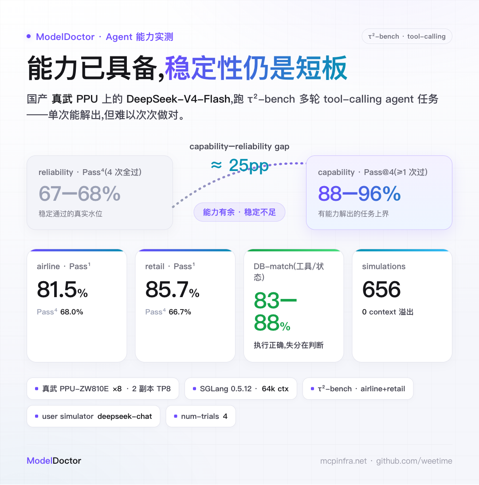
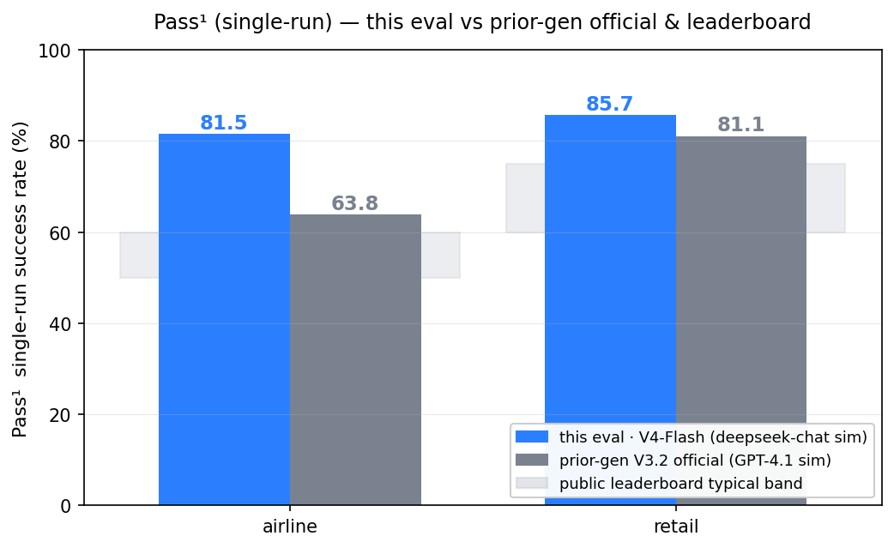
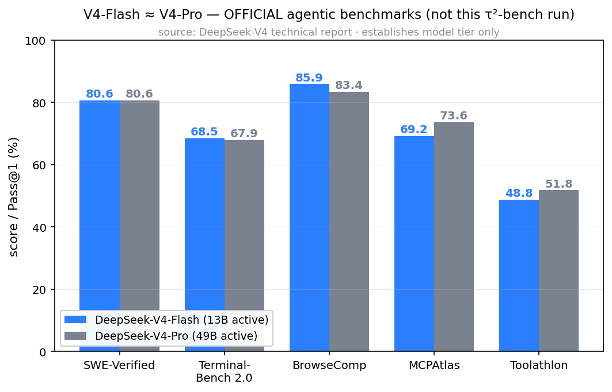
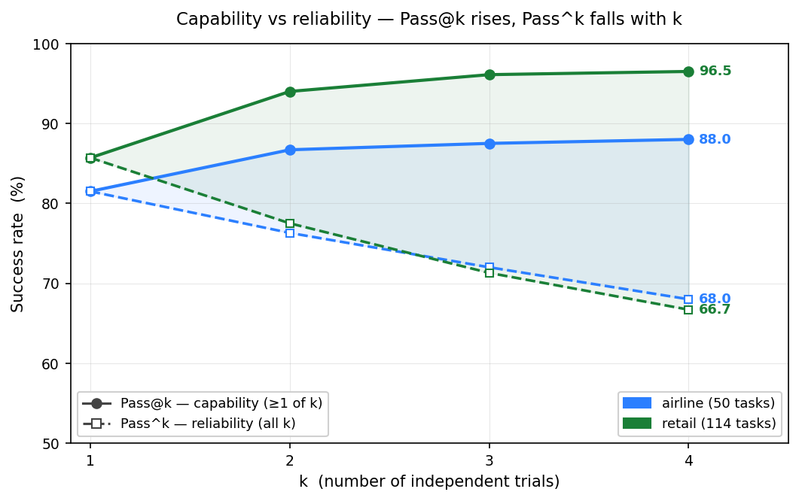
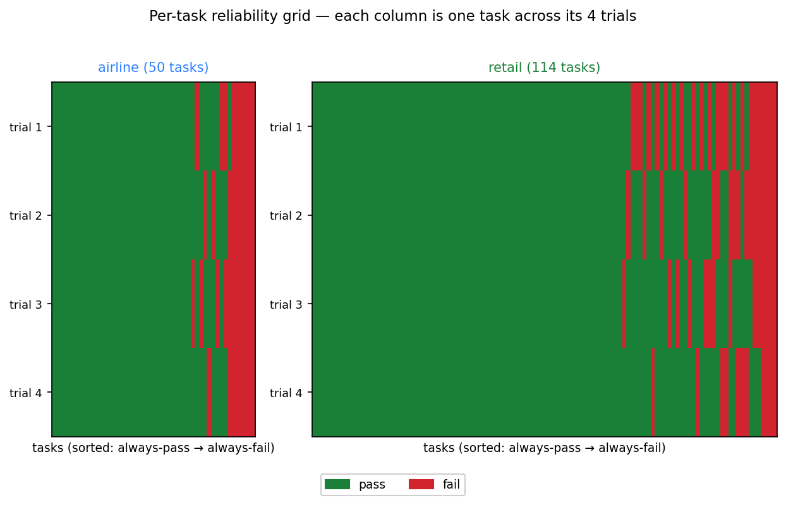
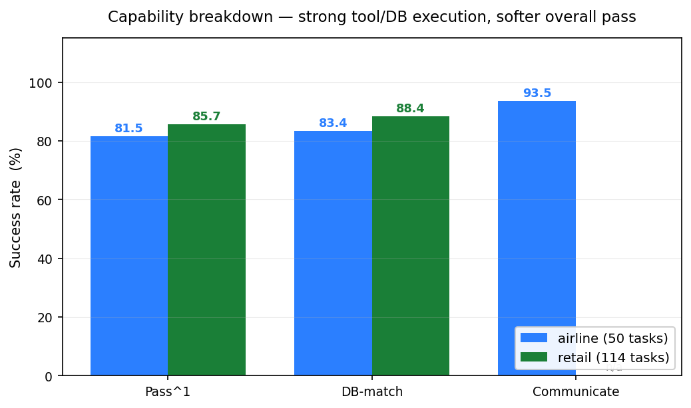

# DeepSeek-V4-Flash × τ²-bench:国产 8 卡 PPU 的 agent 能力实测

> 固定硬件与模型,用 Sierra Research 的 τ²-bench 官方任务集,量化 DeepSeek-V4-Flash-INT8 作为多轮 tool-calling agent 的任务成功率(Pass¹)与跨试验一致性(Pass^k)。本文记录环境、方法、实测数据与作用域,供复现与判断。

## 先看结论:能满足什么 Agent 任务

一句话:**国产真武 PPU 上的 DeepSeek-V4-Flash,已具备可用的多轮 tool-calling agent 能力**,但要看场景——

- **可用 · 可重试 / 有人工兜底的日常客服 agent**:查询、改签、下单、售后等标准工单。单次成功率 airline **81.5%**、retail **85.7%**,能力达标。
- **谨慎 · 无人值守、一次成功要求高的自动化**:把同一个任务重复 4 次、要求次次都对,通过率降到 **67–68%**(约三分之一任务不稳定)。高可靠场景需重试机制或更强模型。
- **硬件 · 国产 PPU 可稳定承载**:656 次 simulation 零崩溃,tool call 与后端数据库操作正确率 **83–88%**。

## 好不好?把数字放进参照系

agent 评测的「好不好」,核心就是看**任务成功率**。但单看 80% 不知道好坏,得有参照:

- 我们的 airline **81.5** / retail **85.7**,高于上一代 **DeepSeek-V3.2 官方**的 63.8 / 81.1,也位于公开 leaderboard 典型区间(airline ~50–60 / retail ~60–75)之上。
- **但有一个关键前提**:我们的 user simulator 用的是 **deepseek-chat(较宽松)**,而官方与 leaderboard 用 **GPT-4.1(较严)**。更顺从的模拟用户会降低任务难度,所以**绝对分不能直接对比**——retail 与预期相符,airline 高出的那一截主要来自较宽松的 simulator。
- 换算到统一口径,V4-Flash 大致与 V3.2 持平或略高。

**被测的 Flash 是什么水平?接近旗舰 Pro。** 这点值得单独说明——很容易以为「Flash」是个阉割小模型。但 DeepSeek-V4 官方报告里,Flash(13B active)与 Pro(49B active)在主流 agentic 基准上几乎持平,互有胜负:

> 注:这张图是 **DeepSeek-V4 官方技术报告**的数据,基准是 SWE / Terminal / BrowseComp 等**另一类** agentic 任务,与本次的 τ²-bench(客服工单)不同轴,**仅用于说明「被测的 Flash 是接近旗舰的强模型」这一档位**;本次 τ²-bench 的实测对比见上一张图。

SWE-Verified 打平,BrowseComp / Terminal-Bench 上 Flash 略高,MCPAtlas / Toolathlon 上 Pro 略高,二者在 TAU3-Bench 更是仅差约 0.5 个百分点。**所以在国产 PPU 上跑的,不是个中档小模型,而是接近旗舰的强 agent 模型。**

## 评测设置(可复现契约)

| 项 | 值 |
|---|---|
| 被测模型(agent) | DeepSeek-V4-Flash-INT8(DeepSeek-V4 MoE,reasoning model,tool-call-parser `deepseekv4`) |
| 硬件 | 真武 PPU-ZW810E ×8 · **2 副本 tensor parallel=8**(GPU 0–7 / 8–15)· HAMi vGPU |
| 引擎 / context | SGLang 0.5.12(sail 镜像)· **`context-length = 65536`(64k)** |
| 部署形态 | 普通 serving 2 副本,Service round-robin(**非 PD disaggregation**) |
| 评测框架 | **τ²-bench**(`sierra-research/tau2-bench`,package `tau2 v1.0.0`,已含 τ³ 任务质量修订),经 LiteLLM 接入 |
| user simulator | **官方 deepseek-chat**(`api.deepseek.com`) |
| 任务集 / 重复 | airline **50** + retail **114**(官方全量)· **num-trials=4** → 656 simulations |

被测模型作为 agent,由另一个 LLM(user simulator)扮演客户发起多轮对话,agent 须正确调用 tool、修改后端数据库(DB)并完成任务。reward 由 DB 状态匹配 + 沟通达标共同判定。**本次跑 airline + retail 两域,未含 τ³ 标志性的 banking 域,故严格说是「τ² 的 airline/retail 任务集(含 τ³ 修订)」,非完整 τ³-bench。**

## 方法:Pass^k 是什么

τ²-bench 的核心是一对方向相反的指标:

- **Pass@k**(capability,能力上界):k 次独立 trial 中**至少一次**成功的期望比例——反映「有没有能力解出」。
- **Pass^k**(reliability,可靠性):k 次 trial **全部**成功的期望比例——反映「能不能稳定地解出」。

按 task_id 聚合 4 个 trial 的成败(reward ≥ 0.999 记为成功),以无放回组合估计 `C(successes, k) / C(trials, k)`,再对全部 task 取均值。**Pass¹ 高、Pass^k 快速回落,即表明 capability 有余而 reliability 不足。**

## 结果

### capability 与 reliability 的剪刀差

这是 τ²-bench 最有信息量的一张图。随 k 增大,两条线朝相反方向张开:**Pass@k 上升**——retail 达 96.5%、airline 88.0%,说明模型**有能力**解决绝大多数任务;而 **Pass^k 下降**至 67–68%。阴影区就是 **capability–reliability gap**:能力已具备,但无法次次做对。生产环境下每个请求通常只有一次机会,真实可靠水位更接近 Pass⁴(约 67%)而非 Pass¹(约 85%)。

### 一致性:哪些 task 稳、哪些 task flaky

把每个 task 的 4 次 trial 逐列画成 pass(绿)/ fail(红)网格,按成功次数排序:**左侧稳定通过、右侧稳定失败,中间那条红绿相间的竖纹就是 flaky band**——同一 task 在重复运行中结果不定。flaky band(airline 约 20%、retail 约 30%)正是 Pass^k 下降的来源。

### 失分在哪:执行正确,判断偏弱

对比 Pass¹ 与分项指标可定位失分环节:两域 **DB-match 达 83–88%**、airline **Communicate 达 93.5%**,均高于其整体 Pass¹。这说明 **tool call 与后端 DB 状态修改基本正确**,失分更多集中在**策略与边界处理**——如应拒绝的请求被接受、应核对的信息未核对、多步任务中途丢失状态。这类问题属于 alignment 与判断,而非能力或知识缺失。

## 适用边界(别盲抄)

- **不可直接对标公开 leaderboard**:本次 user simulator 采用 deepseek-chat,而非 τ²-bench 论文与公开榜使用的 GPT-4.1。较易配合的 user simulator 会降低任务难度。本组数值衡量的是「同一较宽松 user simulator 下,PPU 上 DeepSeek-V4-Flash 的**相对** agent 能力」,要严格对标外部数字须统一为 GPT-4.1 user simulator 重跑。
- **域范围**:仅 airline + retail,未含更难的 banking 与 telecom。
- **共享环境**:单节点共享环境测量;部分任务对 user simulator 的随机性敏感。整体结论(capability 达标、reliability 不足)可靠,精确百分点建议以多 user simulator 复现。

## 结论(带作用域)

- **capability 达标**:两域 Pass¹ ≥ 80%、Pass@4 达 88–96%——国产 PPU 已能承载接近旗舰 V4-Pro 水平的 agent 模型,tool call 与 DB 操作正确率 83–88%。
- **reliability 是当前短板**:Pass⁴ 为 67–68%,约三分之一任务无法稳定通过。适合**可重试 / 有人工兜底**的日常客服类 agent 场景;高可靠、无人值守的自动化仍需重试机制或更强模型。
- **失分结构**:tool/DB 执行已基本正确,提升空间在策略与 alignment,而非扩充知识。
- **可比性**:绝对数值因 user simulator 较宽松而偏高,不作对外横向对标;要对标官方须统一 GPT-4.1 user simulator 后重跑。

## 关于作者

聚焦 LLM 推理的生产工程:让 vLLM / SGLang / MindIE 在国产卡、多集群网关(Higress)、P/D 分离下稳定落地。长期做推理编排(Dynamo / llm-d / AIBrix)、runtime 数据面验证、可观测性与 SRE。相关实践沉淀成部署配方库 **recipes.mcpinfra.net** 与压测工具 **ModelDoctor**。让推理服务从「能跑」到「敢上线」。

> 文中数字均来自单次真实评测,并非普适「标准答案」——换 user simulator / 任务集,结论可能就变。欢迎拿你自己的流量复现、指正。

