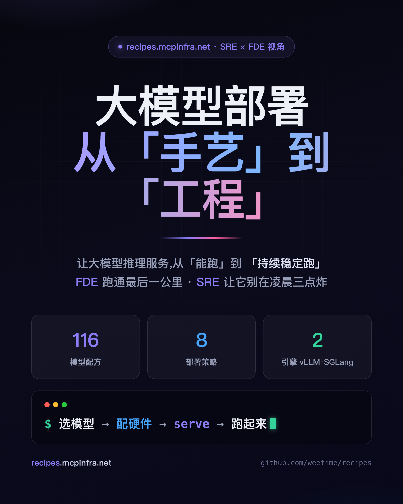
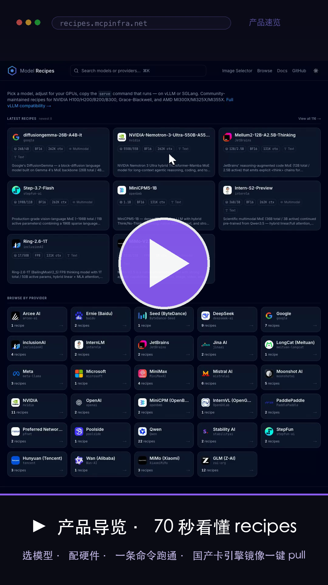
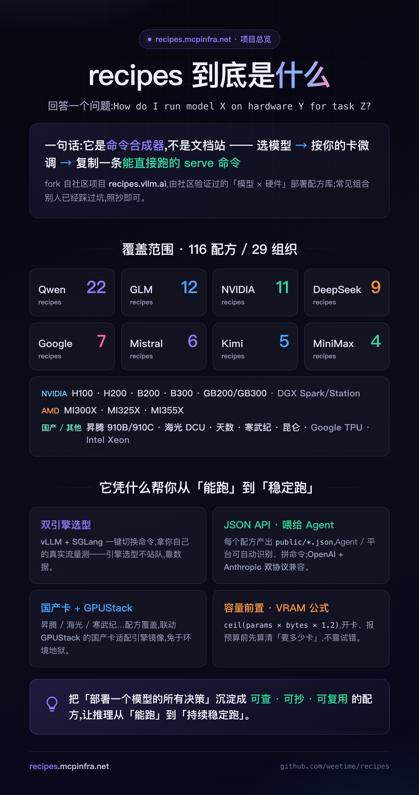
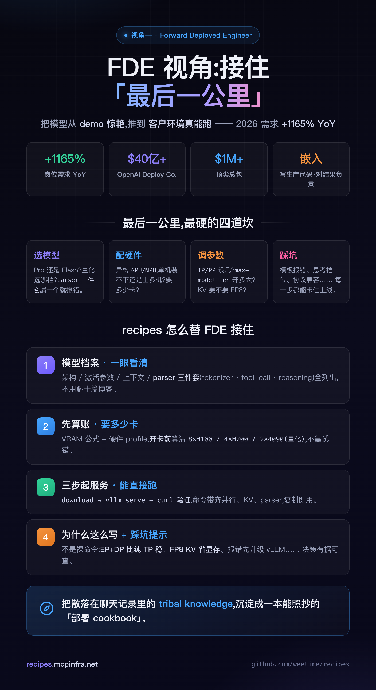
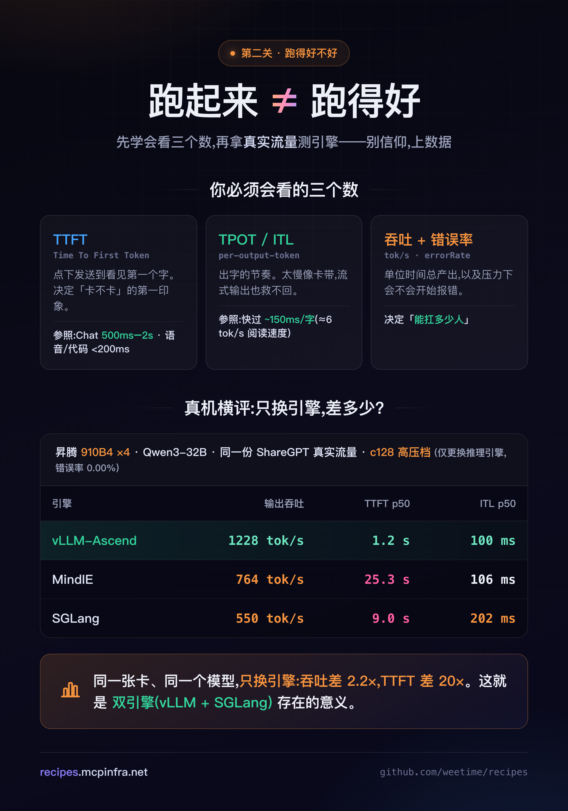
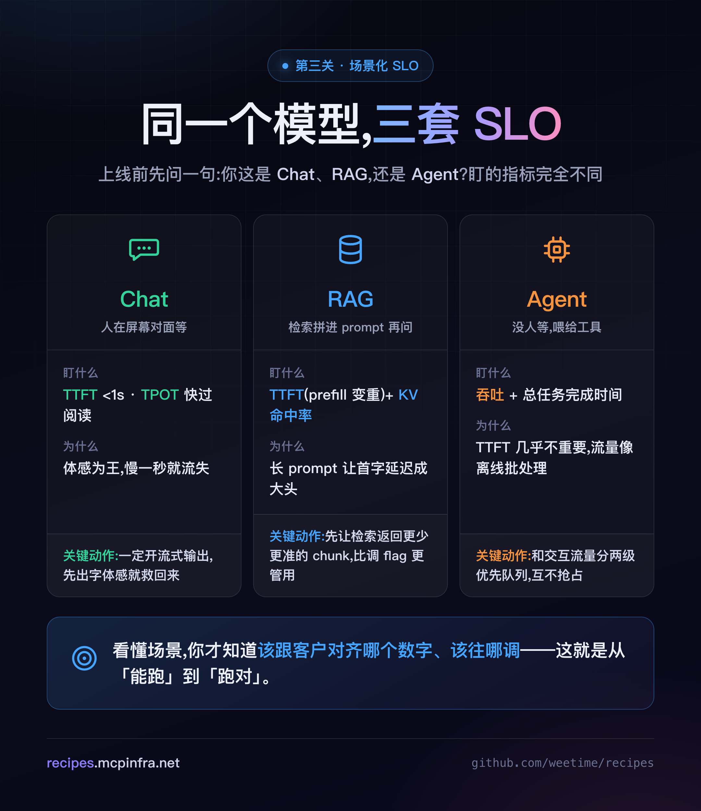
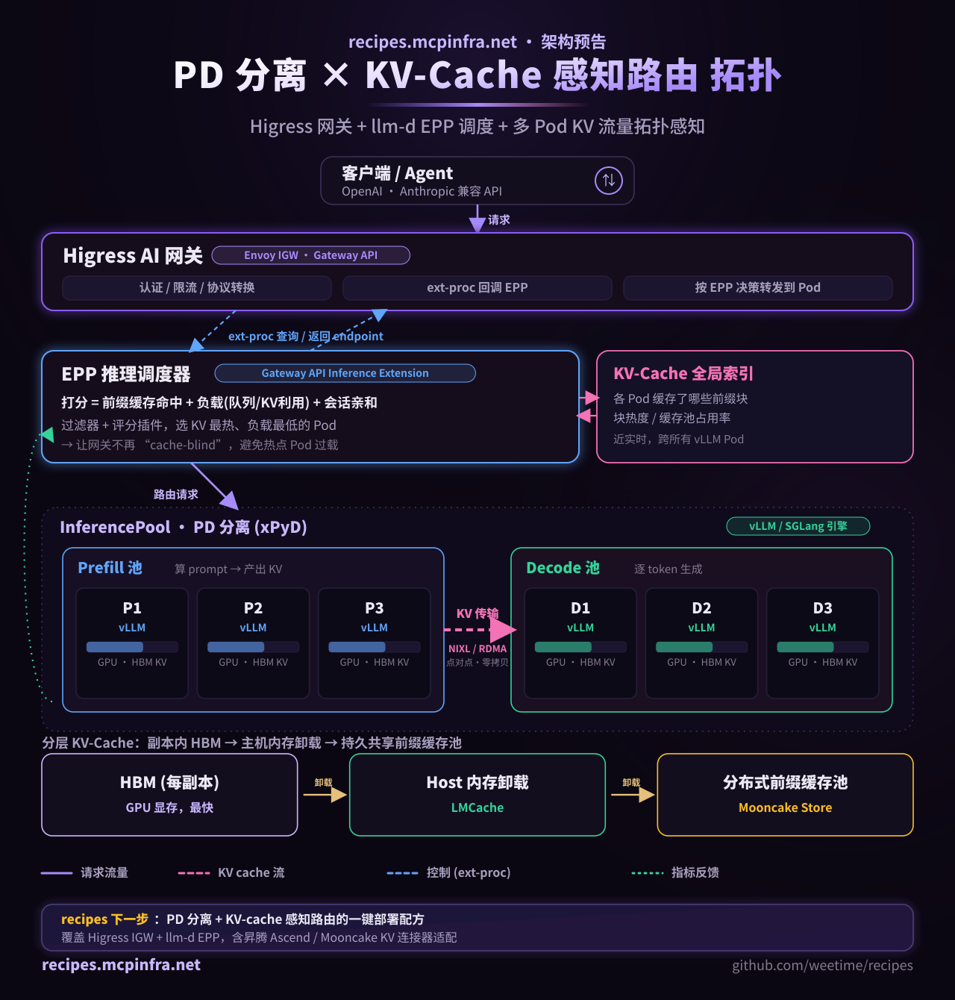

# 大模型部署,从「手艺」到「工程」:一份 FDE 跑得通、SRE 睡得着的落地手册

> Demo 里惊艳,生产上翻车——几乎是每个大模型落地项目的默认剧本。差距往往不在模型,而在「部署」这件被严重低估的工程。而部署也不是「能跑 / 不能跑」两档,它是一道**五级台阶:能跑 → 跑得好不好 → 跑对场景 → 持续稳定跑 → 在国产卡上落地**。大多数人卡在第一级就急着上线,然后在第三、第四级的凌晨三点被告警叫醒。接下来 5 分钟,我用第二人称带你把这五级台阶一次爬完——每一关都有能直接抄走的判断标准和真实数据兜底,顺带认识一个帮你省掉大半试错的工具:[vLLM recipes](https://github.com/weetime/recipes)(部署在 recipes.mcpinfra.net)。

---

**🎬 先花 70 秒看它长什么样**

一支产品导览,带你从「选模型 → 配硬件 → 复制一条 `vllm serve` 命令」,一路走到「换量化实时重算显存、多机一键展开、国产卡引擎镜像一键 `docker pull`」——recipes 到底怎么用,看一遍就懂:

> 上图为导览封面,点击播放即可观看完整 70 秒导览;想亲手试:recipes.mcpinfra.net。

---

## 第零关:你面对的到底是什么

先把话说清楚。把一个模型跑出 demo,不难——`pip install vllm`、`vllm serve`,本地一张卡就能出字。难的是让它"**在客户那台机器上、扛住真实流量、别出事**"。

这中间隔着一整个鸿沟,业内叫「最后一公里」。它今天主要压在两个角色身上:

- **FDE(Forward Deployed Engineer)**:把模型嵌进客户真实环境、写生产代码、对"能不能跑起来"负责。2026 年这个岗位需求同比涨了十倍不止,因为模型能力在飙,但**能把能力兑现到真实环境里的人,极度稀缺**。
- **SRE(Site Reliability Engineer)**:对"跑起来之后别炸"负责——可用性、容量、可观测、值班。

recipes 做的事,一句话:**选模型 → 配硬件 → 复制一条能直接跑的 `vllm serve` 命令**。但它真正的价值,是把这条"最后一公里"上散落的手艺,变成可复用的工程。下面,你来走一遍。

---

## 第一关:先让它「能跑」

场景切进来:客户机房,一堆你没提前见过的卡——可能是 8×H200,可能是 4×MI300X,也可能是一台昇腾 910B 的 Atlas 800。任务:把某个 32B 的模型跑起来,接进他们的 Agent。

于是你的灵魂拷问开始了:

- `--tensor-parallel-size` 设几?单机装得下,还是必须上多机?
- `--max-model-len` 开多大才不 OOM,又不浪费上下文?
- KV cache 要不要 `--kv-cache-dtype fp8`?`--block-size` 给多少?
- 这个模型的 `tool-call-parser` / `reasoning-parser` / `tokenizer-mode` 三件套,漏哪个就直接报错?

**每个问题猜错,代价都是一次通宵。** 这一关,recipes 替你把四道坎逐个接住:

1. **先看模型档案**。架构是 dense 还是 MoE?激活参数多少?上下文多长?parser 三件套是哪几个?——一张卡片全列清,不用翻十篇博客拼。
2. **先算账,要多少卡**。VRAM 公式 `ceil(params × bytes × 1.2)`(bf16=2 / fp8=1 / int4=0.5,MoE 按总参数算)配上硬件 profile,让"要多少卡"在开卡、报预算**之前**就算清:`8×H100 / 4×H200 / 2×4090(量化)`——这是能直接拿去要资源的数字。
3. **复制一条完整命令**。不是残缺模板,是带齐并行、KV、parser 的整条命令,`download → vllm serve → curl 验证` 三步跑通。
4. **顺手读一眼"为什么这么写"**。大 MoE 为什么推荐 EP+DP 而非纯 TP、FP8 KV 为什么省显存、报模板错先升级 vLLM——决策有据可查,不是黑魔法。

好,`curl localhost:8000/v1/chat/completions` 返回了第一段 JSON。**恭喜,你把它跑起来了。**

……但先别急着关电脑。这只是第 0 天。

---

## 第二关:跑起来之后,你怎么知道它「跑得好不好」?

客户探过头来问你两个问题:"**快不快?能扛多少人?**"

你答不上来。因为"能出字"和"跑得好"是两回事。这一关,你要学会看**三个核心数字**——它们是你和客户对齐预期的通用语言:

- **TTFT(Time To First Token,首字延迟)**:用户点下发送,到看见第一个字,等了多久。**它决定"卡不卡"的第一印象。**
- **TPOT / ITL(每字生成间隔)**:出字的节奏。业界的经验参照是——**人的舒适阅读速度约 6 tok/s**,也就是说单字间隔快过 ~150ms,用户就觉得"流畅"。
- **输出吞吐(tokens/s)+ 错误率**:单位时间总产出,以及压力下会不会开始报错。**它决定"能扛多少人"。**

参照值给你打个锚(业界生产经验值,来自 2026 年 LLM 推理 SLO 工程实践):**交互式 Chat 的 TTFT 一般压在 500ms–2s;语音、代码补全这类要求更高,得做到 <200ms(p95)。**

但这里有个更硬的真相:**"跑得好不好",很大程度取决于你选了哪个引擎、哪张卡。** 别信仰,上真实数据。

我们做过一次真机横评:**同一台昇腾 910B4(×4,TP=4)、同一个 Qwen3-32B、同一份 ShareGPT 真实流量,只更换推理引擎**,c128 高压档下——

| 引擎 | 输出吞吐 | TTFT p50 | ITL p50 |
|---|---|---|---|
| **vLLM-Ascend** | **1228 tok/s** | **1.2s** | **100ms** |
| MindIE | 764 tok/s | 25.3s | 106ms |
| SGLang | 550 tok/s | 9.0s | 202ms |

同一张卡、同一个模型,**只换引擎,吞吐差 2.2 倍,TTFT 差 20 倍。** 全程 45 轮错误率 0.00%。

这就是为什么 recipes 坚持**双引擎(vLLM + SGLang)**:引擎选型不是站队,是拿你自己的真实流量测出来的。而"测出来"这件事,交给配套的 ModelDoctor 压测工具。**恭喜,你现在会看性能了。**

---

## 第三关:场景不同,你该盯的指标也不同

这一关最反直觉,也最能拉开你和"只会 serve 的人"的差距。

同一个模型,接进不同业务,**关注的指标和该调的参数完全不一样**。上线前,你得先问客户一句:你这是 Chat、RAG,还是 Agent?

**如果是 Chat(人在屏幕对面等)**:体感为王。死盯 **TTFT**(<1s 体验就好)和 **TPOT**(比阅读速度快)。**一定要开流式输出**——哪怕总时长不变,先出字,体感就救回来了。

**如果是 RAG(检索拼进 prompt 再问)**:你的 prompt 突然变得很长,**prefill 变重,TTFT 成了大头**。这时候第一优化项不是调 GPU 参数,而是**让检索返回更少、更准的 chunk**——从源头砍掉 prefill 量,比你调任何 flag 都管用。其次,把 prefix cache / KV 命中率盯起来,系统提示词和知识块能复用就别重算。

**如果是 Agent(没有人在等,输出喂给工具)**:注意,**TTFT 在这里几乎不重要了**。Agent 是多轮、有状态的,输出直接被下游工具消费,人不在关键路径上。它的流量行为**更像离线批处理**,你真正该优化的是**总任务完成时间**——在高并发下,这等价于**拉满吞吐**。工程上,把 Agent/批量流量和交互式流量**分成两级优先队列**,互不抢占。

看懂了吗?**同一套模型,三种场景,三套 SLO。** 你现在知道该跟客户对齐哪个数字、该往哪个方向调了——这就是从"能跑"到"跑对"。**恭喜,你学会做场景化取舍了。**

---

## 第四关:让它「持续稳定跑」

上线不是终点,是值班的开始。凌晨三点告警响了,你靠什么定位?

这一关是 SRE 的主场。两件事:**把可观测挂上黄金指标,把部署写成 config-as-code。**

**① 黄金指标,LLM 版。** 经典的四个黄金信号,在推理服务上这样落:

- **延迟(Latency)** → TTFT + TPOT,分 p50 / p95 / p99 看。
- **流量(Traffic)** → RPS / 并发数 / 输出 tok/s。
- **错误(Errors)** → errorRate、超时、OOM。
- **饱和度(Saturation)** → **KV-cache 利用率 + 调度排队深度**——这是 LLM 最关键、也最容易被漏掉的一个。

饱和度为什么关键?回到刚才那次横评:MindIE 的调度排队深度冲到 34、SGLang 的 KV-cache 峰值打满 100%——**正是这两个饱和信号,解释了它们为什么 TTFT 崩到 25 秒。** 只看客户端延迟,你只知道"慢了";盯住饱和度,你才知道"为什么慢、下一步扩什么"。

**② config-as-code。** 部署从「手艺」变「工程」的分界线,就是它**能不能进版本库**:

- **配置即代码**:每个配方是一份带版本的 YAML,`min_vllm_version` pin 死,硬件支持标成 verified 三态。部署决策进 code review,而不是躺在某人的记忆里。
- **确定性**:命令由纯函数合成,**同输入 = 同命令**,可 diff、可回滚,从源头拒绝配置漂移。
- **可编程接入**:这点对你尤其重要——recipes 每个配方都产出一份 **JSON**(static JSON API)。你的 **Agent / 内部平台可以直接读它、自动识别模型能力、自动拼出 serve 命令**,不用爬网站、不留人肉环节。加上服务本身 **OpenAI + Anthropic 双协议兼容**,可以直接接 Claude Code 这类客户端。

把部署写进版本库,把饱和度挂上告警——你的服务,从"能跑"变成了"**敢上线、能值班**"。**恭喜,你学会让它稳定跑了。**

---

## 第五关:客户是信创机房,只有国产卡

最后一关,也是最现实的一关。客户告诉你:机房是信创的,给你的是**昇腾、海光、天数、寒武纪、昆仑、T-Head**——没有一张 N 卡。

很多人到这一步就卡死在环境地狱里:CANN 装不对、DTK 版本冲突、引擎编译一整天。recipes 在这里的答案是两条腿:

- **配方覆盖国产卡**:昇腾 910B/910C、海光 DCU、天数、寒武纪、昆仑、T-Head PPU 等都在硬件矩阵里,配方标注了在什么卡上实测跑通。
- **和 [GPUStack](https://github.com/gpustack/gpustack) 联动**:GPUStack 是开源的国产卡集群管理器,原生纳管昇腾 / 海光 / 摩尔线程 / 沐曦 / 寒武纪 / 天数 / T-Head,跑 vLLM / SGLang / MindIE,对外统一 OpenAI + Anthropic 兼容 API。它提供**国产卡适配后的引擎镜像**,把你从"自己编译 CANN/DTK"的地狱里捞出来。

第二关那份昇腾 910B4 三引擎横评,就是这条路走通后的产物:**真机、真流量、真数据。** 国产卡不是"能不能跑"的问题,是"用哪个引擎、调到什么水位最划算"的问题——而这,恰好是 recipes 想帮你回答的。

---

## 恭喜你,通关了

回头看看你走过的五关:

1. **能跑** —— 选型、算卡、一条命令起服务;
2. **跑得好不好** —— TTFT / TPOT / 吞吐三个数,和引擎选型的真实差距;
3. **跑对** —— Chat / RAG / Agent 三种场景,三套 SLO;
4. **持续稳定跑** —— 黄金指标(尤其饱和度)+ config-as-code;
5. **在国产卡上落地** —— 配方覆盖 + GPUStack 引擎镜像。

**恭喜你,你学会了**把一个开源模型,从"能在 demo 里出字",一路带到"在客户的国产卡上,按场景对齐 SLO、挂着黄金指标、可复现地持续稳定运行"。

而这,正是我们做 recipes 想探索的更大的一件事:**给定任何一个开源模型、任何一种指定硬件,它的吞吐 / 延迟 / 成本最优解到底是什么?** 我们想把这个"最优解"沉淀成可抄的配方、量成真实的数据、开放成可被 Agent 调用的 API——让大模型推理服务,从"能跑",走到"**持续稳定地、便宜地,跑在你手里的那张卡上**"。

> 这是我们正在补的下一块拼图:PD 分离 + KV-Cache 感知路由的一键部署配方(Higress AI 网关 + llm-d EPP 调度 + 分层 KV / Mooncake),含昇腾 Ascend 连接器适配——把"持续稳定跑"再往上抬一层。

如果你在昇腾、海光这些国产卡上把某个模型跑通了,**非常欢迎来提一个 recipe**,一起把这块补全。

- 项目:https://github.com/weetime/recipes
- 站点:recipes.mcpinfra.net

